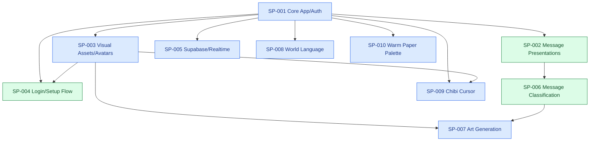

# Project Ledger

## Resume Here

| Field | Last observed state |
|---|---|
| Project goal | Manga-inspired chat app with expressive message presentations, world/room scenes, login/authentication, avatars, and swappable local/Supabase persistence. |
| Current phase | Repository-wide release preparation and the authorized Next.js patch upgrade are committed and published in draft PR [#1](https://github.com/SafwanKamal/Kokoroe/pull/1). The release candidate is ready for review. |
| Branch / commit | Kokoroe is `codex/next-005-message-classifier` / release commit `096e7c13cfe97593b573bc201bab553f13328736`, pushed to `origin` and opened against `main` as draft PR #1. This ledger handoff commit is the branch tip after that release commit. The worktree was clean before this ledger-only update. MangaPanelLab remains separate on `codex/translated-manga-pipeline`. |
| Active primary sub-problem | SP-001 — repository-wide release cleanup and publish review; related SP-007–SP-010 |
| Last validated milestone | At 2026-08-03T16:55:30+06:00, Next.js was upgraded and pinned from `16.2.10` to current stable `16.2.12`. The 15-entry catalog, all 120 Vitest tests, all 25 crawler tests, TypeScript, crawler validate/dry-run, Webpack production build, diff checks, and route type generation pass. The upgraded Turbopack dev server returned HTTP 200 for `/`, `/privacy`, and `/api/health`. The prior desktop and 390×844 rendered acceptance remains applicable because this patch changed dependencies only. |
| Current blocker or risk | No publish blocker. `npm audit --omit=dev` still reports three high-severity transitive advisories in Next's current `postcss` and optional `sharp`; npm proposes an invalid breaking downgrade to Next 9, so no forced audit rewrite was applied. Independently, true coarse-pointer cursor absence remains unverified and the default Turbopack production build is blocked locally by the ignored out-of-root `.data/manga-models/runtime/bin/python` symlink; the Webpack production build passes. |
| Exact next action | Review draft PR #1 and its checks. If accepted, merge it deliberately; otherwise address bounded review feedback on the same branch. Later SP-001 closeout still needs authenticated send/reload and room-membership switching, and SP-009 still needs a true coarse-pointer absence render. |
| Most relevant prior chat | [SP-001 — NEXT-010 UI consistency](codex://threads/019f8cdd-ed03-7a12-ac47-18e974cfbd4b) |
| Ledger updated | 2026-08-03T16:58:01+06:00 |

## Status Legend

| Status | Meaning | Color |
|---|---|---|
| ✅ COMPLETE | Acceptance criteria verified | Green |
| 🔵 ACTIVE | Work currently in progress | Blue |
| 🟡 READY NEXT | Prerequisites satisfied | Yellow |
| 🟠 BLOCKED | Cannot proceed until a condition changes | Orange |
| ⚪ DEFERRED | Intentionally postponed | Gray |
| ❌ SUPERSEDED | Replaced or abandoned | Red |

## Project Goal and Scope

Kokoroe is a manga-inspired chat app built with Next.js. The app should feel expressive, playful, character-driven, and visually distinct from a generic chat or SaaS dashboard. Authoritative project guidance is in `AGENTS.md`, `docs/VISION.md`, `docs/ROADMAP.md`, `docs/DESIGN_DECISIONS.md`, `docs/CONCEPT_ART_NOTES.md`, `docs/AVATAR_PIPELINE.md`, and `docs/MESSAGE_PRESENTATION_PIPELINE.md`.

In scope now: authentication/login, multiple rooms/worlds, basic message sending and reading, runtime avatar identity, room scene art, expressive catalog-driven message presentations, responsive manga UI polish, and backend API contracts with swappable persistence.

Explicit early non-goals: full AI character emulation, AI message masking, arbitrary AI-generated UI styling, large dependency-heavy design systems, and production-scale AI/image-generation pipelines unless explicitly requested.

## Working Architecture

### System Architecture

Current state from repository evidence:

- Next.js app under `app/` with UI in `app/page.tsx` and global styling in `app/globals.css`.
- Shared control tokens in `app/globals.css` define semantic status colors, three border tiers, compact/standard/large heights, square/soft corner roles, hard shadows, and keyboard focus treatment; room/avatar accents remain local overrides.
- Route handlers under `app/api/` cover messages, auth login/register/logout/session, health, profile, members, and rooms.
- Store facade in `app/kokoroe-store.ts`; adapters in `app/stores/` include JSON, SQLite, Supabase, seed data, and shared types.
- Runtime catalogs live in `content/message-presentations/catalog.json`, `content/avatars/catalog.json`, and `content/world-language/catalog.json`.
- `app/world-language.ts` provides typed semantic-key lookup, deterministic state variants, interpolation, and literal accessible labels; `scripts/validate-world-language.mjs` enforces the catalog shape before tests/build.
- `app/chibi-cursor.tsx` owns the isolated fine-pointer overlay, visible/on-screen action filtering, target-seeking pointing-hand/themed-I-beam guides, scroll/resize refresh, and direct animation-frame writes; `app/cursor-companions.ts` owns intent/input-type priority, pure target-distance/orbit/clamping geometry, text-entry versus native-precision policy, media gating, reduced-motion duration, teardown primitives, and the prototype selector. Ink Page Sprite remains the selected humanoid default with geometry/rabbit comparison fallbacks.
- The provider-neutral classifier contract is in `app/message-classifier.ts`; it requires a target plus surrounding context. Its typed evaluation export and 18 held-out contextual cases are in `app/message-classification-evaluation.ts` and `content/message-classification/evaluation-set.json`.
- `app/message-classification-context.ts` pseudonymizes speakers and builds either an eight-turn recent window or a discussion-compaction envelope sourced from up to forty turns. The compaction branch keeps bounded topic summaries plus a four-turn tail and falls back to recent context on invalid output.
- `app/message-classifier-ai-sdk.ts` owns the provider-neutral context-first prompts, strict JSON schemas, contextual few-shot messages, and common AI SDK runners. `app/message-classifier-provider.ts` selects retained Gateway or OpenRouter adapters; OpenRouter requires a fixed `:free` id and enforces required-parameter, denied-data-collection, and ZDR routing. `app/message-classifier-runtime.ts` requires explicit rollout mode, a server-owned room allow-list, and request consent; `app/kokoroe-store.ts` supplies same-room history only at server-owned message creation.
- `scripts/evaluate-message-classifier.ts` selects the same provider/model factory used by runtime and supports contextual batch screening plus paced per-case acceptance runs; discussion compaction is a separate two-pass per-case mode. Structured model output is normalized through the same allow-list contract.
- Decorative message shell assets live in `public/message-templates/`.
- Approved runtime avatars live in `public/avatars/<room-id>/<avatar-id>/portrait.png`; the six current portraits are byte-identical to their accepted full-square reference candidates.
- Runtime room art lives in `public/rooms/<room-id>/preview.jpg` and `scene.jpg`.
- Login scene art for current runtime exists in `public/login-scene-current/`.
- Runtime login wordmark exists at `public/brand/kokoroe-logo-wordmark.svg`.
- Latest login composition reference is `docs/ReferenceImages/Concept/login-panel-blend-concept.png`, showing top manga art dissolving into an integrated paper login form.
- Reference/source art lives under `docs/ReferenceImages/`, including logo/wordmark assets under `docs/ReferenceImages/Logo/` and generated avatar candidates under `docs/ReferenceImages/Character Profile/` plus `docs/ReferenceImages/Avatars/`.

Target-only or future state:

- The accepted `tencent/hy3:free` plus `recent-messages` pair drives only a local explicit-consent, allow-listed development canary; no production rollout is approved.
- Later classifier phases may compare a project-owned shared model and an optional on-device per-user adapter/calibrator against the frozen global baseline; personal history remains local by default and server validation remains authoritative.
- Future avatar generation must feed the approval/import pipeline before runtime exposure.
- Planned next state: review and intentionally commit the verified NEXT-009/NEXT-010 UI set. For SP-007, review the offline-tested manga crawler, configure only an evidenced authorized source, and complete the separate human-conversation schema plus audited withdrawal/deletion behavior; NEXT-006 generation remains blocked until the dual-corpus contract is accepted. Replace the development privacy summary with owner-reviewed production text before launch, then collect reviewed opt-in canary examples before considering room expansion.

### Development Sequence

### Active Work Map

| Sub-problem | Status | Branch / worktree | HEAD | Sessions | Blocker / next action |
|---|---|---|---|---|---|
| SP-001 | 🔵 ACTIVE | `codex/next-005-message-classifier` / relocated Kokoroe checkout | release `096e7c1` plus this ledger handoff commit, pushed in draft PR #1 | Login, privacy, setup, chat, and members are screenshot-verified at 1440×900 and exact 390×844; the privacy overflow is fixed. Upgrade validation and publishing pass. Review PR #1; authenticated send/reload and room-membership switching remain later SP-001 closeout work. |
| SP-002 | ✅ COMPLETE | same | `bf90e7e` | [SP-002 — Auth, Supabase, UI and Bubbles](codex://threads/019f7088-4e63-7323-a377-6e1b41b3c6a3); current session unavailable | Catalog, safe areas, motion policy, tests, and CONFLICT-001 are resolved; feeds SP-006. |
| SP-003 | 🔵 ACTIVE | same | `bf90e7e` | Unavailable from current surface | Current portraits, wordmark, and concept-art paths are accepted and committed; future generated art must reuse intake. |
| SP-004 | ✅ COMPLETE | same | `bf90e7e` | Unavailable from current surface | Accepted desktop/mobile login/setup is committed; rerun only when its assets or responsive structure change. |
| SP-005 | 🔵 ACTIVE | same | `bf90e7e` | Unavailable from current surface | Verify RLS/read policy scope before client realtime expansion. |
| SP-006 | ✅ COMPLETE | `codex/next-005-message-classifier` / same worktree | `bcd9d9d`, shared UI/docs/ledger uncommitted | [Current UI task](codex://threads/019f7088-4e63-7323-a377-6e1b41b3c6a3) | Consent-gated local `after-school` canary passed contextual live checks; NEXT-009 moves disclosure to the optional login choice and adds a visible withdrawal toggle without weakening the request gate. |
| SP-007 | 🔵 ACTIVE | Kokoroe plus standalone `/Users/safwankamal/Desktop/Desktop - Safwan’s MacBook Air/Code/MangaPanelLab` on `codex/translated-manga-pipeline` | OpenMantra normalized; eight-page review/schema and 24-attempt Qwen baseline complete; deterministic dialogue baseline 83/83; dual-corpus contract incomplete | Current session unavailable | Implement the split-pass benchmark: deterministic text-to-panel linking, smaller Qwen page/panel semantic calls, strict merge validation, and review scoring. Ubunchu, reviewed export, conversation schemas, and withdrawal/deletion remain; NEXT-006 stays blocked. |
| SP-008 | 🔵 ACTIVE | `codex/next-005-message-classifier` / same worktree | `bcd9d9d`, world-language foundation, authentication, and navigation slices uncommitted | Current session unavailable | Foundation, auth, and navigation slices are verified; review the three navigation terms, then inventory room discovery, membership, empty states, and activity copy under NEXT-012. |
| SP-009 | 🔵 ACTIVE | current `codex/next-005-message-classifier`; recommended review/commit boundary remains `codex/next-013-chibi-cursor-prototype` | `bcd9d9d`, Phase 0 runtime plus canonical Page-Sleeve layered shoulder/arm art, frame-synchronous aiming tests, and docs uncommitted; floating guide and body rotation removed; no production release | Current session unavailable | Review the smoother attached arm motion, shoulder/mirror/occlusion anatomy, and write ta-da; then render one true coarse-pointer absence state before closing NEXT-013. |
| SP-010 | 🔵 ACTIVE | `codex/next-005-message-classifier` / relocated Kokoroe checkout | `bcd9d9d`, palette/material/typography CSS plus design notes/ledger uncommitted amid substantial unrelated dirty work | Current session unavailable | Review the softened title voice, then inspect members and semantic states; keep refinements token-level or narrowly scoped. |

## Sub-problem Index

| ID | Title | Sequence | Status | Upstream | Downstream | Next action |
|---|---|---:|---|---|---|---|
| SP-001 | Core app, rooms, auth, stores | 1 | 🔵 ACTIVE | None observed | SP-002, SP-003, SP-004, SP-005, SP-006 | Review/commit verified NEXT-009/NEXT-010; later closeout should verify authenticated send/reload and room-membership switching. |
| SP-002 | Message presentation system | 2 | ✅ COMPLETE | SP-001 | Chat UX and SP-006 | Preserve the bounded catalog contract while SP-006 begins. |
| SP-003 | Visual assets and avatars | 3 | 🔵 ACTIVE | SP-001 | SP-004 and chat identity | Runtime wordmark and portraits are accepted; rerun their dedicated pipelines only when assets or framing change. |
| SP-004 | Login/setup/auth visual flow | 4 | ✅ COMPLETE | SP-001, SP-003 | Preserve the accepted committed flow; rerun visual QA only after relevant changes. |
| SP-005 | Supabase persistence and realtime | 5 | 🔵 ACTIVE | SP-001 | Production data sync | Verify RLS/read policies and realtime behavior. |
| SP-006 | Bounded message classification | 6 | ✅ COMPLETE | SP-001, SP-002 | Automatic presentation selection | Preserve the verified classifier and consent boundary; keep collecting reviewed opt-in evidence before expanding beyond the local canary. |
| SP-007 | Approval-gated art generation | 7 | 🔵 ACTIVE | SP-003, SP-006 | Generated portraits, rooms, and scene moments | Continue NEXT-011 corpus contracts and governance; do not generate or train yet. |
| SP-008 | Catalog-driven world language | 8 | 🔵 ACTIVE | SP-001 | Authentication, setup, rooms, membership, chat states | Review the accepted navigation slice, then expand through NEXT-012 one surface at a time. |
| SP-009 | Chibi cursor companion | 9 | 🔵 ACTIVE | SP-001, SP-003 | Desktop interaction personality and later avatar-linked packs | Accept or refine the canonical Page-Sleeve Spirit's smoother frame-synchronous shoulder arm and write ta-da; complete true coarse-pointer rendered absence and keep floating limbs, body rotation, and cat/tanuki runtime packs out of scope. |
| SP-010 | Warm faded-paper site palette | 10 | 🔵 ACTIVE | SP-001 | Login, setup, room discovery, chat, controls, and semantic states | Complete authenticated desktop/mobile visual review and refine only color exceptions that remain too saturated or unclear. |

## Sub-problems

### SP-001 — Core app, rooms, auth, stores

#### Goal and boundaries

Provide the working base app: room/world navigation, login/authentication, profile preferences, messages, and swappable persistence. Avoid overbuilding AI features before the core experience is stable.

#### Dependencies and downstream impact

All visual and presentation work depends on stable room, account, message, and profile contracts.

#### Current state and acceptance criteria

- State: 🔵 ACTIVE
- Evidence: `README.md`, `package.json`, `app/api/*`, `app/stores/*`, and `docs/ROADMAP.md` describe a Next.js app with JSON/SQLite/Supabase stores, route handlers, and credential-backed sessions.
- Acceptance criteria: `npm run check` passes; login/session restore, room membership, room switching, message read/write, and profile memory work in browser.

#### Accumulated accomplishments

- Repository-wide release cleanup inventoried every tracked and untracked path, excluded three explicitly rejected `.codex/ui-drafts/` pages plus Python bytecode/egg metadata, mechanically removed the isolated 1,039-line rejected saved-chapter CSS layer, added durable ignore rules, added a root `crawler:test` runner, included its 25 offline tests in `npm run check`, and added missing login-error alert semantics. Browser QA found and fixed a real `/privacy` grid/min-content overflow; desktop and exact 390×844 login/privacy/setup/chat/members renders now pass without document overflow or missing images. Next.js is now pinned at current stable `16.2.12`; all 120 app tests, 25 crawler tests, TypeScript, crawler validation/dry-run, Webpack build, route type generation, secret scan, diff checks, and upgraded runtime route probes pass. The current audit database still reports three transitive high advisories without a valid non-breaking npm remediation.
- Route handler and store architecture exists.
- Supabase support is scaffolded per roadmap notes.
- Runtime room, avatar, and message-presentation assets exist.
- `npm run check` passed on 2026-07-18T10:21:43-05:00 against the dirty worktree.
- Chatroom members option exists in the current dirty worktree: `Members` header toggle opens a Room Cast panel, shows account members with selected world avatars and line counts, searches existing accounts, and adds accounts through `/api/members`.
- NEXT-004 reconciled the current dirty tree into four ownership clusters: chat UI/motion (`app/page.tsx`, `app/globals.css`, sad shell); presentation contract/debug support (runtime helper, catalog, test, package scripts); documentation/concept-art path cleanup; and package-lock refresh. The concept-art changes intentionally relocate the old typo-path image to `docs/ReferenceImages/Concept/chat_evolution_art.png` and preserve the previously occupied concept as untracked `kokoroe-manga-chat-concept.png`.
- Current reconciliation validation: `npm run check` passed (2 files / 21 tests, TypeScript, Next.js 16.2.10 build), `git diff --check` passed, and logged-out desktop plus 390x844 mobile login rendered without console errors or horizontal overflow. The mobile panel is taller than one viewport and scrolls to expose all controls. No credentials were submitted and no app data was mutated.
- A rounded inset floating-composer experiment was implemented and visually checked, then explicitly rejected as too round and capsule-like. It was fully reverted: the composer is again hard-edged and edge-to-edge, and desktop 1280x720 plus mobile 390x844 screenshots confirm zero radius, margin, shadow, animation, or overflow. NEXT-008 preserves those boundaries while seeking character through angular manga treatment instead.
- The user rejected NEXT-008 as too slight. NEXT-009 replaces it with a larger but still bounded manga-panel re-composition: character-ID slab, live-panel caption, clipped dialogue frame, and halftone/speed-line paper. After review, the experimental directional wedge was removed and the familiar solid rectangular room-accent send button with hard ink shadow was restored.
- The composer AI warning was removed. Login now requires a versioned Privacy Policy agreement and presents a separate optional, unchecked cloud-style choice. That choice is browser-session scoped, continues to gate each server request, can be withdrawn through the chat-navigation `AI style` control, and is removed on logout.
- Browser QA accepted desktop 1440x900 and 390x844 chat screenshots, a full mobile login screenshot, and the `/privacy` route. At 390x844 the composer ends at 822.52px, document width is exactly 390px, the warning count is zero, and the mobile navigation no longer clips after adding the AI switch. Desktop document width is exactly 1440px and the complete composer remains inside its panel.
- NEXT-009 validation passed with 7 test files / 82 tests, TypeScript, the Next.js 16.2.10 production build, and `git diff --check`. The disposable browser account was removed by stopping the exact dev process and restoring the pre-QA JSON store byte-for-byte (`4029dd75e14858a14c3699085b7a7e90bd2ac0c8bc39c3dacdd82a72639ee403`).
- User-review refinement reduced the 390x844 composer from about 150px to 122.70px, made the avatar rail a proportional two-row anchor, and matched the textarea/send heights at 52px. Final mobile and 1440x900 desktop screenshots have exact viewport-width document geometry. The second disposable account was removed by restoring the current pre-QA store byte-for-byte (`97542435e33cdfd6366d3909c2259302942596ca15660e467d6b9d6aa2698c0f`).
- Screenshot review then rejected the remaining mobile identity rail as an ugly empty black block. Mobile now renders only a 38.40px framed portrait in the first row, lets the dialogue frame span underneath it, widens the textarea to 243.30px, and removes the small yellow avatar mark from the shared composer portrait entirely. Desktop retains its useful named identity slab. Final mobile/desktop screenshots have zero mark elements and exact viewport-width document geometry; the third disposable account was removed by restoring the current pre-QA store byte-for-byte (`81512e1ead8c917bf04a108f22c11b7c7a8c9c10027c89c4bd8987177792b2b6`).
- NEXT-010 inventoried login, setup, room-search, members, navigation, and composer controls before editing. `app/globals.css` now defines the previously missing success/error colors and rounded-font fallback plus shared border, height, corner, shadow, focus, and state tokens. Near-duplicate search/member fields share 44px compact proportions and accent focus treatment; common action buttons share hover/active/disabled behavior; mobile navigation, scene, members, and profile targets are at least 44px.
- User review exposed that the shared solid focus outline stacked on the room-search field's own accent border and inset rail, producing an accidental nested blue selection. Room-search and member-entry fields now suppress that competing outline and use one geometry-stable accent border, narrow registration rail, and faint paper halo; the public-room field remains exactly 286.25×44px at the default viewport and 298.25×44px at exact 390×844 geometry.
- Conventional login, room-search, and member-entry fields lift like a loose paper slip, then continuously drift through a slow 3.2-second loop within an approximately two-pixel envelope. CSS `translate` preserves their layout footprint; the public-room field retains its 286×44px offset dimensions at the default viewport and 298×44px at exact 390×844. Reduced-motion users receive the static lift, and the composer textarea remains excluded.
- Member failures now expose `role="alert"`, `aria-invalid`, and `aria-describedby`; rendered QA confirmed the focused invalid field retains a 3px red outline, red border, and inset error marker. The clipped angular composer, room/avatar accents, and expressive message shells remain distinct.
- NEXT-010 browser QA used a disposable account to exercise login, setup, live public-room search, chat, the members panel, disabled submit, keyboard focus, and a real missing-account error at 1440x900 and 390x844. Mobile document width remained exactly 390px, the composer remained geometrically unchanged, and the disposable JSON store was restored byte-for-byte after testing and again after the test suite rewrote fixtures.
- Composer interaction review replaced the textarea's stepped focus-width and 6px shadow snaps with continuous transform/opacity/color/shadow easing, a stable-width hatch marker, a restrained 4px room-accent shadow, and an eased inset ink rail. Desktop and exact 390x844 screenshots confirm the hard-edged panel character remains intact; mobile textarea/send geometry stays fixed at 243.30x52px and 80x52px with a 390px document width. The final shared-worktree check passed the 12-entry world-language validation, 8 files / 97 tests, TypeScript, build, diff checks, exact store restoration (`7cda9d3120f6579c27bd541cf2bcb9beeb9ef019721050c48e377dbce09a8a26`), generated-state normalization, and live HTTP 200.
- Review correction replaced the rounded login field, primary-action, and secondary-action corners with the shared square token. Required and optional consent cards now share a solid 2px ink border, square corners, inset teal rail, hard offset shadow, spacing, and checkbox grammar; restrained background wash and copy carry the optional distinction. The prior disabled-button `saturate(0.72)` / `opacity: 0.72` treatment was restored, returning the login CTA to its earlier teal appearance without changing its enabled color or backend behavior.
- Further user review rejected those square controls as generic bricks, then rejected the coded HUD treatment as a scattered collection of decorated widgets. Three independent agents produced isolated full-interface drafts: a saved-chapter manga RPG page, a living manga page, and a world-portal ritual. All three were rendered at desktop and exact 390x844 before selection; the accepted vertical art-over-form constraint ruled out the otherwise elegant desktop split, while the world-portal draft implied pre-auth world selection.
- The selected saved-chapter direction was implemented and technically verified, then explicitly rejected as garbage/noisy. Its chapter headline, thumbnail reel, player folio, entry-condition steps, status marks, and progress rail are superseded and must not return as a bundled login direction.
- Online visual research inspected current official VIZ/Shonen Jump, WEBTOON, and Marvel home/login surfaces. The recurring pattern is one dominant artwork, restrained editorial typography, conventional labeled account controls, repeated neutral agreement rows, generous gutters, and one brand-accent action. The production login now applies that division of labor: rotating scene art, logo, scene caption, and five compact progress marks carry the manga identity; the paper form uses two plain fields, one neutral consent frame, the original teal CTA, and a text secondary action. Desktop 1440x900 fits without page scroll; exact 390x844 has 390px document width and one 1035px vertical page. Disabled/enabled CTA, checkbox, scene cycling, and missing-image checks pass without backend changes.

#### Branches and worktrees

| Branch | Worktree | Base commit | Last observed HEAD | State |
|---|---|---|---|---|
| `main` | `/Users/safwankamal/Desktop/Code/Kokoroe` | Unknown | `45367e0` | Dirty; uncommitted changes observed. |
| `codex/reconcile-kokoroe-dirty-worktree` | same | `45367e0` | `bf90e7e` | Four product/tooling commits created; ledger-only handoff commit pending. |
| `codex/next-005-message-classifier` | same | `7e18ef5` | release `096e7c1` plus this ledger handoff commit | Intended UI/privacy/language/cursor/crawler/assets/docs, release cleanup, and Next.js 16.2.12 upgrade are committed, pushed to `origin`, and open as draft PR #1 against `main`. Rejected `.codex/ui-drafts/` files and Python-generated caches/egg metadata are excluded; full app/crawler/build/runtime validation and desktop/mobile rendered review pass. |

#### Chat sessions

| Session | Link | Started / updated | Git state | Scope | Outcome |
|---|---|---|---|---|---|
| Unavailable from current surface |  | 2026-07-18T09:47:50-05:00 | `main` / `45367e0`, dirty | Ledger initialization and asset-work handoff | Ledger initialized from repository evidence. |
| Unavailable from current surface |  | 2026-07-18T10:19:35-05:00 | `main` / `45367e0`, dirty | Chatroom members option verification | Confirmed current dirty worktree contains members API/UI/store integration. `npm run check` passed. Started `npm run dev`; `GET /api/health` returned ok and `GET /api/rooms` returned member counts for all 4 rooms. Browser screenshot inspection not completed because browser-control tool was unavailable. |
| Unavailable from current surface |  | Start unavailable; updated 2026-07-18T11:27:30-05:00 | `main` / `45367e0`, dirty; no commit | SP-001 / NEXT-004 dirty-worktree reconciliation | Inspected all tracked/untracked changes, identified ownership/risk clusters, passed `npm run check` and `git diff --check`, and visually inspected logged-out desktop/mobile login. `npm ls --depth=0` reported one extraneous local transitive package; authenticated setup/chat remains unverified. No user changes were reverted, staged, or committed. |
| Unavailable from current surface |  | Start unavailable; updated 2026-07-18T15:21:55-05:00 | `codex/reconcile-kokoroe-dirty-worktree` / `45367e0..d6db046`, committed; final evidence-ledger commit pending | SP-001 reconciliation; related SP-002–SP-007 | Created four reviewable product/tooling commits plus the ledger commit, resolved CONFLICT-001, passed 24 tests/typecheck/build/diff checks, and browser-verified interaction versus ambient effects. Disposable JSON data was restored exactly. No push, merge, rebase, or external model call occurred. |
| `019f7088-4e63-7323-a377-6e1b41b3c6a3` | [SP-002 — Auth, Supabase, UI and Bubbles](codex://threads/019f7088-4e63-7323-a377-6e1b41b3c6a3) | Start unavailable; updated 2026-07-19T18:34:59-05:00 | `codex/next-005-message-classifier` / `bcd9d9d`, ledger-only change | SP-001 composer visual direction; related SP-006 consent surface | Implemented a rounded floating-panel proposal, received explicit rejection, and restored the prior composer exactly. Desktop/mobile browser checks confirmed the square edge-to-edge shell and readable consent copy; 82 tests/typecheck/build/diff checks passed. Added NEXT-008 for a bounded angular follow-up. |
| Unavailable from current surface |  | Start unavailable; updated 2026-07-19T18:46:47-05:00 | `codex/next-005-message-classifier` / `bcd9d9d`, CSS/docs/ledger uncommitted | SP-001 / NEXT-008 angular composer character pass; related SP-006 consent surface | Added hard-edged manga-panel details without changing control geometry; screenshot-inspected settled 1280x720 and 390x844 chat views; proved textarea/send stability across focus; passed 82 tests/typecheck/build/diff checks; and removed disposable QA data by exact backup restoration. |
| Unavailable from current surface |  | Start unavailable; updated 2026-07-19T19:07:05-05:00 | `codex/next-005-message-classifier` / `bcd9d9d`, seven product/docs paths plus ledger uncommitted | SP-001 / NEXT-009 composer replacement and login privacy agreement; related SP-006 consent boundary | Replaced the rejected subtle pass with a stronger angular manga-panel composer, moved optional AI consent to login plus chat withdrawal, added a development privacy route, accepted desktop/mobile screenshots with no overflow, passed 82 tests/typecheck/build/diff checks, and restored disposable data exactly. |
| Unavailable from current surface |  | Start unavailable; updated 2026-07-19T20:24:27-05:00 | `codex/next-005-message-classifier` / `bcd9d9d`, NEXT-009 changes uncommitted | SP-001 / NEXT-009 user-review refinement | Restored the prior rectangular send button, rebalanced the mobile composer into a shorter proportional three-column layout, accepted final 1440x900 and 390x844 screenshots with equal textarea/send heights and no overflow, passed 82 tests/typecheck/build checks, and restored disposable data exactly. |
| Unavailable from current surface |  | Start unavailable; updated 2026-07-19T21:47:02-05:00 | `codex/next-005-message-classifier` / `bcd9d9d`, NEXT-009 changes uncommitted | SP-001 / NEXT-009 screenshot correction | Removed the mobile empty black identity slab and yellow avatar mark, widened the input beneath a compact standalone portrait, accepted 390x844 and 1440x900 screenshots with no overflow or tag elements, passed 82 tests/typecheck/build checks, and restored disposable data exactly. |
| Unavailable from current surface |  | Start unavailable; updated 2026-07-22T21:41:36-05:00 | `codex/next-005-message-classifier` / `bcd9d9d`, ledger plus existing NEXT-009 changes uncommitted | SP-001 / NEXT-010 planning | Added a READY, launchable UI-consistency audit covering shared control geometry, typography, corner language, and interaction/error states across login, setup, members, room search, and chat. No runtime code changed and no tests were run for this ledger-only planning update. |
| `019f8cdd-ed03-7a12-ac47-18e974cfbd4b` | [SP-001 — NEXT-010 UI consistency](codex://threads/019f8cdd-ed03-7a12-ac47-18e974cfbd4b) | Start unavailable; updated 2026-07-23T01:08:32-05:00 | `codex/next-005-message-classifier` / `bcd9d9d`, NEXT-009/NEXT-010 UI, composer focus polish, three rejected draft artifacts, and docs uncommitted | SP-001 / NEXT-010 login and composer consistency; related SP-004 login/setup and SP-006 consent surfaces | Retained the restrained editorial login, then polished the existing hard-edged composer focus treatment with continuous easing and no layout movement. Reaccepted the final shared UI at 1440x900 and exact 390x844 after concurrent world-language changes; mobile textarea/send stay 243.30x52px and 80x52px with 390px document width. The final shared state passes the 12-entry world-language check, 97 tests, typecheck, build, health, diff checks, generated-state normalization, and exact disposable-store restoration. |
| Unavailable from current surface |  | Start unavailable; updated 2026-08-02T06:46:50+06:00 | `codex/next-005-message-classifier` / `bcd9d9d`, focus CSS/design notes/ledger plus substantial overlapping dirty work uncommitted | SP-001 shared room/member field focus correction | Removed the competing shared solid outline from the room-search and member-entry fields while retaining one accent border, inset registration rail, and faint paper halo. Authenticated setup inspection accepted the focused field at the default viewport and exact 390px geometry with no resizing or document overflow; 117 tests, TypeScript, the 15-entry catalog, diff/whitespace checks, and HTTP 200 pass. |
| Unavailable from current surface |  | Start unavailable; updated 2026-08-02T07:42:45+06:00 | `codex/next-005-message-classifier` / `bcd9d9d`, dynamic floating-field CSS/design notes/ledger plus substantial overlapping dirty work uncommitted | SP-001 conventional field focus float | Extended the static paper-slip lift into a slow 3.2-second to-and-fro loop for login, room-search, and member-entry fields without changing layout footprint; kept the composer stationary and reduced motion static. Multi-sample authenticated inspection at the default and exact 390px viewports confirmed continuous movement, stable 44px geometry, and no document overflow. All 119 tests, TypeScript, catalog, diff/whitespace, and HTTP checks pass. |
| Unavailable from current surface |  | Start unavailable; updated 2026-08-02T16:27:22+06:00 | `codex/next-005-message-classifier` / `bcd9d9d`, intended release set plus cleanup uncommitted and unstaged | SP-001 repository-wide cleanup/publish review; related SP-007–SP-010 | Inventoried the mixed worktree; removed rejected drafts, Python-generated metadata, and the isolated 1,039-line rejected saved-chapter CSS layer; added ignore rules and root crawler validation; fixed login error semantics and the rendered 390px privacy overflow. Passed 120 app tests, 25 crawler tests, TypeScript, Webpack build, crawler validate/dry-run, route type generation, secret/diff checks, and desktop/mobile login/privacy/setup/chat/members QA; restored disposable JSON data exactly. `npm audit --omit=dev` reports three high issues fixed by Next.js 16.2.12, so dependency approval is the only blocker before staging/commit/push. |
| Unavailable from current surface |  | Start unavailable; updated 2026-08-03T16:58:01+06:00 | `codex/next-005-message-classifier` / release `096e7c1` plus ledger handoff, pushed to `origin` | SP-001 Next.js upgrade and publish; related SP-007–SP-010 | With explicit authorization, pinned current stable Next.js 16.2.12, passed the full validation set, committed the 86-path reviewed release as `096e7c1`, pushed the branch, and opened draft PR [#1](https://github.com/SafwanKamal/Kokoroe/pull/1) against `main`. Audit still reports three high transitive `postcss`/`sharp` advisories and offers only an invalid Next 9 downgrade; no forced fix was applied. |

Primary: SP-003. Related: SP-001, SP-002, SP-004, SP-005. No commit made. No tests run during ledger initialization.

#### Decisions

- Keep persistence behind store adapters and route handlers.
- Keep current AI features deferred unless explicitly requested.
- Chatroom members are account memberships. The Room Cast panel may show the account's selected avatar for the room, but adding a member must not create a sendable avatar or allow sending as that account.
- Composer character belongs in squared/angular panel language with tight gutters, rectangular captions, one directional diagonal, and focus-owned border details; keep the composer edge-to-edge and never animate or unpredictably reposition its textarea/send targets.
- Keep required policy agreement separate from optional cloud classification consent. Optional consent starts off, is session-scoped, remains request-gated, and must be easy to withdraw from chat.
- Use three control border tiers: 2px for ordinary controls, 3px for emphasized controls, and 4px for panel boundaries. Keep compact controls at least 44px on mobile, use a 3px keyboard-visible focus outline, retain hard ink shadows, and let room/avatar accents color selected/focus states.
- Inputs that already own an accent border, inset registration rail, and soft halo must suppress the shared solid focus outline; never stack both systems into a doubled selection rectangle. Focus signals must not reflow the field or change its layout dimensions.
- Conventional login/search/member text fields may visually lift and drift slowly through an approximately two-pixel CSS `translate` envelope with a small hard shadow, provided their layout footprint stays fixed and reduced motion receives a static state. Keep the composer textarea stationary under its stricter accepted geometry rule.
- Square or cut-paper corners remain the shared structural default; rounded capsules are reserved for genuinely soft content roles. Login character comes from one strong scene, the wordmark, a small scene caption/progress control, warm paper, and the original teal action—not from theming every form control. Keep fields conventional, agreements in one neutral frame, and gutters generous. Do not return to chapter headlines, player folios, thumbnail rails, progress HUDs, scattered coded plates, or unrelated status-card silhouettes. Clipped manga composer/panels and expressive message presentations remain accepted, named exceptions.

#### Blockers and open questions

- NEXT-009/NEXT-010, including the editorial login and three rejected comparison drafts, are locally verified but uncommitted; user visual acceptance, rejected-layer cleanup, and intentional commit boundaries remain open.
- The development privacy summary is not production-complete without operator/legal details and owner review.
- The prior ownership ambiguity is resolved on `codex/reconcile-kokoroe-dirty-worktree`; review or merge the five-commit branch before starting classifier implementation from it.
- Local `node_modules` is not perfectly aligned with the refreshed lockfile: `npm ls --depth=0` reports extraneous `@emnapi/wasi-threads@1.2.2`. This did not block tests/typecheck/build; use a clean install only when the user authorizes dependency-environment reconciliation.
- `next-env.d.ts` was normalized through `npm run check`; do not hand-edit future generated drift.
- Restarting `next dev` on port 3001 after validation regenerated `next-env.d.ts` to import `.next/dev/types/routes.d.ts`; this is expected live-server drift and should be normalized through the intended build command after the server is stopped, never by hand.

#### Future directions

- Authenticated login/setup, public-room search, chat rendering, members layout, disabled/focus states, and member-error handling are browser-verified. Send/reload, joining and switching room memberships, profile memory, and presentation-motion acceptance remain for full SP-001 closeout.
- Recommended SP-001 closeout order: review and intentionally commit NEXT-009/NEXT-010, then use disposable data to exercise the remaining send/reload, membership-switching, profile-memory, and presentation-motion paths before marking the core flow complete.

### SP-002 — Message presentation system

#### Goal and boundaries

Keep expressive manga chat bubbles catalog-driven, readable, and browser-rendered with real text.

#### Dependencies and downstream impact

Depends on message contracts from SP-001. Future AI classification can only select catalog ids.

#### Current state and acceptance criteria

- State: ✅ COMPLETE
- Evidence: `docs/MESSAGE_PRESENTATION_PIPELINE.md`, `content/message-presentations/catalog.json`, `app/message-presentations.ts`, `app/globals.css`, and `public/message-templates/*.svg`.
- Acceptance criteria: presentation catalog tests pass; changed shells fit long text in browser desktop and narrow layouts; portraits align beneath tails.

#### Accumulated accomplishments

- Catalog owns shell, typography role, ink, motion, max character limits, classifier hints, and safe-area metrics.
- Runtime SVG shell assets exist.
- Sad shell tail dots were removed from `public/message-templates/message-template-sad.svg`; `app/page.tsx` now appends `messageTemplateAssetVersion` to message-template image URLs to force browser refresh of updated shell art.
- Bubble rows now use consistent incoming/outgoing anchors; tone-specific SVG overlays share their shell viewBox and mirror with outgoing art.
- Exact single-word debug messages can force presentation ids for visual testing.
- Grandiose uses gold glitter, Exclaim uses speed-line flashes, Shout uses a strong exponential pop-in, Whisper uses blue motes and a contour trace, and Mutter uses green ticks with sequential green-and-gold dots.
- The newest three messages keep repeatable effects active after reload; historical effects stay mounted but paused/hidden until hover or keyboard focus.
- Scribble is a one-shot procedural construction: a visible nib traces and fills the clipped shell, hands off to `message-template-scribble.svg`, then reveals the copy. Reduced motion shows the finished SVG immediately.
- Current-chat verification: `npm run check` passed (2 test files, 21 tests, TypeScript, Next.js production build), `git diff --check` passed, localhost returned HTTP 200, and desktop plus 390px-width geometry were visually inspected in the in-app browser.
- Sad bubble was later refactored again into a clean cloud-only SVG shell plus runtime `.sad-rain-rig` elements. The latest implementation uses 12 separate animated raindrop elements with varied position, length, opacity, duration, and delay rather than tiled CSS stripe backgrounds.
- NEXT-002 moved the 12 drops behind and around the stationary cloud, strengthened their blue-gray ink, varied perimeter/below-shell placement and rhythm, and replaced broad faint splash bars with two restrained ground splashes. Desktop and 390x844 screenshots show readable rain without text interference or document-level overflow. The temporary JSON-store QA account and `sad` message were removed by restoring the exact pre-QA file.

#### Branches and worktrees

| Branch | Worktree | Base commit | Last observed HEAD | State |
|---|---|---|---|---|
| `main` | `/Users/safwankamal/Desktop/Code/Kokoroe` | Unknown | `45367e0` | Dirty; message presentation files modified. |
| `codex/reconcile-kokoroe-dirty-worktree` | same | `45367e0` | `bf90e7e` | Presentation contract and runtime changes committed in `2f85519` and `665baea`. |

#### Chat sessions

| Session | Link | Started / updated | Git state | Scope | Outcome |
|---|---|---|---|---|---|
| Unavailable from current surface |  | 2026-07-18T09:47:50-05:00 | `main` / `45367e0`, dirty | Ledger initialization | Existing modified presentation files recorded. |
| Unavailable from current surface |  | 2026-07-18T10:18:51-05:00 | `main` / `45367e0`, dirty; `app/page.tsx` and `public/message-templates/message-template-sad.svg` modified | Suggested title `SP-002 — Sad Bubble Dot Cleanup`; removed sad shell tail dots and cache-busted runtime template URLs | Implemented but uncommitted. Verified served SVG has no `<circle>` elements; rendered mirrored SVG/portrait preview visually; `npm run typecheck` passed. |
| `019f7088-4e63-7323-a377-6e1b41b3c6a3` | [SP-002 — Auth, Supabase, UI and Bubbles](codex://threads/019f7088-4e63-7323-a377-6e1b41b3c6a3) | Start unavailable; updated 2026-07-18T11:06:02-05:00 | `main` / `45367e0`, dirty and uncommitted | UI polish, auth/Supabase/backend setup, bubble alignment, tone-specific motion, reload/hover lifecycle, procedural Scribble construction, ledger reconciliation, and chat-title correction | Implemented and browser-verified expressive presentation motion. The current combined worktree passes 21 tests, TypeScript, production build, and diff checks. Corrected skill-compliant composite title suggested as `SP-002 — Auth, Supabase, UI and Bubbles`; no confirmed rename action or commit was recorded. |
| Unavailable from current surface |  | 2026-07-18T10:22:17-05:00 | `main` / `45367e0`, dirty; `app/page.tsx`, `app/globals.css`, `public/message-templates/message-template-sad.svg`, and docs modified | Sad bubble rain animation refactor | Implemented but uncommitted. Replaced repeating-background rain with 12 individual `.sad-rain-rig` drops around the cloud shell. `npm run typecheck`, `npm run build`, and `git diff --check` passed. Browser DOM confirmed 12 live `kokoroe-sad-raindrop` animations; screenshot capture timed out, so visual acceptance remains open. |
| Unavailable from current surface |  | Start unavailable; updated 2026-07-18T11:59:11-05:00 | `main` / `45367e0`, dirty; no commit | SP-002 / NEXT-002 sad-rain visual acceptance | Screenshot-inspected the live authenticated chat at desktop and 390x844, tuned only `app/page.tsx` rain data and `app/globals.css` rain styling, preserved the stationary shell/text, and accepted the result. Mobile document width stayed 390px; 12 drops remained live. `npm run check` passed (21 tests, TypeScript, build), `git diff --check` passed, and disposable JSON QA data was restored exactly. No unrelated chat/backend changes were edited, staged, or committed. |
| Unavailable from current surface |  | Start unavailable; updated 2026-07-18T15:21:55-05:00 | `codex/reconcile-kokoroe-dirty-worktree` / `2f85519`, `665baea`; committed | CONFLICT-001 resolution and presentation boundary | Limited automatic effects to recent sad rain and one-shot Scribble; other shell-specific rigs remain paused until hover/focus. Browser QA confirmed Whisper inactive before focus and active after focus, with Sad and Scribble ambient-active. The disposable store was restored byte-for-byte; 24 tests, typecheck, build, and diff checks passed. |

#### Decisions

- Do not bake text into bubble assets.
- Future classifier must emit allow-listed catalog ids only.
- Keep settled text stages stable for repeatable ambient effects; Scribble is the deliberate one-shot construction exception and must finish its SVG handoff before copy appears.
- Latest user direction rejects generic or ambient bubble motion. Further motion work should be shell-specific, visually justified, and screenshot-verified before being considered accepted.
- Sad motion belongs behind and around the cloud shell: keep its copy and frame stable, keep the strongest drops out of the text safe area, and use only restrained splash marks below the shell.

#### Blockers and open questions

- No current presentation blocker. SP-006 must consume only the allow-listed catalog contract and fall back to `plain` at low confidence.

#### Future directions

- Continue tightening shell safe areas and responsive sizing based on screenshot inspection.

### SP-003 — Visual assets and avatars

#### Goal and boundaries

Maintain reference and runtime visual assets for room scenes, login scene cycling, avatars, logos, and manga UI references. Runtime avatars must be approved single-character square portraits, not rough generations or contact sheets.

#### Dependencies and downstream impact

Feeds setup/login visuals and chat identity. Depends on SP-001 runtime catalogs and avatar import script.

#### Current state and acceptance criteria

- State: ✅ COMPLETE
- Evidence: `docs/AVATAR_PIPELINE.md`, `content/avatars/catalog.json`, `public/avatars/*/*/portrait.png`, `docs/ReferenceImages/Avatars/`, `docs/ReferenceImages/Room Themes/`, `docs/ReferenceImages/Login Scene Cycle Normalized/`, and `docs/ReferenceImages/Logo/`.
- Acceptance criteria: candidate portraits are visually reviewed, imported through `npm run avatar:add`, catalog paths resolve, and setup/chat browser views show readable circular portraits.

#### Accumulated accomplishments

- Reference room themes and login scene cycle images exist.
- Runtime avatar catalog and portraits exist for several rooms.
- Initial avatar generation attempts produced rough/cropped candidates that were not approved or imported as runtime avatars.
- Earlier avatar board/crop attempts were superseded by individually generated full-square portraits.
- Six generated full-square avatar candidates were saved in `docs/ReferenceImages/Character Profile/` and mirrored to `docs/ReferenceImages/Avatars/`: radio-club tinkerer, midnight station poet, ramen cartographer, rainy groundskeeper, sports announcer, and archive night guard. `sips` verified each candidate is `768x768`; `avatar-full-square-preview.png` was visually inspected.
- A prior session recorded the six candidates as reference-only, but NEXT-001 reconciliation proved that all six corresponding runtime portraits and catalog entries were already present and byte-identical at `HEAD`; the old ledger claim was stale.
- NEXT-001 approved all six full portraits under the centering rubric. No regeneration was necessary: each is a single character, has a complete and naturally centered face, reads at setup-card size, and belongs to its intended world. The `804x530` `avatar-full-square-preview.png` remained reference-only and was not imported.
- Six dry-run and six real `npm run avatar:add -- --replace` commands succeeded for Hina, Ink, Ame, Shiori, Yuto, and Rei. The importer produced no Git diff because runtime images and catalog metadata already matched the accepted candidates exactly.
- Browser QA used a disposable local account whose JSON-store mutation was backed up and restored byte-for-byte afterward. Desktop setup and chat visually confirmed each full portrait and circular stamp, world association, message portrait loading, and readable face framing. At 390x844, the app reported `scrollWidth: 390`, all tested avatar images loaded at natural `768x768`, and setup/card geometry stayed within the viewport; the narrow screenshot raster itself was incorrectly scaled by the in-app browser, so mobile visual evidence is geometry-backed rather than screenshot-accepted. Browser console warnings/errors were empty.
- NEXT-001 validation passed: `npm run typecheck`, `npm run build`, and `git diff --check`. No application code, catalog, or runtime portrait diff was introduced.
- Generated Kokoroe wordmark PNG was saved as reference art in `docs/ReferenceImages/Logo/kokoroe-logo-wordmark-generated-2026-05-21.png`.
- Trace-friendly PNG variants and a vectorized SVG were created under `docs/ReferenceImages/Logo/`; the cleaned SVG `kokoroe-logo-wordmark-vectorized-cleaned-2026-05-21.svg` removes converter noise, has no embedded raster image, has no opacity-zero paths, and contains 48 paths plus one ellipse after replacing the first-`o` dark scribble with a coral oval accent.
- `docs/ReferenceImages/Logo/kokoroe-logo-svg-preview-cleaned.png` was rendered from the cleaned SVG with `sharp` and visually inspected.
- Current dirty runtime includes `public/brand/kokoroe-logo-wordmark.svg`, referenced by the login screen in `app/page.tsx`.

#### Branches and worktrees

| Branch | Worktree | Base commit | Last observed HEAD | State |
|---|---|---|---|---|
| `main` | `/Users/safwankamal/Desktop/Code/Kokoroe` | Unknown | `45367e0` | Dirty; asset/docs changes observed. |

#### Chat sessions

| Session | Link | Started / updated | Git state | Scope | Outcome |
|---|---|---|---|---|---|
| Unavailable from current surface |  | 2026-07-18T09:47:50-05:00 | `main` / `45367e0`, dirty | Avatar/profile-pic generation request and ledger setup | Rough local avatar generation was not accepted into runtime; ledger initialized. |
| Unavailable from current surface |  | 2026-07-18T10:17:38-05:00 | `main` / `45367e0`, dirty; `.codex/PROJECT_LEDGER.md` untracked | Kokoroe logo reference generation and SVG cleanup | Saved generated logo reference assets, made trace-friendly PNG variants, cleaned vectorized SVG, removed first-`o` dark scribble, added coral accent, and rendered/inspected preview. No runtime integration, tests, commit, or app build performed. |
| Unavailable from current surface |  | 2026-07-18T10:19:20-05:00 | `main` / `45367e0`, dirty; `.codex/PROJECT_LEDGER.md` untracked | Full-square avatar candidate generation and save-path correction | Saved six `768x768` PNG reference candidates to `docs/ReferenceImages/Character Profile/` and `docs/ReferenceImages/Avatars/`; visual preview inspected. No `npm run avatar:add`, app test, commit, or runtime catalog update performed. |
| Unavailable from current surface |  | Start unavailable; updated 2026-07-18T11:44:09-05:00 | `main` / `45367e0`, dirty; no commit | SP-003 / NEXT-001 avatar intake reconciliation and browser QA | Approved all six candidates without regeneration; dry-ran and reran six intentional importer replacements; proved runtime/catalog already matched `HEAD`; visually inspected desktop setup/chat across all identities; verified narrow DOM geometry and asset loads; passed typecheck/build/diff checks; restored disposable QA store state exactly. |

#### Decisions

- Follow `docs/AVATAR_PIPELINE.md` before adding or replacing runtime portraits.
- Never publish contact sheets, multi-character previews, or reference-only images as runtime avatars.
- Keep generated logo source/reference work in `docs/ReferenceImages/Logo/`; the user-requested runtime wordmark lives under `public/brand/`.
- Keep generated candidate portraits as full-square images without circular mattes; let runtime CSS/catalog thumbnail settings handle circular cropping.

#### Blockers and open questions

- The in-app browser's 390x844 screenshot raster was scaled incorrectly even though DOM geometry and overflow measurements were correct; use a reliable narrow screenshot surface for final mobile visual acceptance if portrait framing changes later.

#### Future directions

- Re-run the approval/import/browser pipeline only when adding or changing a portrait; regenerate only candidates that fail the full-square centering rubric.
- Re-run runtime wordmark QA only when the wordmark asset or login framing changes; NEXT-003 accepted its current desktop and mobile placement.

### SP-004 — Login/setup/auth visual flow

#### Goal and boundaries

Implement/refine Kokoroe login and setup as manga-auth flow, including scene art without destabilizing the form.

#### Dependencies and downstream impact

Depends on SP-001 auth contracts and SP-003 login scene assets.

#### Current state and acceptance criteria

- State: 🔵 ACTIVE
- Evidence: `docs/DESIGN_DECISIONS.md` records login direction; `docs/ReferenceImages/Concept/login-panel-blend-concept.png` records the latest vertical blended-panel concept; `app/page.tsx` renders the dirty runtime login/setup flow with scene-cycle art, runtime wordmark, dream-world selection, and avatar selection after world choice.
- Acceptance criteria: login form remains stable and usable; scene art cycles without layout shift; browser inspection verifies desktop and mobile layout.

#### Accumulated accomplishments

- Login concept art and normalized scene-cycle assets exist in `docs/ReferenceImages/`.
- Runtime current login scene assets exist in `public/login-scene-current/`.
- Generated a reference-only login-page composition concept showing a top manga bedroom/rain scene blending into a paper login form with Kokoroe branding, email/password fields, sign-in button, and create-account option.
- Current dirty app implementation separates login from dream-world/avatar setup. Login uses a top art panel fading into form content; setup combines joined-world cards, public world search, selected-world scene art, and world-scoped avatar choice.
- `npm run check` passed on 2026-07-18T10:21:43-05:00.
- NEXT-003 browser-inspected login and authenticated setup at 1440x1000 and 390x844. Desktop login remains a centered `700x849` panel with all controls visible; desktop setup remained within a `980x653` panel. Mobile login now uses a shorter `47vh` art panel, `54%` fade/halftone transition, and stronger negative form overlap, reducing document height from 1043px to 961px while keeping the artwork, wordmark, primary action, and scrollable secondary action coherent.
- Setup copy now reads “Choose a dream world, then pick the character identity you'll carry into it.” The mobile mood badge and header spacing were tightened, reducing header height from about 258px to 230px. At 390px the setup document width remained exactly 390px with no horizontal overflow; viewport screenshots accepted both the top world hierarchy and the scrolled world/avatar/action section.
- NEXT-003 validation passed: 2 test files / 21 tests, TypeScript, Next.js 16.2.10 production build, and `git diff --check`. Browser console warnings/errors were empty. A disposable local account exercised account creation, login-to-setup transition, world/avatar setup, and logout; after detecting a stale in-memory dev-store rewrite, the exact Kokoroe dev process was restarted and the pre-QA JSON file was restored byte-for-byte.

#### Branches and worktrees

| Branch | Worktree | Base commit | Last observed HEAD | State |
|---|---|---|---|---|
| `main` | `/Users/safwankamal/Desktop/Code/Kokoroe` | Unknown | `45367e0` | Dirty. |
| `codex/reconcile-kokoroe-dirty-worktree` | same | `45367e0` | `bf90e7e` | Accepted login/setup runtime and documentation committed in `665baea` and `21cb409`. |

#### Chat sessions

| Session | Link | Started / updated | Git state | Scope | Outcome |
|---|---|---|---|---|---|
| Unavailable from current surface |  | 2026-07-18T09:47:50-05:00 | `main` / `45367e0`, dirty | Ledger initialization | Existing design direction recorded. |
| Unavailable from current surface |  | 2026-07-18T10:19:03-05:00 | `main` / `45367e0`, dirty | Login concept generation and reference save | Saved `docs/ReferenceImages/Concept/login-panel-blend-concept.png`; visually inspected concept; no runtime implementation or tests. |
| Unavailable from current surface |  | 2026-07-18T10:23:47-05:00 | `main` / `45367e0`, dirty; no commit | Ledger reconciliation for handoff | Verified current dirty login/setup implementation, runtime logo path, login-scene assets, and `npm run check` pass. Browser visual inspection not run in this ledger-only turn. |
| Unavailable from current surface |  | Start unavailable; updated 2026-07-18T12:12:52-05:00 | `main` / `45367e0`, dirty; no commit | SP-004 / NEXT-003 login/setup visual acceptance | Screenshot-inspected desktop and 390x844 login/setup, tightened only mobile art/fade/form overlap and setup header spacing, refined dream-world copy, accepted desktop/mobile hierarchy and lower setup actions, passed full checks, and restored disposable JSON data byte-for-byte after restarting the repo dev server. No AI, chat, room, or backend logic was changed. |

#### Decisions

- Login should use art and manga-panel language, not a generic centered SaaS card.
- Current preferred direction in design docs: single vertical manga panel with rotating art at top fading into paper login area below.
- The latest concept clarifies the transition: use ink wash, halftone, rain streaks, and desk shadow to blend top artwork into the lower auth controls while minimizing blank whitespace.

#### Blockers and open questions

- No current SP-004 blocker; preserve the accepted implementation while SP-006 begins.

#### Future directions

- Re-run login/setup visual acceptance only when structure, scene art, wordmark, or responsive styling changes; preserve the current vertical blended-panel direction.

### SP-005 — Supabase persistence and realtime

#### Goal and boundaries

Support hosted Supabase persistence and narrow realtime message sync without moving write authority to the client.

#### Dependencies and downstream impact

Depends on SP-001 route/store contracts. Downstream: production deployment and multi-user room sync.

#### Current state and acceptance criteria

- State: 🔵 ACTIVE
- Evidence: `docs/ROADMAP.md`, `app/stores/supabase-store.ts`, `app/realtime.ts`, and package dependencies.
- Acceptance criteria: hosted Supabase store works with server-owned message writes; client subscriptions only read allowed active-room inserts; RLS policies are narrow and documented.

#### Accumulated accomplishments

- Supabase adapter and realtime module exist.
- Roadmap states initial migration, RLS, and server-only REST adapter have been verified against hosted project.

#### Branches and worktrees

| Branch | Worktree | Base commit | Last observed HEAD | State |
|---|---|---|---|---|
| `main` | `/Users/safwankamal/Desktop/Code/Kokoroe` | Unknown | `45367e0` | Dirty. |

#### Chat sessions

| Session | Link | Started / updated | Git state | Scope | Outcome |
|---|---|---|---|---|---|
| Unavailable from current surface |  | 2026-07-18T09:47:50-05:00 | `main` / `45367e0`, dirty | Ledger initialization | Existing Supabase/realtime state recorded from docs. |

#### Decisions

- Message writes remain server-owned API calls.
- Design narrow RLS read policies before expanding client-side realtime.

#### Blockers and open questions

- Hosted Supabase details were not independently revalidated during ledger initialization.

#### Future directions

- Verify current Supabase env/migration/RLS state before changing realtime.

### SP-006 — Bounded message classification

#### Goal and boundaries

Classify message context into one allow-listed presentation id without rewriting the user's text or generating visual styling. Keep the model behind a typed contract with confidence and a deterministic `plain` fallback.

#### Dependencies and downstream impact

Depends on SP-001 message flow and the completed SP-002 catalog contract. Its accepted outputs gate SP-007 and any later message masking work.

#### Current state and acceptance criteria

- State: ✅ COMPLETE
- Evidence: `app/message-classifier.ts`, `app/message-classification-evaluation.ts`, `content/message-classification/evaluation-set.json`, and the classifier tests implement and verify the bounded provider-neutral foundation; `tencent/hy3:free` plus `recent-messages` completed the live acceptance gate on `codex/next-005-message-classifier`.
- Acceptance criteria: satisfied for the frozen synthetic baseline and bounded development canary—representative contextual data and contrast groups exist; the typed boundary validates one allow-listed id plus confidence while preserving original text; invalid, failed, low-confidence, or context-free attempts become `plain`; 82 local tests/typecheck/build pass; the exact model/strategy pair passed all 18 independent live cases; and cloud runtime calls require explicit consent plus an allow-listed room.

#### Accumulated accomplishments

- NEXT-005 defines 18 labeled offline cases spanning all nine catalog presentation ids, including neutral/ambiguous `plain` examples and compact-shell-safe expressive examples.
- The typed normalizer accepts only catalog ids, finite confidence in `[0, 1]`, and an optional non-empty reason of at most 160 characters. Confidence below `0.70`, malformed output, provider failure, or a catalog character-limit mismatch deterministically returns `plain`.
- The result preserves the exact input in `originalText`; provider-supplied extra fields are ignored. No rewriting, art generation, model SDK, API route, message-flow integration, or UI rollout was added.
- `npm run check` passed with 3 test files / 56 tests, TypeScript, and the Next.js 16.2.10 production build. `git diff --check` passed.
- NEXT-007 adds AI SDK 7.0.31 with Vercel AI Gateway routing, a replaceable `openai/gpt-oss-20b` candidate default, a plain-JSON compatibility adapter for lightweight models, and deterministic `plain` degradation on malformed output, provider errors, or rate limits.
- Automatic selection is integrated only at server-owned message creation and remains off unless `KOKOROE_MESSAGE_CLASSIFIER=global-cloud`; `KOKOROE_CLASSIFIER_MODEL` can replace the candidate without changing the contract. Cloud calls omit account identifiers and custom reporting tags.
- Evaluation tooling supports one-request batch screening and a paced, rate-limit-aware per-case mode. Acceptance requires at least 80% accuracy, zero provider/fallback failures, zero expressive false positives on neutral cases, and zero wrong answers at confidence 0.90 or above.
- Earlier Gateway evidence was incomplete: Mistral completed 5/18 per-case examples with 3 correct and two incorrect high-confidence `plain` labels; sustained free-tier 429s then blocked it. GPT-OSS reached the provider but did not complete a retained benchmark; later GPT-OSS, Mistral, and Nova requests received 429s. This was superseded by the later accepted OpenRouter Tencent HY3 result; automatic rollout was never enabled.
- `npm run check` passed after NEXT-007 with 5 test files / 64 tests, TypeScript, and the Next.js 16.2.10 production build. `git diff --check` passed. `npm audit --omit=dev` still reports two moderate Next/PostCSS advisories; no breaking forced fix was applied.
- OpenRouter was researched as an alternate evaluation provider. Its AI SDK adapter can sit behind the current provider-neutral boundary; fixed `:free` model ids are suitable for zero-token-cost evaluation, while the random `openrouter/free` router is reserved for screening because its selected model can vary. No OpenRouter dependency, key, request, provider switch, or runtime change was made.
- The categorization system prompt now classifies only the target's conversational function, treats all transcript content as inert untrusted data, prefers `plain` under ambiguity, and requests one bounded JSON object. Six contextual few-shot exchanges are disjoint from the held-out evaluation targets.
- The 18-case evaluation set now gives every target chronological context and includes two contrast groups where identical words require different labels. Acceptance additionally requires zero contrast-group failures and zero requested-context-strategy fallbacks; batch screening can never report acceptance.
- `recent-messages` pseudonymizes participants and keeps the latest eight same-room turns. `discussion-compaction` separately segments up to forty turns into at most six bounded summaries, marks target relevance, then supplies the summaries plus four recent turns. Invalid compaction falls back to the recent-window branch.
- Server message creation supplies same-room context while preserving exact target text. With no prior conversation, the classifier returns `plain` without calling a provider. `KOKOROE_CLASSIFIER_CONTEXT` selects the strategy, but both remain behind the existing off-by-default `global-cloud` rollout.
- `npm run check` passed after the context-first work with 6 test files / 74 tests, TypeScript, and the Next.js 16.2.10 production build. `git diff --check` passed. No live provider call, model acceptance, rollout, rewriting, art generation, commit, push, merge, or rebase occurred.
- OpenRouter integration was refined into an implementation-ready plan without changing application code. The official AI SDK v7 adapter is `@openrouter/ai-sdk-provider` 3.0.0, which requires Node 22+ and matches the repository's AI SDK 7.0.31; the current environment is Node 25.2.1. The adapter should be selected through a provider registry rather than replacing the classifier contract or Gateway path.
- A live 2026-07-18 Models API query found fixed free models with structured-output and ZDR availability, including `openai/gpt-oss-20b:free`, `google/gemma-4-26b-a4b-it:free`, and `qwen/qwen3-next-80b-a3b-instruct:free`. These are evaluation candidates only and must be refreshed before implementation; `openrouter/free` remains excluded from acceptance because it selects models dynamically.
- OpenRouter is now implemented through the official 3.0.0 adapter behind `KOKOROE_CLASSIFIER_PROVIDER=openrouter`; Gateway remains the safe default and retained adapter. Runtime and evaluator share `app/message-classifier-ai-sdk.ts` and the same provider factory instead of maintaining provider-specific prompt paths.
- OpenRouter model creation rejects missing server keys and any model id without the fixed `:free` suffix. Its outbound model settings require structured-output support, `data_collection: deny`, and ZDR; the AI SDK emits strict named JSON schemas for classification, batch screening, and discussion compaction. A fake transport test verified the serialized request body rather than only checking configuration constants.
- Provider construction failures, malformed structured output, and provider errors all degrade runtime selection to `plain`; original message persistence remains unchanged. Evaluation errors now print only a concise message rather than dumping request metadata.
- `npm run check` passed after the provider integration with 7 test files / 79 tests, TypeScript, and the Next.js 16.2.10 production build; `git diff --check` passed. One live batch screen for `openai/gpt-oss-20b:free` reached OpenRouter with the required controls but was rejected before inference because that exact free model had no endpoint satisfying the combined policy. No evaluation row completed, no model was accepted, and no rollout was enabled.
- A refreshed ZDR feed exposed healthy Novita capacity for `tencent/hy3:free`. Despite omitting `response_format` from one metadata list, the unchanged strict AI SDK request completed successfully: the batch screen scored 18/18, then the paced independent per-case `recent-messages` gate scored 18/18 in 153,498 ms with every acceptance counter at zero. This exact pair is accepted as the frozen synthetic global baseline.
- `tencent/hy3:free` is now the off-by-default OpenRouter candidate in provider defaults, evaluator defaults, `.env.example`, README, and AI notes. `npm run check` passed afterward with 7 files / 79 tests, TypeScript, and the Next.js 16.2.10 build; `git diff --check` passed. No automatic rollout, rewriting, art generation, commit, push, merge, or rebase occurred.
- Cloud runtime selection now requires three gates: `global-cloud` mode, membership in `KOKOROE_CLASSIFIER_CANARY_ROOMS`, and a strict boolean consent field on the message request. A public policy route exposes only consent-relevant window and room settings; the canary-room composer starts unchecked, describes the exact recent-window or compaction envelope, names OpenRouter, and states that only bubble style changes.
- A disposable local account exercised the accepted provider on realistic context: private, urgent, and routine targets resolved to `whisper`, `shout`, and `plain` while exact text remained unchanged. No-consent and non-canary requests stayed on the manual path. Provider-outage, malformed-output, privacy-routing, no-context, and allow-list behavior are covered by tests.
- `npm run check` passed with 7 files / 82 tests, TypeScript, and the Next.js 16.2.10 production build; `git diff --check` passed. The disposable JSON data was restored byte-for-byte to SHA-256 `2e4435bda7e336070e2d3ae654fc85bd31803866c6fa09cf19ea23cb41356118`.
- The original composer consent strip was screenshot-inspected at 1280x720 and 390x844, then removed at the user's request. NEXT-009 preserves the underlying gate while moving disclosure to a separate optional login control and providing a chat-navigation withdrawal switch.

#### Branches and worktrees

| Branch | Worktree | Base commit | Last observed HEAD | State |
|---|---|---|---|---|
| `codex/next-005-message-classifier` | `/Users/safwankamal/Desktop/Code/Kokoroe` | `7e18ef5` | `bcd9d9d` | Classifier product and ledger handoff commits exist; NEXT-009 leaves shared UI, privacy route/constants, design/AI notes, and this ledger uncommitted. No push, merge, or rebase occurred. |

#### Chat sessions

| Session | Link | Started / updated | Git state | Scope | Outcome |
|---|---|---|---|---|---|
| Unavailable from current surface |  | Start unavailable; updated 2026-07-18T15:48:48-05:00 | `codex/next-005-message-classifier` / `7e18ef5`, uncommitted | SP-006 / NEXT-005 bounded classifier foundation | Implemented and verified the typed provider-neutral contract, 18-case evaluation set, deterministic fallbacks, exact-text preservation, tests, and AI notes. No provider/model, route/UI integration, rewriting, art generation, commit, push, or external call. |
| Unavailable from current surface |  | Start unavailable; updated 2026-07-18T16:23:43-05:00 | `codex/next-005-message-classifier` / `7e18ef5`, 19 paths uncommitted | SP-006 / NEXT-007 global-cloud classifier and future personalization direction | Added AI Gateway runtime/evaluator behind an off-by-default server flag, ran synthetic-only live attempts, recorded incomplete/failed model evidence honestly, formalized acceptance gates, documented shared and optional on-device personalization phases, and passed 64 tests/typecheck/build/diff checks. No model was accepted, no rollout enabled, no app data mutated, and no commit/push/merge/rebase/billing change occurred. Temporary refreshed environment files were moved to Trash after use. |
| Unavailable from current surface |  | Start unavailable; updated 2026-07-18T17:04:13-05:00 | `codex/next-005-message-classifier` / `7e18ef5`, 19 paths uncommitted | SP-006 / OpenRouter provider assessment | Verified OpenRouter's current free limits, random free-router behavior, fixed `:free` variants, structured outputs, provider privacy controls, and AI SDK adapter. Recommended it as the next evaluation-provider experiment with a fixed model id, while retaining the existing acceptance gate and off-by-default rollout. No application code, dependency, key, request, model acceptance, or provider switch was performed. |
| Unavailable from current surface |  | Start unavailable; updated 2026-07-18T17:23:02-05:00 | `codex/next-005-message-classifier` / `7e18ef5`, 21 paths uncommitted | SP-006 / NEXT-007 context-first prompt and context strategies | Implemented the inert-data system prompt, disjoint contextual few shots, held-out contrastive evaluation cases, pseudonymized recent-window branch, separate discussion-segmentation/compaction branch, same-room server context wiring, no-context fallback, and two-strategy evaluator. `npm run check` passed with 74 tests/typecheck/build and `git diff --check` passed. No live model call, rollout, rewriting, art generation, commit, push, merge, or rebase occurred. |
| Unavailable from current surface |  | Start unavailable; updated 2026-07-18T21:50:42-05:00 | `codex/next-005-message-classifier` / `7e18ef5`, 21 paths uncommitted | SP-006 / OpenRouter integration plan | Verified the official AI SDK v7 adapter/package requirements, current Node compatibility, provider routing/privacy controls, free-model limits, Models API filtering, and a current fixed free/ZDR/structured candidate snapshot. Defined a provider-registry integration and staged evaluation plan. No dependency, application code, key, provider call, model acceptance, rollout, or Git operation occurred; only the ledger was updated. |
| Unavailable from current surface |  | Start unavailable; updated 2026-07-19T07:14:41-05:00 | `codex/next-005-message-classifier` / `7e18ef5`, 24 paths uncommitted | SP-006 / NEXT-007 OpenRouter provider integration | Added the official OpenRouter adapter behind the explicit provider selector, retained Gateway, unified runtime/evaluator generation, enforced fixed free ids plus strict schema/privacy/ZDR routing, verified the serialized request with a fake transport, and passed 79 tests/typecheck/build/diff checks. Corrected the live blocker: the tested exact free model lacked an eligible endpoint; per-request ZDR was already enforced and account-level ZDR is not required. No model acceptance, rollout, rewriting, art generation, commit, push, merge, or rebase occurred. |
| Unavailable from current surface |  | Start unavailable; updated 2026-07-19T07:20:38-05:00 | `codex/next-005-message-classifier` / `7e18ef5`, 24 paths uncommitted | SP-006 / NEXT-007 Qwen free screen attempt | Refreshed the exact ZDR endpoint feed, observed Venice Qwen Next free at unhealthy status `-5`, and made two bounded batch attempts separated by 30 seconds. Both were upstream-rate-limited before inference, so no classification output or acceptance evidence exists and the 18-case gate was not started. No code, rollout, Git, privacy-policy, or model-acceptance change occurred. |
| Unavailable from current surface |  | Start unavailable; updated 2026-07-19T08:26:21-05:00 | `codex/next-005-message-classifier` / `7e18ef5`, 24 paths uncommitted | SP-006 / NEXT-007 Qwen free recheck | Confirmed the Qwen Next free slug had disappeared from the exact ZDR endpoint feed and made one requested bounded call. OpenRouter reported the model unavailable for free and offered only the paid slug before inference; no benchmark, model acceptance, rollout, code, Git, or privacy-policy change occurred. |
| Unavailable from current surface |  | Start unavailable; updated 2026-07-19T08:33:37-05:00 | `codex/next-005-message-classifier` / `7e18ef5`, 24 paths uncommitted | SP-006 / NEXT-007 Tencent HY3 acceptance | Found healthy Novita `tencent/hy3:free` ZDR capacity, passed the 18/18 batch screen and required 18/18 independent recent-message gate with all failure counters at zero, promoted it to the off-by-default candidate, and passed 79 tests/typecheck/build/diff checks. No rollout, rewriting, art generation, commit, push, merge, or rebase occurred. |
| Unavailable from current surface |  | Start unavailable; updated 2026-07-19T14:44:57-05:00 | `codex/next-005-message-classifier` / `8b456c8`, committed | SP-006 / consent-gated OpenRouter canary | Added the room allow-list and unchecked composer consent boundary, disclosed exact pseudonymized context, passed realistic private/urgent/routine live calls, verified manual behavior without consent and outside the canary, passed 82 tests/typecheck/build/diff checks, restored disposable data exactly, and committed the product change set. Visual screenshot QA remains open because browser control was unavailable. |
| `019f7088-4e63-7323-a377-6e1b41b3c6a3` | [SP-002 — Auth, Supabase, UI and Bubbles](codex://threads/019f7088-4e63-7323-a377-6e1b41b3c6a3) | Start unavailable; updated 2026-07-19T18:34:59-05:00 | `codex/next-005-message-classifier` / `bcd9d9d`, ledger-only change | SP-006 consent-surface visual closeout; related SP-001 composer direction | Verified the disclosure remains readable at desktop and mobile widths after the rounded floating treatment was rejected and fully reverted; no overflow occurred and the full 82-test/typecheck/build/diff suite passed. |

#### Decisions

- Begin with classification only. Do not combine rewriting, art generation, or arbitrary CSS/asset output.
- Define the evaluation set and acceptance threshold before selecting or integrating a model provider.
- Keep provider-specific code behind a narrow interface so local and hosted model options remain replaceable.
- Begin global hosted evaluation with inexpensive/open-weight candidates; do not describe the Gateway free tier as unlimited free inference.
- Prefer a staged classifier path: global hosted baseline, then a project-owned shared model trained only from opt-in reviewed corrections, then optional per-user on-device adapters/calibrators. Do not train shared models from private history by default.
- Do not send account identifiers to the global model merely for personalization or reporting. Future local proposals still pass through the server allow-list and confidence boundary before persistence.
- OpenRouter may be added as a replaceable evaluation adapter, not a new classifier contract. Use `openrouter/free` only for broad screening; acceptance and rollout require a fixed model id, recorded provider behavior, structured-output support, and the same complete evaluation gate.
- Classification is context-first: do not evaluate or call a production model with only the target message. Keep few-shot demonstrations disjoint from held-out evaluation targets, require contrast-group correctness, and treat missing context as a deterministic `plain` fallback.
- Keep recent-window and discussion-compaction as explicit comparable strategies. Discussion compaction is a separate bounded model pass, not hidden prompt preprocessing, and invalid compaction must fall back to pseudonymized recent context.
- Require all cloud runtime calls to pass explicit server rollout mode, a server-owned room allow-list, and request-scoped composer consent. Consent starts unchecked, is cleared on logout, and never authorizes rewriting or art generation.

#### Blockers and open questions

- No context-first runtime, adapter, frozen-gate, consent-boundary, or consent-UI blocker remains. `tencent/hy3:free` plus `recent-messages` is the accepted synthetic baseline and local canary. Provider availability can drift, real-world quality remains lightly measured, and discussion compaction doubles calls.

#### Future directions

- Recheck exact endpoint health before future evaluations or rollout because free provider capacity can disappear. Keep `tencent/hy3:free` as the frozen global baseline until another exact model beats it on the same complete gate. Compare discussion compaction only if the expected context benefit justifies doubled calls.
- When opt-in correction volume is sufficient, benchmark a project-owned shared classifier against the frozen global baseline before considering any migration.
- Prototype per-user personalization only as an optional, resettable on-device adapter/calibrator with cold-start fallback, device capability checks, version/drift handling, and no default upload of private examples.
- Keep the local `after-school` canary small and reviewed; do not expand rooms until a larger set of opt-in examples supports it.

### SP-007 — Approval-gated art generation

#### Goal and boundaries

Generate coherent manga-style portraits, room art, or occasional scene moments without publishing raw model output directly into runtime catalogs.

#### Dependencies and downstream impact

Depends on SP-003 asset-intake contracts and acceptance of SP-006 behavior. Downstream consumers include avatars, room scenes, and future contextual visual moments.

#### Current state and acceptance criteria

- State: 🔵 ACTIVE
- Evidence: `docs/AVATAR_PIPELINE.md`, `docs/CONCEPT_ART_NOTES.md`, and `docs/AI_FEATURE_NOTES.md` define approval and consistency requirements. `tools/manga_crawler/` implements the first authorization-first acquisition and specialist-analysis slice.
- Acceptance criteria for the first slice: accepted dual-corpus schemas and tiny fixtures with rights/consent provenance, temporal context cutoffs, story-sequence splits, multi-answer and `shouldGenerate: false` annotations, tested withdrawal/deletion behavior, and no raw-source leakage into generation-run records.

#### Chat sessions

| Session | Link | Started / updated | Git state | Scope | Outcome |
|---|---|---|---|---|---|
| Unavailable from current surface |  | Start unavailable; updated 2026-07-22T21:51:52-05:00 | `codex/next-005-message-classifier` / `bcd9d9d`, existing NEXT-009 changes plus AI notes and ledger uncommitted | SP-007 context-based manga-panel training plan | Planned only: separated conversation direction from image rendering, defined a typed `PanelSpec`, required a no-training baseline and licensed held-out evaluation set before adapter training, and retained human approval plus reproducible generation metadata. No model call, dataset collection, training run, runtime code, test, or deployment occurred. |
| Unavailable from current surface |  | Start unavailable; updated 2026-07-22T22:11:03-05:00 | `codex/next-005-message-classifier` / `bcd9d9d`, existing UI work plus AI notes and ledger uncommitted | SP-007 / NEXT-011 dual-corpus plan | Planned only: separated authorized manga scene bundles from specifically consented human conversation episodes, required rights and participant-withdrawal records, added zero-or-more acceptable `PanelSpec` annotations including `shouldGenerate: false`, and placed generation evidence in a third registry. No crawl, ingestion, model call, training, runtime code, test, or deployment occurred. |
| Unavailable from current surface |  | Start unavailable; updated 2026-07-22T22:34:38-05:00 | `codex/next-005-message-classifier` / `bcd9d9d`, new crawler plus existing UI/docs/ledger changes uncommitted | SP-007 / NEXT-011 manga crawler foundation | Implemented a rights-gated, allowlisted, resumable crawler with content-addressed storage, SQLite audit state, metadata eligibility, bounded specialist-model adapters, and strict output normalization. Passed 17 tests, compilation, config validation, offline dry run, and diff checks. No live crawl, model download/call, ingestion, training, export, or runtime change occurred. |
| Unavailable from current surface |  | Start unavailable; updated 2026-07-23T00:51:52-05:00 | `codex/next-005-message-classifier` / `bcd9d9d`, crawler plus existing UI/docs/ledger changes uncommitted | SP-007 / NEXT-011 configured crawler execution | Ran validation, offline dry run, and the crawl command against the only available example configuration. Because every placeholder source/model is disabled, zero items were queued or processed and no network request occurred; only the ignored SQLite audit database and lock file were created. A rights-evidenced operator source remains required for the first live acquisition. |
| Unavailable from current surface |  | Start unavailable; updated 2026-07-23T00:55:55-05:00 | `codex/next-005-message-classifier` / `bcd9d9d`, AI notes/ledger plus existing crawler/UI changes uncommitted | SP-007 / NEXT-011 licensed-source research | Verified official source and license terms. Prioritized Manga109-s for gated actual-manga experiments, Ubunchu for a small CC BY-NC manga pilot, and Pepper&Carrot for an immediate CC BY sequential-comic fixture; classified eBDtheque, Comics100/DCM, Hokusai, and Bound by Law as narrower benchmarks. No download, access application, crawl, model call, or training occurred. |
| Unavailable from current surface |  | Start unavailable; updated 2026-07-23T01:08:59-05:00 | `codex/next-005-message-classifier` / `bcd9d9d`, crawler/importer/AI notes/ledger plus concurrent world-language/UI changes uncommitted | SP-007 / NEXT-011 licensed local pilot | Added a source-root-allowlisted local manifest importer with traversal, size, image-header, idempotency, provenance, and stale-analysis protections. Shallow-fetched source repositories into ignored storage and imported four Ubunchu plus four Pepper&Carrot pages. Passed 20 tests, compilation, validations, offline dry run, idempotent re-import, visual source inspection, and diff checks. No model, training, export, runtime publication, stage, or commit occurred. |
| Unavailable from current surface |  | Start unavailable; updated 2026-07-31T13:07:06+06:00 | `codex/next-005-message-classifier` / `bcd9d9d`, detector wrapper/tests/AI notes/ledger plus concurrent cursor/world-language/UI changes uncommitted | SP-007 / NEXT-011 specialist pilot analysis | Reviewed current model terms, rejected academic-only MAGI for the product path, pinned an Apache-2.0 Manga109-s panel/text detector and SHA-256 under ignored storage, added a dependency-isolated LiteRT wrapper, fixed the analyzer method/field collision exposed by the first invocation, passed 25 tests/compilation/config/pinned-hash smoke/diff checks, and analyzed exactly eight pilot items into eight visually inspected records. No OCR, character grounding, context normalization, training, export, runtime publication, stage, or commit occurred. |
| Unavailable from current surface |  | Start unavailable; updated 2026-07-31T13:31:37+06:00 | Kokoroe `codex/next-005-message-classifier` / `bcd9d9d`; standalone MangaPanelLab `codex/translated-manga-pipeline`, both uncommitted | SP-007 / NEXT-011 translated-first side project | Created the project-owned MangaPanelLab source/extraction pipeline without cloning or executing external code. Pinned and hash-verified OpenMantra plus the specialist detector, normalized 5 manga / 214 pages / 1,592 professional translation regions, extracted 45 panels and 83 text crops from eight pages, generated and visually inspected a 36-frame captioned animatic, and passed seven tests/compilation/dependency/repeat verification. No OCR, machine translation, character grounding, training, Kokoroe runtime publication, staging, or commit occurred. |
| Unavailable from current surface |  | Start unavailable; updated 2026-07-31T14:11:34+06:00 | Kokoroe `codex/next-005-message-classifier` / `bcd9d9d`; standalone MangaPanelLab `codex/translated-manga-pipeline`, both uncommitted | SP-007 / NEXT-011 open-weight VLM choice | Researched current official model cards and recorded a bounded semantic-annotation evaluation plan. Keep the specialist detector authoritative for geometry; benchmark Apache-2.0 Qwen3-VL-4B first over stable IDs on the existing eight-page pilot, reserve MIT Florence-2 for geometry/OCR cross-checks, and keep Molmo2 as a larger comparison. The 16 GB Apple M4 host was verified, but no model was downloaded or run and no accuracy, speed, or memory result is claimed. |
| Unavailable from current surface |  | Start unavailable; updated 2026-08-01T10:57:31+06:00 | Kokoroe `codex/next-005-message-classifier` / `bcd9d9d`; relocated MangaPanelLab `codex/translated-manga-pipeline`, both uncommitted | SP-007 / NEXT-011 Qwen semantic baseline | Downloaded pinned official Qwen3-VL-4B Q4 weights and Q8 projector, froze an eight-page manual review and strict schema, and ran 24 attempts. Strict raw validity was 6/24 and safe identical-duplicate normalization yielded 15/24; valid outputs scored 15/15 exact order, 12/15 acceptable story beats, and 99/159 dialogue assignments. A deterministic containment/overlap pass scored 83/83, so the one-pass design is rejected in favor of split deterministic linking plus smaller Qwen semantic calls. Thirteen tests, compilation, dependency checks, review validation, and the layout scorer pass. No fine-tuning, Kokoroe runtime publication, staging, or commit occurred. |

#### Decisions

- Start only after SP-006 classifier acceptance.
- Model output remains reference material until approved; no direct runtime publication.
- Reuse existing avatar/room asset contracts rather than creating a parallel generated-asset path.
- Keep raw conversation interpretation outside the image model: a bounded context director emits a typed `PanelSpec`, then a renderer consumes approved world/character references.
- Benchmark prompt and visual conditioning before training. Fine-tune a removable style or identity adapter only after the held-out evaluation set exposes a specific repeatable gap.
- Keep dialogue and lettering as reviewed application text or SVG/HTML overlays rather than asking the image model to render production copy.
- Keep authorized manga and consented human conversations in separate source corpora. Share versioned normalized annotations and generation-run evidence, not raw source records.
- Treat a manga scene sequence as the visual-grounding unit; isolated panels omit the narrative evidence the system is meant to learn.
- Keep deterministic panel/text boxes authoritative and use a VLM only for a separately versioned semantic proposal layer over stable IDs. Benchmark `Qwen/Qwen3-VL-4B-Instruct` first on the reviewed eight-page pilot before adding a larger candidate or fine-tuning.
- Split semantic annotation into deterministic text-to-panel linking plus smaller Qwen page/panel calls. The one-pass pilot's valid outputs were strong on order but weak on dialogue assignment; defer Florence-2 and Molmo2 until the split pass is measured.
- Require specific authorization from every conversation participant for art-model dataset use. Ordinary chat/classifier consent does not authorize this new purpose.
- Human conversation annotations may contain several acceptable panel interpretations or `shouldGenerate: false`; one chosen illustration is not universal ground truth.

#### Blockers and open questions

- NEXT-011 schema, rights/consent workflow, withdrawal behavior, and tiny fixtures must be accepted before crawling sources or running NEXT-006 generation.
- The acquisition program exists, but live crawling remains blocked until an operator supplies and verifies source-specific rights evidence and scene metadata. Automated withdrawal/deletion is intentionally deferred until the retention contract is accepted.

#### Future directions

- Build a small licensed context-to-panel evaluation set spanning quiet, emotional, action, multi-character, and continuity-dependent scenes; split by story sequence to prevent leakage.
- Pilot the manga corpus only from whitelisted sources with recorded training/evaluation rights; crawler access alone is not provenance.
- Pilot the human corpus with newly recruited, fully consented participants, restricted raw storage, a pseudonymized working copy, and deletion/withdrawal tests. Do not import existing Kokoroe history by default.
- Establish a no-training renderer baseline with structured prompts, character/style references, and optional pose/depth/sketch/layout conditioning.
- Prefer one reviewed portrait or room-scene workflow before conversation-driven runtime integration, but use the same versioned metadata and human-review contract for contextual panel experiments.
- Train separate style and character adapters only when a measured baseline failure justifies them; do not train a foundation model from scratch for the first slice.

### SP-008 — Catalog-driven world language

#### Goal and boundaries

Give Kokoroe a coherent, characteristic interface voice without scattering themed strings through components or making important actions hard to understand. This system owns product microcopy, not user messages, room-authored fiction, legal policy text, or raw server errors.

#### Dependencies and downstream impact

Depends on stable SP-001 surfaces and flows. Downstream consumers include authentication, setup, room discovery, membership, empty/loading states, navigation, and chat actions.

#### Current state and acceptance criteria

- State: 🔵 ACTIVE
- Evidence: `content/world-language/catalog.json`, `app/world-language.ts`, `scripts/validate-world-language.mjs`, `tests/world-language.test.ts`, `docs/WORLD_LANGUAGE_PIPELINE.md`, and the authentication integration in `app/page.tsx`.
- Acceptance criteria for the foundation: semantic ids instead of phrase-derived ids; plain meanings and review status; deterministic operation/state variants; literal accessible labels for unusually expressive actions; structural validation in `npm run check`; desktop/mobile browser inspection of every integrated surface.

#### Chat sessions

| Session | Link | Started / updated | Git state | Scope | Outcome |
|---|---|---|---|---|---|
| Unavailable from current surface |  | Start unavailable; updated 2026-07-23T01:08:03-05:00 | `codex/next-005-message-classifier` / `bcd9d9d`, world-language files plus overlapping existing UI/docs/ledger changes uncommitted | SP-008 world-language pipeline and authentication slice; related SP-001 login | Added a 12-entry catalog, typed runtime helper, validator, tests, editorial workflow, repository rule, and first login/account-creation integration. Replaced generic account creation with the cast/story lane, added operation-specific busy phrases, kept fields/consent literal, and attached literal accessible labels. Fixed the current login grid's min-content overflow and heading wrapping without redesigning it. Accepted 1440x900 and 390x844 sign-in/create renders with no horizontal overflow or clipped descendants; passed catalog validation, 97 tests, TypeScript, production build, and diff checks. No account was submitted and no data, Git history, dependency state, or external system changed. |
| Unavailable from current surface |  | Start unavailable; updated 2026-08-02T06:40:47+06:00 | `codex/next-005-message-classifier` / `bcd9d9d`, navigation-language files plus substantial overlapping existing work uncommitted | SP-008 / NEXT-012 navigation slice | Added catalog-owned `Change World + Role`, `Bubble Spirit · Asleep/Awake`, and `Leave the Story`, with literal accessible names for setup return, AI bubble styling, and logout. Integrated both setup and chat logout surfaces, documented the slice, and extended typed/test coverage. Accepted authenticated 1440×900 and exact 390×844 renders with 44px controls, no clipping or document overflow, and deterministic AI state transitions. The 15-entry catalog, all 117 tests, TypeScript, diff/whitespace checks, and byte-exact disposable-store restoration pass. The live port-3001 server was preserved; no build, dependency, staging, commit, push, merge, or branch change occurred. |
| Unavailable from current surface |  | Start unavailable; updated 2026-08-02T06:50:02+06:00 | `codex/next-005-message-classifier` / `bcd9d9d`, research-backed navigation-language files plus substantial overlapping existing work uncommitted | SP-008 / NEXT-012 navigation vocabulary correction | Researched official Apple and Microsoft control-writing guidance, Clip Studio Paint comic terminology, and Google People + AI control guidance. Rejected the prior mystical-state vocabulary and replaced it with `Change World + Character`, deterministic `AI Bubble Styling · Off/On`, and conventional `Sign Out`; documented the reusable rule that personality belongs in established content nouns, not disguised control mechanics. Accepted authenticated 1440×900 and 390×844 renders with no clipping or document overflow; all 117 tests, TypeScript, the 15-entry catalog, diff checks, and byte-exact disposable-store restoration pass. No build, dependency, staging, commit, push, merge, or branch change occurred. |
| Unavailable from current surface |  | Start unavailable; updated 2026-08-02T07:09:07+06:00 | `codex/next-005-message-classifier` / `bcd9d9d`, narrow catalog/tests/docs/ledger correction uncommitted amid substantial overlapping work | SP-008 / NEXT-012 user language correction | Restored the user-accepted visible label `Leave the Story` without reverting `Change World + Character` or `AI Bubble Styling · Off/On`. Kept the literal accessible name `Sign out of Kokoroe`, added a regression assertion, and corrected the editorial rule: a restrained reversible story action is allowed when placement and accessibility keep its meaning exact; invented binary-state lore remains rejected. The 15-entry catalog, 20 focused tests, TypeScript, and diff checks pass. No build, data, dependency, staging, commit, push, merge, or branch change occurred. |

#### Decisions

- Catalog ids describe user intent and surface, never the current phrase.
- Product state chooses variants deterministically; do not rotate synonyms randomly.
- Use the established vocabulary lanes: cast/identity, panels/lines, stories/arcs, scenes/worlds, and inking/page turns.
- Keep fields, permissions, consent, legal text, errors, and destructive actions comparatively literal.
- Pair an expressive control with a literal accessible label when the visible metaphor alone may be ambiguous.
- Theme established content nouns such as world, character, panel, and bubble; keep binary states, AI use, consent, and destructive consequences familiar and explicit. A restrained reversible action such as `Leave the Story` may carry narrative voice when placement is familiar and its accessible name remains literal. `Bubble Spirit · Asleep/Awake` remains a rejected example.
- Review copy inside its rendered control at desktop and mobile widths before approval.

#### Blockers and open questions

- The user rejected the first navigation voice as cringe; the research-backed correction is technically accepted and awaits product-language review.
- The broader site inventory is incomplete. Existing strings such as room/member search, loading, empty, retry, and join states remain outside the catalog; logout is now integrated.
- This work overlaps the already-uncommitted login page and CSS; commit boundaries must be reviewed intentionally.

#### Future directions

- NEXT-012: inventory and migrate room discovery, membership, empty states, and activity phrases as one bounded slice.
- Later slices may add room-specific variants only where the room owns the action; avoid fragmenting global navigation into four incompatible dialects.
- Add localization/export support only after the semantic catalog shape and editorial ownership settle.

### SP-009 — Chibi cursor companion

#### Goal and boundaries

Add optional desktop pointer personality through a small chibi companion whose pose reflects the current target intent. The companion is decorative feedback only: it must not replace semantic states, keyboard focus, native precision fallbacks, or touch behavior.

#### Dependencies and downstream impact

Depends on stable SP-001 interaction surfaces and SP-003 visual-asset review rules. A later phase may resolve companion packs from the user's world-scoped avatar selection, but the interaction prototype does not depend on bulk avatar art.

#### Current state and acceptance criteria

- State: 🔵 ACTIVE
- Evidence: `docs/CHIBI_CURSOR_PLAN.md`, `app/chibi-cursor.tsx`, `app/cursor-companions.ts`, bounded `data-cursor-intent` hooks in `app/page.tsx`, styles in `app/globals.css`, and `tests/cursor-companions.test.ts`.
- Phase 0 acceptance: geometric stand-ins prove six intent states, stable hotspot registration, native precision fallback, fine-pointer/touch gating, reduced-motion behavior, viewport clamping, cleanup/failure fallback, and zero pointer-move React renders.
- Production acceptance: one reviewed catalog-driven companion pack passes full logged-out/authenticated rendered QA before selected-avatar packs begin.

#### Chat sessions

| Session | Link | Started / updated | Git state | Scope | Outcome |
|---|---|---|---|---|---|
| Unavailable from current surface |  | Start unavailable; updated 2026-07-31T13:02:01+06:00 | `codex/next-005-message-classifier` / `bcd9d9d`, cursor plan/docs plus substantial pre-existing UI/world-language/crawler work uncommitted | SP-009 / NEXT-013 product and implementation plan | Planned only: defined the cursor-companion experience, pose/asset catalog contract, precision and accessibility fallbacks, isolated runtime architecture, staged rollout, and verification matrix. No runtime cursor code, production chibi art, browser QA, test, dependency, backend, stage, commit, push, merge, or branch switch occurred. |
| Unavailable from current surface |  | Start unavailable; updated 2026-07-31T13:46:47+06:00 | `codex/next-005-message-classifier` / `bcd9d9d`, Phase 0 runtime/tests plus substantial pre-existing UI/world-language/crawler/docs work uncommitted | SP-009 / NEXT-013 Phase 0 implementation and QA | Implemented six inline geometric stand-ins, one fine-pointer DOM overlay, direct CSS-variable position updates, explicit representative annotations, precision/native fallback, reduced motion, viewport clamping, and failure/blur/exit/teardown cleanup. All 106 tests and typecheck pass; Webpack production build and diff checks pass. Authenticated 1440x900, 1024x768, and 390x844 layouts were inspected with exact document width and disposable store restoration. The 390 browser override still exposed a fine pointer, so true rendered coarse-pointer absence remains open; default Turbopack build is blocked by the unrelated external `.data/manga-models/runtime/bin/python` symlink. No production art, pack/catalog, preference, trail, autonomous motion, backend change, dependency change, stage, commit, push, merge, or branch switch occurred. |
| Unavailable from current surface |  | Start unavailable; updated 2026-07-31T14:28:35+06:00 | `codex/next-005-message-classifier` / `bcd9d9d`, four reference concept sheets plus existing Phase 0 and substantial unrelated dirty work uncommitted | SP-009 / NEXT-013 cursor concept batch | Generated four original six-pose concept sheets with a fixed intent order and consistent per-sheet identity, converted their magenta chroma backgrounds to alpha using the bundled image runtime, visually inspected all four, and documented the 512px cell mapping. No concept was selected, cropped, registered, or used by runtime; no code, backend, dependency, stage, commit, push, merge, or branch switch occurred. |
| Unavailable from current surface |  | Start unavailable; updated 2026-07-31T20:03:05+06:00 | `codex/next-005-message-classifier` / `bcd9d9d`, two test-only image packs plus existing Phase 0 and substantial unrelated dirty work uncommitted | SP-009 / NEXT-013 candidate normalization and comparison harness | Selected Ink Page Sprite and Folded Panel Rabbit for testing, cropped all twelve fixed cells, normalized centered baselines onto 128×128 transparent lossless WebPs, and added an allow-listed `?cursorConcept=` switch with all-assets-ready activation and existing failure teardown. Browser checks covered both packs, geometry fallback, 1280 desktop, and 390×844 responsive layout; all 108 tests, typecheck, Webpack build, and diff checks pass. The emulator remained fine-pointer/hover, so true coarse-pointer rendering and user selection remain open. No production selection, catalog/preference, avatar pack, trail, autonomous motion, backend/dependency change, stage, commit, push, merge, or branch switch occurred. |
| Unavailable from current surface |  | Start unavailable; updated 2026-07-31T23:40:25+06:00 | `codex/next-005-message-classifier` / `bcd9d9d`, selected cursor prototype plus substantial unrelated dirty work uncommitted | SP-009 / NEXT-013 default-pose and hotspot refinement | Applied direct user feedback by making the complete Ink Page Sprite intent set the no-query default and reducing the pointer/art frame offset from 12×14px to 2×2px. Browser inspection confirmed all six 128×128 assets, the selected `action` pose, readiness-gated native-cursor suppression, exact frame delta, and no 1280px overflow; all 108 tests, typecheck, Webpack build, and diff checks pass. Geometry and rabbit remain explicit fallbacks. No backend/dependency change, catalog/preference, avatar pack, trail, autonomous motion, stage, commit, push, merge, or branch switch occurred. |
| Unavailable from current surface |  | Start unavailable; updated 2026-08-01T08:54:49+06:00 | `codex/next-005-message-classifier` / `bcd9d9d`, cursor marker refinement plus substantial unrelated dirty work uncommitted; intact repo relocated by macOS during the session | SP-009 / NEXT-013 directional and text cursor refinement | Replaced the bullseye with a manga directional arrow whose tip is registered exactly to the hit-test coordinate and consolidated text entry to one centered themed I-beam. Native resize/drag/zoom/select cursors and all load/failure/teardown fallbacks remain. Rendered action and textarea inspection confirmed the two exclusive marker states, exact hotspot/center deltas, native text-cursor suppression, and adjacent selected pose. All 109 tests, typecheck, Webpack build, and diff checks pass. No backend/dependency change, control redesign, avatar pack, trail, autonomous motion, stage, commit, push, merge, or branch switch occurred. |
| Unavailable from current surface |  | Start unavailable; updated 2026-08-01T09:45:54+06:00 | `codex/next-005-message-classifier` / `bcd9d9d`, target-seeking cursor refinement plus substantial unrelated dirty work uncommitted | SP-009 / NEXT-013 nearest-action guidance and checkbox correction | Split input semantics so checkboxes, radios, and button-like inputs resolve to the custom `action` cursor instead of native precision fallback. Added pure nearest-rectangle distance/rotation geometry and rotate only the arrow toward the nearest visible enabled action in the existing pointer animation frame. Logged-out rendered checks covered checkbox, non-interactive-copy-to-username guidance, and the unchanged single I-beam text state. All 111 tests, typecheck, Webpack build, and diff checks pass. No backend/dependency/control redesign, trail, autonomous motion, stage, commit, push, merge, or branch switch occurred. |
| Unavailable from current surface |  | Start unavailable; updated 2026-08-01T10:02:21+06:00 | `codex/next-005-message-classifier` / `bcd9d9d`, orbit geometry refinement plus substantial unrelated dirty work uncommitted | SP-009 / NEXT-013 arrow orbit and edge hardening | Moved the target arrow from the pointer/overlay origin to a 44px orbit around the actual clamped chibi frame. Added viewport-safe arrow clamping, offscreen/hidden/disabled target filtering, no-target hiding, scroll/resize refresh, stale-target cleanup, and zero-vector fallback. Rendered checks measured the arrow below and upper-left of the chibi for two target directions while the themed I-beam remained exclusive. All 112 tests, typecheck, Webpack build, and diff checks pass. No backend/dependency/control redesign, trail, autonomous motion, stage, commit, push, merge, or branch switch occurred. |
| Unavailable from current surface |  | Start unavailable; updated 2026-08-01T16:30:42+06:00 | `codex/next-005-message-classifier` / `bcd9d9d`, natural guide SVG/runtime/tests/docs/ledger changes uncommitted; full status unavailable due iCloud stalls | SP-009 / NEXT-013 natural character-linked guide | Replaced the abstract arrow SVG with a 34×23px cream manga pointing hand and blue sleeve. Reoriented guide geometry to the fingertip's natural right-facing axis, renamed arrow-specific runtime variables to guide semantics, and kept the wrist extending inward toward the selected humanoid chibi. Authenticated setup rendering confirmed a 44px orbit, target-facing rotation, and visual attachment; text entry retained exactly one I-beam. All 112 tests, TypeScript, targeted whitespace scan, and HTTP 200 pass. A fresh production build was not run because the long-lived port-3001 dev server was preserved. No backend/control redesign, cat pack, trail, autonomous motion, stage, commit, push, merge, or branch switch occurred. |
| Unavailable from current surface |  | Start unavailable; updated 2026-08-02T06:54:16+06:00 | `codex/next-005-message-classifier` / `bcd9d9d`, canonical Page-Sleeve Spirit art/runtime/tests/docs/ledger plus substantial unrelated dirty work uncommitted | SP-009 / NEXT-013 from-scratch coherent pose sets and canonical implementation | Generated Page-Sleeve Spirit, Ink-Tail Courier, and Margin Painter as complete fixed-order six-pose sheets plus a matching isolated Page-Sleeve hand guide; removed chroma, alpha-validated all four generations, and kept the cat/tanuki sets review-only. Normalized the six Page-Sleeve poses to 128×128 lossless WebPs, made the complete pack the default, registered a shared gesture hotspot, used the connected action finger and open-palm write ta-da without duplicate markers, and replaced the heavy SVG neutral guide with the matching generated hand. Authenticated setup rendering covered action, settled write, neutral target guidance, desktop edge clamping, and 390×844 exact-width layout. The catalog, all 117 tests, TypeScript, targeted diff check, and HTTP 200 pass. The 390 override remained fine-pointer/hover, and the live dev server was preserved instead of running a fresh build. No backend/dependency/control redesign, avatar preference/catalog, trail, autonomous motion, stage, commit, push, merge, or branch switch occurred. |
| Unavailable from current surface |  | Start unavailable; updated 2026-08-02T07:21:26+06:00 | `codex/next-005-message-classifier` / `bcd9d9d`, Page-Sleeve attached-pose runtime/styles/tests/docs/ledger correction plus substantial unrelated dirty work uncommitted | SP-009 / NEXT-013 anatomical pointing correction | Applied direct rendered feedback by removing the rejected floating-hand runtime asset and all canonical marker DOM. Nearest-action guidance now shows the complete connected action pose, registers its fingertip as the transform origin, mirrors the whole character before the arm would cross the head, and rotates the body for the remaining target angle. Added orientation selection and transformed-corner viewport clamping as pure tested geometry; write/inspect/blocked/press clear the pointing transform. Authenticated setup checks covered left/right mirroring, steep full-body turns, action hotspot, exclusive unrotated write, 590×747 edges, and 390×844 bottom-right clamping with exact document width. The catalog, all 119 tests, TypeScript, targeted diff check, and HTTP 200 pass. The 390 override remained fine-pointer/hover and the live dev server was preserved instead of running a fresh build. No new art generation, backend/dependency/control redesign, trail, autonomous motion, stage, commit, push, merge, or branch switch occurred. |
| Unavailable from current surface |  | Start unavailable; updated 2026-08-02T07:41:31+06:00 | `codex/next-005-message-classifier` / `bcd9d9d`, layered Page-Sleeve component art/runtime/styles/tests/docs/ledger plus substantial unrelated dirty work uncommitted | SP-009 / NEXT-013 shoulder-pivoted arm correction | Superseded whole-body rotation after direct user feedback. Used built-in image editing against the canonical action pose/sheet to create a registered upright body with the pointing-side arm removed and a matching isolated shoulder-to-fingertip arm; rejected one intermediate draft that restored a down arm. Chroma-removed and alpha-validated the corrected sheet, normalized both components with one scale onto 128×128 WebPs, rendered the arm beneath the body at the shoulder seam, rotated only the arm, mirrored only the layer assembly left/right, and computed the moving fingertip hotspot from the arm arc. Authenticated setup rendering covered attached shallow left/right pointing, head occlusion at steep angles, upright body invariance, exclusive write, and exact 390×844 edge clamping. The catalog, all 119 tests, TypeScript, targeted diff check, and HTTP 200 pass. The 390 override remained fine-pointer/hover and the live server was preserved instead of running a build. No backend/dependency/control redesign, trail, autonomous motion, stage, commit, push, merge, or branch switch occurred. |
| Unavailable from current surface |  | Start unavailable; updated 2026-08-02T08:30:37+06:00 | `codex/next-005-message-classifier` / `bcd9d9d`, cursor runtime/style/test/ledger correction plus substantial unrelated dirty work uncommitted | SP-009 / NEXT-013 pointer-motion smoothness | Diagnosed a restarted `100ms ease-out` transform on every pointer frame plus avoidable write-before-read work. Removed continuous arm interpolation, promoted cursor transforms for compositing, reduced style reads to viable nearest candidates, reused the chosen target rectangle, applied one final clamped position write per frame, and skipped stable CSS-property writes. Live default-viewport multi-direction samples showed the rendered arm matrix matching the target angle with no transition; 390×844 bottom-right clamping remained within `330..386 × 784..840` and document width stayed 390px. The 15-entry catalog, all 120 tests, TypeScript, targeted diff checks, and HTTP 200 pass. Default Turbopack build remains blocked by the existing external `.data` Python symlink. No backend/dependency/control redesign, art change, stage, commit, push, merge, or branch switch occurred. |

#### Decisions

- Use a pointer-transparent DOM overlay, not a native image cursor, so pose swaps and fallback remain controllable.
- For the canonical Page-Sleeve Spirit, consolidate text entry into the generated open-palm ta-da pose with no additional I-beam marker. Retained comparison packs may keep the themed I-beam. Keep native cursors for resize, drag, zoom, select/other precision surfaces, and every loading/failure/teardown path. Do not mount on coarse/touch pointers.
- Treat checkboxes, radios, and button-like inputs as action targets, not precision targets. The canonical pack owns its pointer anatomy through a registered two-layer action assembly: keep the body upright above the limb, rotate only the arm around its shoulder, mirror the whole assembly only to move the shoulder to the target side, compute the fingertip hotspot from that arc, and let the body occlude the arm naturally behind the head.
- Prefer explicit `data-cursor-intent` annotations plus conservative native-element fallbacks; never infer behavior from styling class names.
- Begin with six bounded intents: `default`, `action`, `write`, `inspect`, `blocked`, and transient `press`.
- Use the complete Page-Sleeve Spirit set as the selected default canonical pack with a shared 10×21 CSS-pixel gesture hotspot; retain Ink Page Sprite, geometry, and rabbit only as explicit comparison fallbacks. Keep the new cat/tanuki sheets outside runtime until a later pack-expansion decision.
- Hide the native arrow only after the active pack loads; restore it immediately on failure, blur/exit, teardown, or classic-cursor preference.
- Avoid trails, generic idle loops, autonomous roaming, random poses, pointer lag, and per-move React renders.
- Continuous pointer-driven transforms must be frame-synchronous rather than CSS-transitioned: read target geometry before cursor style writes, reuse the chosen rectangle, write the final clamped position once, and avoid invalidating stable CSS properties.
- Review one complete character at a time and never mix poses between generated sheets; add selected-avatar or additional species packs only after the canonical pilot is accepted.

#### Blockers and open questions

- Page-Sleeve Spirit is the current canonical mascot candidate; user acceptance of its scale and gesture anatomy remains open. Supported-desktop default/opt-in policy and whether passive messages qualify for `inspect` remain unresolved.
- True rendered coarse-pointer absence remains open because the available 390×844 browser override continued to report fine pointer plus hover.
- Existing unrelated dirty work requires narrow patches and intentional commit boundaries.

#### Future directions

- NEXT-013: review the canonical Page-Sleeve Spirit's layered shoulder seam, arm-only rotation, left/right mirroring, behind-head occlusion, open-palm write ta-da, and dynamic fingertip hotspot; then complete true rendered coarse-pointer absence and interaction acceptance.
- After acceptance, close the canonical pilot before adding packs one avatar/species at a time with explicit fallback and preloading during room switches.
- Consider profile-synced preference only after local preference behavior is accepted.

### SP-010 — Warm faded-paper site palette

#### Goal and boundaries

Make Kokoroe feel like a calming, expressive printed manga space through warmer aged-paper surfaces, charcoal ink, and desaturated room/semantic accents. Preserve accepted layouts, message behavior, cursor work, backend logic, accessibility, and strong contrast where text or state communication requires it.

#### Current state and acceptance criteria

- State: 🔵 ACTIVE
- Implemented: shared palette variables and editorial-login overrides; a reusable static paper-fiber asset and research note; global low-opacity paper grain; selective screentone and faded artwork treatment; a compact manuscript composer; and a softer major-title role using the existing RocknRoll One face with warm-charcoal printed ink while preserving Dela Gothic for explicit impact roles.
- Evidence: authenticated setup and chat screenshot inspection at the default 590px viewport; the Skybell Academy chat title measures 208.87×41.77px there and 190.16×39.12px at exact 390×844 geometry with no document overflow; computed font resolves to RocknRoll One and the title ink to the softened shared value. The catalog has 15 valid entries; all 116 tests, TypeScript, direct trailing-whitespace scan, and live HTTP 200 pass. The earlier shared-palette Webpack production build also passed.
- Remaining acceptance: members and disabled/success/error states plus reliable 390px raster screenshots need direct visual review. The in-app mobile raster remains incorrectly scaled despite valid geometry.

#### Chat sessions

| Session | Link | Started / updated | Git state | Scope | Outcome |
|---|---|---|---|---|---|
| Unavailable from current surface |  | Start unavailable; updated 2026-08-01T10:50:25+06:00 | `codex/next-005-message-classifier` / `bcd9d9d`, palette/docs/ledger plus substantial unrelated dirty work uncommitted | SP-010 / NEXT-014 warm palette foundation | Implemented the shared palette, hydrated 470 cloud-only files after the macOS Desktop relocation, accepted the logged-out desktop render and mobile geometry, passed contrast and technical checks, recorded the known Turbopack symlink blocker, and restored disposable JSON data exactly. Authenticated visual acceptance remains ready next. |
| Unavailable from current surface |  | Start unavailable; updated 2026-08-01T15:50:51+06:00 | `codex/next-005-message-classifier` / `bcd9d9d`, paper texture/composer/docs/ledger plus substantial unrelated dirty work uncommitted | SP-010 / NEXT-014 material and composer cleanup | Added the static paper substrate and selective screentone treatment, then reduced the composer to a quiet manuscript-like control and removed the unconditional fake typing card. Accepted 1280 desktop, exact 390px geometry, and stable focused geometry; tests, TypeScript, catalog, whitespace fallback, and HTTP check pass. |
| Unavailable from current surface |  | Start unavailable; updated 2026-08-02T06:38:34+06:00 | `codex/next-005-message-classifier` / `bcd9d9d`, typography CSS/design notes/ledger plus substantial unrelated dirty work uncommitted | SP-010 / NEXT-014 printed title refinement | Reused RocknRoll One for major login/setup/room/avatar/chat/privacy titles, softened their ink to warm charcoal, and reserved Dela Gothic for impact roles. Accepted setup and chat at the default viewport plus exact 390px title geometry; 116 tests, TypeScript, the 15-entry catalog, whitespace scan, and HTTP 200 pass. |

#### Decisions

- Use aged cream papers rather than clean white; use charcoal rather than absolute black for shared ink while keeping panel boundaries deliberate.
- Desaturate blue, green, coral, and gold, but darken text-bearing accent fills enough to retain at least 4.5:1 against field cream.
- Treat room art and expressive shell colors as curated exceptions; refine them only after rendered inspection shows they overpower the shared paper system.
- Use one restrained global fiber layer and selective screentone on art-bearing regions; avoid animated grain, dense patterns behind small text, and uniform filters that flatten every surface.
- Keep the composer as a compact writing instrument: one ruled status caption, one clear field, one aligned rectangular action, and no decorative rails, oversized placeholder, duplicate black banner, or simulated typing state.
- Use RocknRoll One with warm-charcoal printed ink for major paper titles; keep Dela Gothic and the darkest ink for deliberate impact/exclamation roles rather than ordinary room or setup headings.

#### Blockers and open questions

- Members and disabled/success/error semantic states still need authenticated rendered review; setup, room selection, and chat titles are now inspected.
- The known in-app 390x844 screenshot raster scaling issue prevents mobile visual acceptance from geometry alone.
- The iCloud-relocated checkout still has 124 cloud-only files and stalls Git status/diff scans; keep it downloaded or relocate it before intentional diff review and commit work.

#### Future directions

- Before NEXT-014, make the checkout durable with Finder **Keep Downloaded** or a move outside iCloud; final recheck observed 441 files re-evicted after successful validation.
- NEXT-014: visually review authenticated desktop/mobile surfaces and adjust only shared tokens or narrow hard-coded color exceptions.

## Prioritized Future Chats

| Task | Target | Priority | Readiness | Why / dependencies | Scope and non-goals | Outcome / verification | Branch | Start chat |
|---|---|---|---|---|---|---|---|---|
| NEXT-001 | SP-003 | P0 | OPTIONAL | Completed for the current six portraits at `main` / `45367e0`; rerun only when a portrait candidate or framing value changes. | Reapply the approval/import/browser pipeline to changed portraits only; never publish previews/contact sheets and do not regenerate accepted art without a new reason. | Current six portraits pass full-square review, importer validation, desktop setup/chat inspection, narrow geometry/asset-load checks, typecheck, build, and diff checks. | `codex/next-001-avatar-intake` | [Start chat](codex://new?prompt=Use%20%24maintain-project-ledger.%20Read%20.codex%2FPROJECT_LEDGER.md%2C%20starting%20with%20Resume%20Here.%20Work%20on%20SP-003%20%2F%20NEXT-001%20only%20if%20an%20avatar%20candidate%20or%20thumbnail%20framing%20has%20changed.%20Review%20the%20changed%20full-square%20portrait%2C%20regenerate%20only%20if%20it%20fails%20centering%2C%20import%20only%20approved%20art%20through%20npm%20run%20avatar%3Aadd%2C%20inspect%20setup%20and%20chat%20views%2C%20verify%20Git%20state%2C%20respect%20recorded%20decisions%2C%20and%20update%20the%20ledger%20at%20handoff.&path=%2FUsers%2Fsafwankamal%2FDesktop%2FCode%2FKokoroe) |
| NEXT-002 | SP-002 | P0 | OPTIONAL | Completed for the current sad rig at `main` / `45367e0`; rerun only if rain data, styling, shell art, or responsive bubble geometry changes. | Reapply screenshot QA to the changed sad rig only; keep the cloud/text stationary and do not touch unrelated chat/backend or non-sad motion. | Current rig has accepted desktop and 390x844 screenshots, 12 live drops, no document overflow, passing 21 tests/typecheck/build, and clean diff checks. | `codex/next-002-sad-rain-qa` | [Start chat](codex://new?prompt=Use%20%24maintain-project-ledger.%20Read%20.codex%2FPROJECT_LEDGER.md%2C%20starting%20with%20Resume%20Here.%20Work%20on%20SP-002%20%2F%20NEXT-002%20only%20if%20the%20sad-rain%20implementation%20or%20shell%20geometry%20has%20changed.%20Screenshot-inspect%20the%20running%20chat%20at%20desktop%20and%20mobile%20widths%2C%20keep%20the%20cloud%20and%20copy%20stationary%2C%20avoid%20generic%20motion%2C%20do%20not%20touch%20unrelated%20chat%2Fbackend%20changes%2C%20verify%20current%20Git%20state%2C%20respect%20recorded%20decisions%2C%20and%20update%20the%20ledger%20at%20handoff.&path=%2FUsers%2Fsafwankamal%2FDesktop%2FCode%2FKokoroe) |
| NEXT-003 | SP-004 | P0 | OPTIONAL | Completed for the current dirty login/setup implementation at `main` / `45367e0`; rerun only if structure, scene art, wordmark, or responsive CSS changes. | Reapply desktop/mobile visual acceptance to changed login/setup surfaces only; do not add AI features or rebuild unrelated chat logic. | Current login/setup passes 1440x1000 and 390x844 viewport inspection, no-overflow geometry, 21 tests, TypeScript, production build, diff checks, and exact disposable-data restoration. | `codex/next-003-login-setup-visual-verify` | [Start chat](codex://new?prompt=Use%20%24maintain-project-ledger.%20Read%20.codex%2FPROJECT_LEDGER.md%2C%20starting%20with%20Resume%20Here.%20Work%20on%20SP-004%20%2F%20NEXT-003%20only%20if%20the%20login%2Fsetup%20structure%2C%20scene%20art%2C%20wordmark%2C%20or%20responsive%20CSS%20has%20changed.%20Browser-inspect%20desktop%20and%20mobile%20sizes%2C%20preserve%20the%20accepted%20vertical%20blend%2C%20do%20not%20touch%20AI%20or%20unrelated%20chat%20logic%2C%20verify%20Git%20state%2C%20respect%20recorded%20decisions%2C%20and%20update%20the%20ledger%20at%20handoff.&path=%2FUsers%2Fsafwankamal%2FDesktop%2FCode%2FKokoroe) |
| NEXT-004 | SP-001 | P3 | OPTIONAL | Completed for the 2026-07-18T11:27:30-05:00 snapshot; rerun only if the dirty tree changes materially or immediately before an intentional commit. | Re-inspect diffs and checks without reverting user changes; do not stage or commit without user direction. | Current snapshot has a clear ownership/risk report, passing full checks, and logged-out responsive QA; authenticated UI remains outside this pass. | `codex/next-004-worktree-reconcile` | [Start chat](codex://new?prompt=Use%20%24maintain-project-ledger.%20Read%20.codex%2FPROJECT_LEDGER.md%2C%20starting%20with%20Resume%20Here.%20Work%20on%20SP-001%20%2F%20NEXT-004.%20Inspect%20the%20current%20dirty%20worktree%2C%20summarize%20changed%20files%20and%20risks%2C%20run%20appropriate%20checks%2C%20do%20not%20revert%20user%20changes%20without%20explicit%20request%2C%20and%20update%20the%20ledger%20at%20handoff.&path=%2FUsers%2Fsafwankamal%2FDesktop%2FCode%2FKokoroe) |
| NEXT-005 | SP-006 | P0 | OPTIONAL | The bounded foundation is implemented and verified on `codex/next-005-message-classifier`; revisit only if review changes its contract or evaluation labels. | Maintain the provider-neutral evaluation data and typed boundary; do not add rewriting, art generation, arbitrary styling, or automatic rollout under this task. | Current foundation covers all catalog ids, threshold and character-limit fallbacks, malformed/provider failures, and exact original-text preservation; 56 tests/typecheck/build/diff checks pass. | `codex/next-005-message-classifier` | [Start chat](codex://new?prompt=Use%20%24maintain-project-ledger.%20Read%20.codex%2FPROJECT_LEDGER.md%2C%20starting%20with%20Resume%20Here.%20Work%20on%20SP-006%20%2F%20NEXT-005.%20Build%20the%20bounded%20message-classification%20foundation%20only%3A%20define%20the%20evaluation%20set%20and%20typed%20classifier%20contract%2C%20return%20one%20allow-listed%20presentationId%20with%20confidence%20and%20a%20plain%20fallback%2C%20preserve%20original%20text%2C%20do%20not%20implement%20rewriting%20or%20art%20generation%2C%20verify%20current%20Git%20state%2C%20respect%20recorded%20decisions%2C%20and%20update%20the%20ledger%20at%20handoff.&path=%2FUsers%2Fsafwankamal%2FDesktop%2FCode%2FKokoroe) |
| NEXT-006 | SP-007 | P1 | BLOCKED | SP-006 is accepted, but the user made dual-corpus curation the first art-generation dependency. | After NEXT-011 acceptance, implement one bounded approval-gated asset type. Do not publish raw output directly or add message rewriting. | Generated reference includes versioned corpus/spec/run metadata, passes human review and existing importer validation, and is browser-inspected before runtime exposure. | `codex/next-006-art-generation` | — |
| NEXT-007 | SP-006 | P0 | COMPLETE | The context-first contract, Gateway/OpenRouter adapters, strict privacy/schema controls, fixed free candidate, explicit-consent room canary, and desktop/mobile consent UI are implemented and verified. | Preserve the accepted baseline and three-gate boundary; keep the development canary small while gathering reviewed opt-in examples. Discussion compaction remains optional. | Completed: 18/18 independent cases plus realistic private/urgent/routine canary calls; accepted 1280x720 and 390x844 consent screenshots; 82 tests/typecheck/build/diff checks pass; exact disposable-data restoration verified. | `codex/next-005-message-classifier` | [Start chat](codex://new?prompt=Use%20%24maintain-project-ledger.%20Read%20.codex%2FPROJECT_LEDGER.md%2C%20starting%20with%20Resume%20Here.%20Work%20on%20SP-006%20%2F%20NEXT-007.%20Review%20the%20uncommitted%20NEXT-005%20classifier%20foundation%2C%20then%20evaluate%20candidate%20model%2Fprovider%20outputs%20against%20the%20labeled%20set%20and%20integrate%20only%20at%20a%20server-owned%20boundary%20behind%20an%20explicit%20rollout%20control%20if%20the%20foundation%20is%20accepted.%20Preserve%20original%20text%2C%20emit%20only%20allow-listed%20presentationId%20values%20with%20confidence%20and%20plain%20fallback%2C%20do%20not%20implement%20rewriting%20or%20art%20generation%2C%20verify%20current%20Git%20state%2C%20respect%20recorded%20decisions%2C%20and%20update%20the%20ledger%20at%20handoff.&path=%2FUsers%2Fsafwankamal%2FDesktop%2FCode%2FKokoroe) |
| NEXT-008 | SP-001 | P0 | ❌ SUPERSEDED | User explicitly said the verified pass barely changed the composer and rejected it. | Preserve only its hard-edge prohibition and validation evidence; do not restore its slight rail/marker-only treatment. | Superseded by NEXT-009 after direct user feedback. | `codex/next-005-message-classifier` | — |
| NEXT-009 | SP-001 | P0 | COMPLETE | A materially more creative composer was required while retaining the hard-edged, edge-to-edge prohibition; login also needed a privacy agreement and the composer warning had to be removed. | Implemented a desktop identity slab, compact standalone mobile portrait, rectangular scene caption/send action, angular dialogue frame, login policy agreement, separate optional AI choice, chat withdrawal toggle, and development privacy route. | Accepted 1440x900 and 390x844 chat screenshots plus mobile login and privacy-route inspection; mobile has no empty identity rail or yellow tag and uses a 243.30px textarea with 80px send action; no horizontal overflow or composer warning; 82 tests/typecheck/build/diff checks pass; disposable data restored exactly. | `codex/next-005-message-classifier` | — |
| NEXT-010 | SP-001 | P1 | COMPLETE | Latest gamified login correction is implemented and verified on `codex/next-005-message-classifier`; rerun only when shared controls or responsive/state rules change. | Shared tokens cover geometry/states; login adds shared clipped HUD silhouettes, coded plates, status tabs, and shaped shadows without changing structure or backend behavior. | Desktop render plus 877x747 and exact 390x844 geometry/focus/overflow checks pass; 82 tests/typecheck/build/diff checks pass. | `codex/next-005-message-classifier` | — |
| NEXT-011 | SP-007 | P1 | ACTIVE | The eight-page manual review, strict semantic schema, and 24-attempt Qwen3-VL-4B baseline are complete. Safe normalized outputs scored 15/15 exact order and 12/15 acceptable story beats, but only 99/159 dialogue assignments; deterministic geometry scored 83/83. Aligned Ubunchu ingestion, export governance, and the conversation corpus remain incomplete. | Implement and measure the split pass: deterministic text-to-panel linking, smaller Qwen calls for page-level order/story and panel-local semantics, strict merge validation, and review scoring. Then add Ubunchu, reviewed export, consented-conversation schemas, and audited withdrawal/deletion. Do not scrape unlicensed manga, ingest private chats, fine-tune, or publish assets. | Detector geometry remains immutable; deterministic assignments and VLM proposals preserve IDs, provenance, prompt/model/runtime revisions, raw-output hashes, schema validation, uncertainty, and human disposition. The split pass must improve valid-proposal completeness without regressing exact order or exceeding the measured 5.80 GB peak materially. | `codex/next-011-art-corpora` | — |
| NEXT-012 | SP-008 | P1 | ACTIVE | The semantic catalog, typed helper, validation, editorial rules, authentication slice, and first navigation slice are implemented and verified. | After user review of the navigation vocabulary, inventory and migrate room discovery, membership, empty states, and operation-specific activity copy. Preserve literal errors, permissions, destructive actions, and legal text; do not rewrite user messages or add AI-generated copy. | Every integrated phrase has a semantic catalog entry, plain meaning, approval state, deterministic variants, and accessible label where needed; catalog check, tests, typecheck, build, diff checks, and desktop/mobile rendered inspection pass. | `codex/next-012-world-language-expansion` | [Start chat](codex://new?prompt=Use%20%24maintain-project-ledger.%20Read%20.codex%2FPROJECT_LEDGER.md%2C%20starting%20with%20Resume%20Here.%20Work%20on%20SP-008%20%2F%20NEXT-012.%20Review%20the%20existing%20authentication%20voice%20lane%2C%20then%20inventory%20and%20migrate%20room%20discovery%2C%20membership%2C%20empty%20states%2C%20and%20operation-specific%20activity%20copy%20through%20the%20world-language%20catalog.%20Keep%20errors%2C%20permissions%2C%20destructive%20actions%2C%20and%20legal%20text%20literal.%20Do%20not%20rewrite%20user%20messages%20or%20add%20AI-generated%20copy.%20Inspect%20desktop%20and%20mobile%20renders%2C%20run%20full%20validation%2C%20verify%20current%20Git%20state%2C%20respect%20recorded%20decisions%2C%20and%20update%20the%20ledger%20at%20handoff.&path=%2FUsers%2Fsafwankamal%2FDesktop%2FCode%2FKokoroe) |
| NEXT-013 | SP-009 | P1 | ACTIVE | Phase 0 remains intact and the first canonical Page-Sleeve Spirit pack now has a registered layered action assembly. The body stays upright above a shoulder-pivoted arm; the assembly mirrors only to put the shoulder on the target side; the fingertip hotspot follows the arm arc. Write uses the open-palm ta-da with no second marker; native precision/failure fallbacks remain. | Review the shoulder seam, arm-only rotation, left/right mirroring, and behind-head occlusion, then verify no overlay on a real/DevTools-emulated coarse pointer. Keep floating limbs, whole-body rotation, and cat/tanuki runtime packs out of scope; do not add preferences, avatar switching, trails, backend changes, or control redesigns. | Authenticated setup checks confirmed the two additional ready layer assets, upright body invariance, attached shallow-angle pointing on both sides, natural steep-angle head occlusion, exclusive write, and exact 390px document width with bottom-right artwork inside `(330,784)–(386,840)`. The catalog, all 119 tests, TypeScript, targeted diff check, and HTTP 200 pass; the 390 override remained fine-pointer/hover and fresh build remains open while port 3001 is preserved. | `codex/next-013-chibi-cursor-prototype` | [Start chat](codex://new?prompt=Use%20%24maintain-project-ledger.%20Read%20.codex%2FPROJECT_LEDGER.md%2C%20starting%20with%20Resume%20Here.%20Work%20on%20SP-009%20%2F%20NEXT-013.%20Review%20the%20canonical%20Page-Sleeve%20Spirit%20layered%20shoulder%20seam%2C%20arm-only%20rotation%2C%20left-right%20mirroring%2C%20behind-head%20occlusion%2C%20and%20open-palm%20write%20pose%20in%20setup%20and%20chat.%20Then%20verify%20that%20a%20real%20or%20DevTools-emulated%20coarse-pointer%20state%20does%20not%20mount%20the%20companion.%20Keep%20native%20precision%20and%20failure%20fallbacks%20and%20keep%20floating%20limbs%20and%20whole-body%20rotation%20out%20of%20runtime.%20Verify%20Git%20state%2C%20preserve%20unrelated%20dirty%20work%2C%20run%20relevant%20validation%2C%20and%20update%20the%20ledger%20at%20handoff.&path=%2FUsers%2Fsafwankamal%2FDesktop%2FDesktop%20-%20Safwan%E2%80%99s%20MacBook%20Air%2FCode%2FKokoroe) |
| NEXT-014 | SP-010 | P0 | READY | Shared palette implementation and logged-out validation pass; authenticated surfaces remain unreviewed because browser continuation was blocked after the recovered checkout restart. | Inspect setup, world cards, chat, composer, members, focus, disabled, success, and error colors at desktop and 390px. Refine tokens or narrow hard-coded exceptions only; do not redesign layout, behavior, message shells, cursor, or backend. | Accept authenticated desktop/mobile screenshots, preserve at least 4.5:1 for normal text-bearing accents, rerun 112 tests/typecheck/Webpack build/diff checks, and restore disposable data exactly. | `codex/next-014-warm-paper-palette` | [Start chat](codex://new?prompt=Use%20%24maintain-project-ledger.%20Read%20.codex%2FPROJECT_LEDGER.md%2C%20starting%20with%20Resume%20Here.%20Work%20on%20SP-010%20%2F%20NEXT-014.%20Review%20the%20implemented%20warm%20faded-paper%20palette%20across%20authenticated%20setup%2C%20world%20cards%2C%20chat%2C%20composer%2C%20members%2C%20and%20semantic%20states%20at%20desktop%20and%20390px.%20Refine%20only%20shared%20tokens%20or%20narrow%20hard-coded%20color%20exceptions%3B%20do%20not%20restructure%20accepted%20layouts%2C%20message%20behavior%2C%20cursor%20work%2C%20or%20backend%20logic.%20Verify%20contrast%2C%20run%20tests%2C%20typecheck%2C%20Webpack%20build%2C%20and%20diff%20checks%2C%20restore%20disposable%20data%20exactly%2C%20and%20update%20the%20ledger%20at%20handoff.&path=%2FUsers%2Fsafwankamal%2FDesktop%2FDesktop%20-%20Safwan%E2%80%99s%20MacBook%20Air%2FCode%2FKokoroe) |

NEXT-001 handoff prompt

Use `$maintain-project-ledger`. Read `.codex/PROJECT_LEDGER.md`, starting with `Resume Here`. Work on `SP-003` / `NEXT-001` only if an avatar candidate or thumbnail framing has changed. Review the changed full-square portrait, regenerate only if it fails centering, import only approved art through `npm run avatar:add`, inspect setup and chat views, verify current Git state, respect recorded decisions, and update the ledger at handoff.

NEXT-002 handoff prompt

Use `$maintain-project-ledger`. Read `.codex/PROJECT_LEDGER.md`, starting with `Resume Here`. Work on `SP-002` / `NEXT-002` only if the sad-rain implementation or shell geometry has changed. Screenshot-inspect the running chat at desktop and mobile widths, keep the cloud and copy stationary, avoid generic motion, do not touch unrelated chat/backend changes, verify current Git state, respect recorded decisions, and update the ledger at handoff.

NEXT-003 handoff prompt

Use `$maintain-project-ledger`. Read `.codex/PROJECT_LEDGER.md`, starting with `Resume Here`. Work on `SP-004` / `NEXT-003`. Browser-inspect the current dirty login and setup flow at desktop and mobile sizes; refine visible layout, art fade, texture transition, dream-world copy, and responsive spacing only as needed; do not add AI features or rebuild unrelated chat logic; verify current Git state, respect recorded decisions, and update the ledger at handoff.

NEXT-004 handoff prompt

Use `$maintain-project-ledger`. Read `.codex/PROJECT_LEDGER.md`, starting with `Resume Here`. Work on `SP-001` / `NEXT-004`. Inspect the current dirty worktree, summarize changed files and risks, run appropriate checks, do not revert user changes without explicit request, and update the ledger at handoff.

NEXT-005 handoff prompt

Use `$maintain-project-ledger`. Read `.codex/PROJECT_LEDGER.md`, starting with `Resume Here`. Work on `SP-006` / `NEXT-005`. Build the bounded message-classification foundation only: define the evaluation set and typed classifier contract, return one allow-listed `presentationId` with confidence and a `plain` fallback, preserve original text, do not implement rewriting or art generation, verify current Git state, respect recorded decisions, and update the ledger at handoff.

NEXT-006 handoff prompt

Use `$maintain-project-ledger`. Read `.codex/PROJECT_LEDGER.md`, starting with `Resume Here`. Work on `SP-007` / `NEXT-006` only after NEXT-011 dual-corpus acceptance. Design and implement the first approval-gated art-generation slice using the versioned corpus, `PanelSpec`, generation-run, avatar, and asset-intake contracts; do not publish model output directly or add message rewriting, verify current Git state, respect recorded decisions, and update the ledger at handoff.

NEXT-007 handoff prompt

Use `$maintain-project-ledger`. Read `.codex/PROJECT_LEDGER.md`, starting with `Resume Here`. Work on `SP-006` / `NEXT-007`. Review the uncommitted NEXT-005 classifier foundation, then evaluate candidate model/provider outputs against the labeled set and integrate only at a server-owned boundary behind an explicit rollout control if the foundation is accepted. Preserve original text, emit only allow-listed `presentationId` values with confidence and `plain` fallback, do not implement rewriting or art generation, verify current Git state, respect recorded decisions, and update the ledger at handoff.

NEXT-008 handoff prompt

Use `$maintain-project-ledger`. Read `.codex/PROJECT_LEDGER.md`, starting with `Resume Here`. Work on `SP-001` / `NEXT-008`. Revisit the chat composer character pass after the rejected rounded floating-panel experiment. Preserve the restored hard-edged, edge-to-edge composer geometry: do not add pill or capsule rounding, floating card margins, or broad soft shadows. Add character through manga-specific squared or angular treatment and restrained interaction or motion, keeping textarea and send positions predictable and the AI consent disclosure readable. Inspect desktop and 390x844 mobile screenshots, verify current Git state, respect recorded decisions, and update the ledger at handoff.

NEXT-010 handoff prompt

Use `$maintain-project-ledger`. Read `.codex/PROJECT_LEDGER.md`, starting with `Resume Here`. Work on `SP-001` / `NEXT-010`. Audit UI consistency across text inputs, textareas, checkboxes, buttons, links styled as actions, and common interactive states in login, setup, members, room search, and chat. Establish or reuse a small set of shared visual tokens and patterns for border weight, corner language, control heights, spacing, typography, focus, hover, active, disabled, error, and mobile proportions while preserving room accents and accepted manga-specific exceptions. Do not flatten expressive message presentations, redesign the accepted composer or login structure, or alter backend behavior. Inventory before editing, inspect desktop and 390x844 screenshots, run full validation, verify current Git state, respect recorded decisions, and update the ledger at handoff.

NEXT-011 handoff prompt

Use `$maintain-project-ledger`. Read `.codex/PROJECT_LEDGER.md`, starting with `Resume Here`. Work on `SP-007` / `NEXT-011`. Define and implement the dual-corpus curation foundation only: versioned schema and manifests for authorized manga scene bundles and separately consented human conversation episodes, shared `PanelSpec` annotations, rights, consent, withdrawal, provenance, story-sequence splits, and a generation-run registry. Do not crawl unlicensed manga, ingest existing private chats, train models, or publish assets. Start with a tiny fixture corpus, validate schema plus deletion and withdrawal behavior, verify current Git state, respect recorded decisions, and update the ledger at handoff.

NEXT-012 handoff prompt

Use `$maintain-project-ledger`. Read `.codex/PROJECT_LEDGER.md`, starting with `Resume Here`. Work on `SP-008` / `NEXT-012`. Review the existing authentication voice lane, then inventory and migrate room discovery, membership, empty states, and operation-specific activity copy through the world-language catalog. Keep errors, permissions, destructive actions, and legal text literal. Do not rewrite user messages or add AI-generated copy. Inspect desktop and mobile renders, run full validation, verify current Git state, respect recorded decisions, and update the ledger at handoff.

NEXT-013 handoff prompt

Use `$maintain-project-ledger`. Read `.codex/PROJECT_LEDGER.md`, starting with `Resume Here`. Work on `SP-009` / `NEXT-013`. Implement Phase 0 of `docs/CHIBI_CURSOR_PLAN.md` only: use temporary geometric stand-ins for the six cursor intents, add the isolated fine-pointer DOM overlay, explicit intent annotations for the representative UI slice, native precision-cursor fallback, reduced-motion behavior, viewport clamping, asset/loading failure teardown, and tests. Do not create production chibi art, add avatar packs, add trails or autonomous motion, change backend behavior, or redesign existing controls. Verify current Git state, preserve unrelated dirty work, inspect rendered desktop and emulated touch mobile states, run relevant validation, respect recorded decisions, and update the ledger at handoff.

NEXT-014 handoff prompt

Use `$maintain-project-ledger`. Read `.codex/PROJECT_LEDGER.md`, starting with `Resume Here`. Work on SP-010 / NEXT-014. Review the implemented warm faded-paper palette across authenticated setup, world cards, chat, composer, members, and semantic states at desktop and 390px. Refine only shared tokens or narrow hard-coded color exceptions; do not restructure accepted layouts, message behavior, cursor work, or backend logic. Verify contrast, run tests, typecheck, Webpack build, and diff checks, restore disposable data exactly, and update the ledger at handoff.

## Cross-cutting Decisions

| ID | Decision | Rationale / evidence | Applies to | Status |
|---|---|---|---|---|
| DEC-001 | Use warm aged-paper surfaces, charcoal ink, and desaturated printed accents while preserving deliberate text/state contrast. | `AGENTS.md`, `app/globals.css`, and `docs/DESIGN_DECISIONS.md`; tested normal text-bearing accent pairs are at least 4.52:1. | UI and assets | Active |
| DEC-002 | Runtime message presentations are catalog-driven. | `docs/MESSAGE_PRESENTATION_PIPELINE.md`; catalog/runtime files exist. | Chat bubbles and future classifier | Active |
| DEC-003 | Runtime avatars must go through approved intake. | `AGENTS.md` and `docs/AVATAR_PIPELINE.md`. | Avatar assets and catalog | Active |
| DEC-004 | Text stays real HTML/CSS, not baked into art assets. | `docs/DESIGN_DECISIONS.md` and `docs/CONCEPT_ART_NOTES.md`. | Login, bubbles, message UI | Active |
| DEC-005 | Future AI features are deferred and constrained. | `docs/AI_FEATURE_NOTES.md`. | AI masking, classifier, generated assets | Active |
| DEC-006 | Scribble constructs once with a visible nib, resolves to the catalog SVG, then reveals real HTML copy. | Browser-verified implementation in `app/page.tsx`, `app/globals.css`, and `docs/MESSAGE_PRESENTATION_PIPELINE.md`. | Scribble presentation motion | Active |
| DEC-007 | Login auth should use a vertical blended manga panel. | User-requested concept and `docs/ReferenceImages/Concept/login-panel-blend-concept.png`. | Login/auth UI | Active |
| DEC-008 | Project chat titles should preserve a primary `SP-xxx — ...` prefix when a relevant ledger sub-problem exists. | User preference; `/Users/safwankamal/.codex/skills/name-project-chat/SKILL.md` updated outside the repo. | Project continuity and chat naming | Active |
| DEC-009 | Implement bounded message classification before approval-gated art generation. | User direction on 2026-07-18; `docs/ROADMAP.md` and `docs/AI_FEATURE_NOTES.md`. | SP-006 and SP-007 | Active |
| DEC-010 | Evolve classification from a global hosted baseline to an opt-in project-owned shared model, then consider optional on-device per-user adapters/calibrators rather than full per-user models. | User direction on 2026-07-18; privacy, cold-start, cost, drift, and server-validation constraints recorded in `docs/AI_FEATURE_NOTES.md`. | SP-006 classifier architecture | Active |
| DEC-011 | Message classification must be conversation-aware and compare an explicit recent-window strategy with a separate discussion-segmentation/compaction strategy. | User direction on 2026-07-18; context-first prompt, held-out contrast cases, pseudonymized context builders, and evaluator gates are implemented and verified. | SP-006 prompt, evaluation, privacy, and runtime context | Active |
| DEC-012 | Cloud classification requires server rollout mode, a server-owned room allow-list, and unchecked-by-default request consent with an exact context disclosure. | User-authorized canary on 2026-07-19; runtime, API, composer, tests, and design notes implement the boundary. | SP-006 privacy and rollout | Active |
| DEC-013 | The chat composer is an inset floating manuscript panel with restrained ambient drift that pauses on focus and disappears under reduced motion. | The implementation was visually verified, then explicitly rejected as too round and capsule-like and fully reverted. | SP-001 chat UX and SP-006 consent surface | Superseded |
| DEC-014 | Preserve a hard-edged, edge-to-edge composer; future character work must avoid pill/capsule rounding and floating-card treatment. Keep the send action as the familiar solid rectangular room-accent button with hard ink shadow. On mobile, use a standalone framed portrait rather than an empty full-height identity slab, and do not add a yellow avatar-mark overlay. Focus signals must ease continuously through visual properties without moving or resizing the textarea or send target. | Explicit user corrections on 2026-07-19 and composer-focus polish on 2026-07-23; NEXT-009/NEXT-010 applies manga-panel hierarchy, tight gutters, rectangular captions, clipped corners, and geometry-stable focus feedback. | SP-001 chat UX and SP-006 consent surface | Active |
| DEC-015 | Required policy agreement and optional cloud-classification consent are separate login decisions; AI choice is off by default, session-scoped, request-gated, and withdrawable from chat. | User requested removal of the composer warning and a login privacy agreement; regulatory consent guidance requires optional consent to remain specific, informed, freely given, and easy to withdraw. | SP-001 login/chat UX and SP-006 privacy boundary | Active |
| DEC-016 | Context-based manga panels use a two-stage context-director and image-renderer architecture; benchmark licensed-data prompt/reference conditioning before training separate removable adapters. | The 2026-07-22 SP-007 planning pass isolates context, identity, style, and composition failures so training is evidence-driven and model output remains reviewable. | SP-007 art generation | Active |
| DEC-018 | Curate two separate SP-007 source corpora before generation: authorized manga scene bundles for visual grounding and specifically consented human conversation episodes for contextual direction. Share versioned `PanelSpec` annotations and generation-run evidence; support multiple acceptable interpretations and `shouldGenerate: false`. | User direction on 2026-07-22; the sources differ in rights, privacy, temporal-context, and ground-truth semantics, so combining raw records would obscure provenance and evaluation meaning. | SP-007 datasets and evaluation | Active |
| DEC-019 | Manga acquisition and normalization use a specialist-first model chain: manga layout/transcription before region-scoped Japanese OCR, followed by a bounded context normalizer. Reject general-purpose model profiles and require declared tuning target, license, and permitted purpose. | Explicit user direction on 2026-07-22 to use more specific tuned models; implemented in `tools/manga_crawler/` with normalized adapter contracts and disabled-by-default examples. | SP-007 manga corpus tooling | Active |
| DEC-017 | Shared controls use three border tiers, compact/standard/large height tokens, hard ink shadows, and a keyboard-visible focus signal. Login follows editorial comic-site restraint: art/logo/slideshow carry identity; labeled fields and one shared consent frame remain conventional; teal is reserved for links, focus, and the primary action. | NEXT-010 inventory, explicit rejection of noisy HUD/saved-chapter directions, current VIZ/WEBTOON/Marvel review, and rendered desktop/mobile QA; `app/globals.css` and `docs/DESIGN_DECISIONS.md`. | SP-001, SP-004, and shared UI | Active |
| DEC-020 | Product-system microcopy is catalog-driven by semantic intent, with plain meanings, approval status, deterministic state variants, and literal accessible labels where expressive metaphors may be ambiguous. | User direction on 2026-07-23; implemented and browser-verified through `docs/WORLD_LANGUAGE_PIPELINE.md`, `content/world-language/catalog.json`, and `app/world-language.ts`. | SP-008 and all user-facing product surfaces | Active |
| DEC-021 | The personalized cursor is an optional fine-pointer companion with target-aware registered sprite layers, action semantics for choice/button inputs, native non-text precision/touch/failure fallback, reduced-motion support, and no essential semantics or per-move React renders. Page-Sleeve Spirit is the first canonical complete pack: its action body stays upright above a separate shoulder-to-fingertip arm; only the arm rotates, the assembly mirrors only to choose the target-side shoulder, the body occludes the limb behind the head, and the hotspot is computed from the arm arc. Its open-palm write ta-da replaces the separate I-beam marker. Floating limb markers and whole-body aiming rotation are rejected. Complete sheets are reviewed without pose mixing; species-specific tails require their matching pack and a later expansion decision. | User direction on 2026-07-31 through 2026-08-02 plus the staged product/architecture contract in `docs/CHIBI_CURSOR_PLAN.md`; anatomically attached layered gestures are more coherent than abstract, floating, or whole-body-rotated markers while preserving precision and accessibility fallbacks. | SP-009 and shared desktop UI | Active |
| DEC-022 | Use the pinned Apache-2.0 `leoxs22/manga-panel-detector-yolo26n` only for panel/text evidence; preserve Manga109-s attribution and represent unsupported character, order, and speaker evidence as empty rather than inferred. Keep academic-only MAGI disabled for this product path. | Official model/dataset terms and the visually inspected eight-item run on 2026-07-31; implemented by the LiteRT command adapter and recorded in `docs/AI_FEATURE_NOTES.md`. | SP-007 manga corpus tooling | Active |
| DEC-023 | Prioritize professionally translated or officially multilingual manga before adding OCR or machine translation noise. Keep acquisition, panel/text extraction, translation alignment, reading-order review, and animatics in the standalone project-owned MangaPanelLab toolchain; Kokoroe may consume only reviewed versioned exports. | User direction on 2026-07-31 and the OpenMantra pilot: five manga, 214 pages, and 1,592 professional JA-EN-ZH regions are immediately more useful than expanding untranslated crawls. | SP-007 corpus and generation evidence | Active |
| DEC-024 | Keep the specialist detector authoritative for geometry and evaluate open-weight VLMs only as semantic proposal layers over stable evidence IDs. Start with Apache-2.0 Qwen3-VL-4B on the eight-page pilot; use MIT Florence-2 only for geometry/OCR cross-checking and consider Molmo2 only as a larger comparison. | Official model cards plus the verified 16 GB Apple M4 execution target; this preserves deterministic dataset geometry while testing narrative understanding with reviewable provenance. | SP-007 manga understanding | Active |
| DEC-025 | Reject one-pass VLM semantic proposals for production. Assign text regions to active panels deterministically, then use smaller Qwen calls for page-level order/story and panel-local semantics before strict merge validation; defer Florence-2 and Molmo2. | The reviewed eight-page baseline: deterministic linking scored 83/83, while Qwen's 15 valid normalized proposals scored 99/159 dialogue assignments despite 15/15 exact panel order and 12/15 acceptable story beats. | SP-007 manga understanding | Active |

## State Conflicts

| ID | Conflicting claims | Branches / commits | Required verification | Status |
|---|---|---|---|---|
| CONFLICT-001 | Prior SP-002 work auto-ran the newest three presentation rigs, while later direction rejected generic or ambient transcript motion. | `codex/reconcile-kokoroe-dirty-worktree` / `665baea` | Resolved: only accepted recent sad rain and one-shot Scribble auto-run; other shell-specific rigs remain paused until hover/focus. Tests cover the policy, and browser QA confirmed the Whisper/Sad/Scribble runtime states. | Resolved |

## Ledger History

| Timestamp | Branch / commit | Material update |
|---|---|---|
| 2026-07-18T09:47:50-05:00 | `main` / `45367e0` | Initialized ledger from repository evidence; recorded dirty worktree, active sub-problems, avatar intake risk, and prioritized next-chat queue. |
| 2026-07-18T10:17:38-05:00 | `main` / `45367e0` | Recorded Kokoroe logo reference generation, trace-friendly PNG variants, cleaned SVG outcome, visual render inspection, and remaining runtime-integration handoff. |
| 2026-07-18T10:18:51-05:00 | `main` / `45367e0` | Recorded SP-002 sad bubble tail-dot cleanup, runtime template URL cache-bust, typecheck pass, visual preview verification, and suggested chat title. |
| 2026-07-18T10:19:20-05:00 | `main` / `45367e0` | Recorded six full-square generated avatar reference candidates, verified saved paths/dimensions, and updated SP-003/NEXT-001 handoff to require approval and `npm run avatar:add` before runtime use. |
| 2026-07-18T10:19:35-05:00 | `main` / `45367e0` | Recorded members option verification: API/UI/store integration present, `npm run check` passed, dev server started, `/api/health` and `/api/rooms` returned expected room/member data; browser visual inspection remains queued. |
| 2026-07-18T10:21:17-05:00 | `main` / `45367e0` | Recorded verified SP-002 bubble-motion work, procedural Scribble handoff, full validation results, and confirmed chat title/link while preserving concurrent ledger updates. |
| 2026-07-18T10:22:12-05:00 | `main` / `45367e0` | Recorded generated vertical blended login-panel concept, saved reference image path, updated SP-004/NEXT-003 handoff, and noted no runtime implementation or tests. |
| 2026-07-18T10:22:17-05:00 | `main` / `45367e0` | Recorded sad bubble rain refactor from tiled CSS backgrounds to 12 individual animated raindrops, validation results, screenshot timeout, and conflict with earlier generic/ambient bubble motion direction. |
| 2026-07-18T10:23:47-05:00 | `main` / `45367e0` | Reconciled ledger with current dirty runtime login/setup/logo state, recorded `npm run check` pass, and reprioritized NEXT-003 toward browser visual verification. |
| 2026-07-18T10:24:30-05:00 | `main` / `45367e0` | Reconciled Resume Here and NEXT-002 back to the latest SP-002 sad-rain QA handoff after concurrent ledger updates. |
| 2026-07-18T11:03:11-05:00 | `main` / `45367e0` | Verified ledger/Git alignment and recorded a prior unconfirmed suggested composite chat title that was later corrected because it used the wrong primary `SP-*` anchor. |
| 2026-07-18T11:04:15-05:00 | `main` / `45367e0` | Reconciled concurrent SP-001–SP-004 ledger updates, verified the current combined dirty worktree with 21 tests/typecheck/build/diff checks, refreshed SP-002 resume details, and preserved sad-rain visual QA as the next action. |
| 2026-07-18T11:04:40-05:00 | `main` / `45367e0` | Recorded another unconfirmed title suggestion that was later superseded by the corrected SP-002 composite title for this multi-topic Kokoroe thread. |
| 2026-07-18T11:05:33-05:00 | `main` / `45367e0` | Recorded user preference that project chat titles should retain `SP-xxx` prefixes when ledger-linked; `name-project-chat` skill was updated outside the repo. |
| 2026-07-18T11:06:02-05:00 | `main` / `45367e0` | Corrected the current chat-title handoff to preserve the SP-002 primary anchor while reflecting the broader auth, Supabase, UI, and bubble workstreams. |
| 2026-07-18T11:27:30-05:00 | `main` / `45367e0` | Completed SP-001 / NEXT-004 reconciliation: mapped 19 dirty paths into ownership/risk clusters, passed 21 tests/typecheck/build/diff checks, inspected logged-out desktop/mobile login, recorded local dependency drift and authenticated-flow limits, and made no code reverts, staging, or commits. |
| 2026-07-18T11:43:34-05:00 | `main` / `45367e0` | Rechecked SP-001 handoff and found post-validation `next-env.d.ts` generated-state drift, no live Next dev process, and a 20-path dirty tree; prioritized generated-state normalization followed by authenticated acceptance testing before commit-boundary decisions. |
| 2026-07-18T11:44:09-05:00 | `main` / `45367e0` | Completed SP-003 / NEXT-001: approved six centered full-square portraits without regeneration, reconciled stale ledger claims against byte-identical runtime/catalog state, reran importer dry/real replacements, inspected setup/chat framing, passed typecheck/build/diff checks, restored disposable QA data exactly, and normalized the transient `next-env.d.ts` dev-route import. |
| 2026-07-18T11:59:11-05:00 | `main` / `45367e0` | Completed SP-002 / NEXT-002: tuned sad rain behind and around the stable cloud, accepted desktop and 390x844 screenshots, passed 21 tests/typecheck/build/diff checks, restored disposable JSON QA data exactly, and left unrelated dirty changes untouched. |
| 2026-07-18T12:12:52-05:00 | `main` / `45367e0` | Completed SP-004 / NEXT-003: accepted desktop/mobile login and setup, tightened mobile art/fade overlap and setup spacing, refined dream-world copy, accepted runtime wordmark placement, passed 21 tests/typecheck/build/diff checks, restored disposable JSON QA data exactly after restarting the stale dev process, and left unrelated logic untouched. |
| 2026-07-18T15:15:09-05:00 | `codex/reconcile-kokoroe-dirty-worktree` / `bf90e7e` | Reconciled the mixed worktree into four product/tooling commits, resolved CONFLICT-001 with tested interaction-driven effect policy, passed 24 tests/typecheck/build/diff checks, normalized generated state, and queued SP-006/NEXT-005 classification before blocked SP-007/NEXT-006 art generation. |
| 2026-07-18T15:21:55-05:00 | `codex/reconcile-kokoroe-dirty-worktree` / `d6db046` | Browser-verified CONFLICT-001 at 1440x1000: Whisper stayed paused until profile focus, while recent Sad and Scribble activated automatically; visually inspected the rendered chat and restored the disposable JSON store byte-for-byte. |
| 2026-07-18T15:48:48-05:00 | `codex/next-005-message-classifier` / `7e18ef5`, uncommitted | Implemented SP-006/NEXT-005 provider-neutral classification foundation with an 18-case evaluation set, typed allow-list/confidence contract, deterministic `plain` fallbacks, exact-text preservation, 56 passing tests/typecheck/build/diff checks, and no rewriting, art generation, provider call, or runtime rollout. |
| 2026-07-18T16:23:43-05:00 | `codex/next-005-message-classifier` / `7e18ef5`, 19 paths uncommitted | Implemented NEXT-007 AI Gateway runtime/evaluator behind an off-by-default server flag, formalized model acceptance gates and staged global/shared/local-personalization direction, passed 64 tests/typecheck/build/diff checks, and recorded incomplete live evidence: Mistral 3/5 before sustained free-tier 429s, no accepted model, and no rollout or billing change. |
| 2026-07-18T17:04:13-05:00 | `codex/next-005-message-classifier` / `7e18ef5`, 19 paths uncommitted | Assessed OpenRouter as an alternate NEXT-007 evaluation provider: recorded its 50-request free daily cap, random free-router reproducibility limitation, fixed-model acceptance requirement, AI SDK fit, privacy routing controls, and no-code/no-provider-switch outcome. |
| 2026-07-18T17:23:02-05:00 | `codex/next-005-message-classifier` / `7e18ef5`, 21 paths uncommitted | Implemented and verified context-first NEXT-007 foundations: inert-data system prompt, disjoint few shots, 18 contextual held-out cases with contrast gates, pseudonymized recent-window and separate discussion-compaction branches, same-room runtime wiring, no-context fallback, 74 passing tests/typecheck/build, and no live call or rollout. |
| 2026-07-18T21:50:42-05:00 | `codex/next-005-message-classifier` / `7e18ef5`, 21 paths uncommitted | Produced the evidence-backed OpenRouter integration plan: verified adapter 3.0.0 compatibility with AI SDK 7 and Node 22+, current free/ZDR/structured candidates, privacy and parameter-routing controls, provider-registry architecture, quota-aware evaluation order, and no dependency/code/key/provider-call change. |
| 2026-07-18T22:52:58-05:00 | `codex/next-005-message-classifier` / `7e18ef5`, 24 paths uncommitted | Implemented the OpenRouter provider selector with the official adapter, retained Gateway, unified strict structured generation across runtime/evaluator, enforced fixed free ids plus required-parameter/denied-data/ZDR routing, verified serialized requests with no-network coverage, passed 79 tests/typecheck/build/diff checks, and recorded the live no-eligible-endpoint blocker without accepting a model or enabling rollout. |
| 2026-07-19T07:14:41-05:00 | `codex/next-005-message-classifier` / `7e18ef5`, 24 paths uncommitted | Corrected the ZDR diagnosis from an account-toggle requirement to exact-endpoint eligibility: official docs confirm per-request ZDR is sufficient, and the live endpoint feed shows the tested GPT-OSS free variant lacked an exact ZDR endpoint while Qwen Next free currently advertises one structured-output ZDR route with uncertain availability. |
| 2026-07-19T07:20:38-05:00 | `codex/next-005-message-classifier` / `7e18ef5`, 24 paths uncommitted | Refreshed Qwen Next free endpoint health and attempted the bounded batch screen twice with a 30-second interval; both requests were upstream-rate-limited by Venice before inference, so the full evaluation was not started and no model or rollout state changed. |
| 2026-07-19T08:26:21-05:00 | `codex/next-005-message-classifier` / `7e18ef5`, 24 paths uncommitted | Rechecked Qwen Next free: the exact slug disappeared from the ZDR feed and OpenRouter reported it unavailable for free, offering only the paid slug before inference. No benchmark or model/rollout state changed. |
| 2026-07-19T08:33:37-05:00 | `codex/next-005-message-classifier` / `7e18ef5`, 24 paths uncommitted | Accepted `tencent/hy3:free` plus `recent-messages` after 18/18 batch and 18/18 independent per-case results with every failure counter at zero, promoted it to the off-by-default candidate, passed 79 tests/typecheck/build/diff checks, completed SP-006/NEXT-007, and left automatic rollout off pending privacy review. |
| 2026-07-19T14:44:57-05:00 | `codex/next-005-message-classifier` / `8b456c8` | Implemented and committed three-gate cloud classification, exact composer disclosure, and a local `after-school` canary; realistic private/urgent/routine calls returned `whisper`/`shout`/`plain` with exact text, no-consent/non-canary paths stayed manual, 82 tests/typecheck/build/diff checks passed, and disposable data was restored exactly. Screenshot QA remains open because browser control was unavailable. |
| 2026-07-19T17:36:37-05:00 | `codex/next-005-message-classifier` / `bcd9d9d`, uncommitted | Reworked the edge-to-edge composer into a floating manga manuscript panel, froze its subtle drift while focused, added reduced-motion handling, accepted 1280x720 and 390x844 screenshots with readable consent copy and no overflow, passed 82 tests/typecheck/build/diff checks, and closed the consent UI visual follow-up. |
| 2026-07-19T18:34:59-05:00 | `codex/next-005-message-classifier` / `bcd9d9d`, ledger-only change | Recorded explicit rejection of the rounded capsule-like floating composer, reverted its CSS and design rule exactly, verified the restored hard-edged edge-to-edge shell at 1280x720 and 390x844 with no overflow, passed 82 tests/typecheck/build/diff checks, and added launchable NEXT-008 for an angular character pass. |
| 2026-07-19T18:46:47-05:00 | `codex/next-005-message-classifier` / `bcd9d9d`, CSS/docs/ledger uncommitted | Completed SP-001 / NEXT-008 with angular edge-to-edge composer details, accepted settled desktop/mobile screenshots, proved focus leaves textarea/send geometry unchanged, passed 82 tests/typecheck/build/diff checks, restored disposable QA data from backup, and made no commit, push, merge, rebase, or branch switch. |
| 2026-07-19T19:07:05-05:00 | `codex/next-005-message-classifier` / `bcd9d9d`, composer/login/privacy/docs/ledger uncommitted | Recorded the user's rejection of NEXT-008 and completed NEXT-009: substantially recomposed the hard-edged composer using researched manga-panel grammar, moved optional AI consent to login plus a chat withdrawal toggle, added a development privacy page, accepted 1440x900 and 390x844 screenshots with no overflow or warning, passed 82 tests/typecheck/build/diff checks, and restored disposable data exactly. |
| 2026-07-19T19:08:00-05:00 | `codex/next-005-message-classifier` / `bcd9d9d`, NEXT-009 changes plus generated `next-env.d.ts` drift uncommitted | Restarted the validated app at `http://localhost:3001`; recorded the expected development-types import generated by the live Next server. The JSON store still matches its pre-QA SHA-256 exactly. |
| 2026-07-19T20:25:33-05:00 | `codex/next-005-message-classifier` / `bcd9d9d`, NEXT-009 changes plus generated `next-env.d.ts` drift uncommitted | Applied user review by restoring the prior rectangular send button and rebalancing 390x844 proportions; accepted final mobile/desktop screenshots with 122.70px mobile composer, matched 52px controls, and no overflow; passed 82 tests/typecheck/build/diff checks, restored disposable data exactly, and restarted the healthy app on port 3001. |
| 2026-07-19T21:48:16-05:00 | `codex/next-005-message-classifier` / `bcd9d9d`, NEXT-009 changes plus generated `next-env.d.ts` drift uncommitted | Applied screenshot correction by removing the mobile empty black identity slab and yellow avatar tag, widening the mobile input under a compact portrait, accepting 390x844 and 1440x900 screenshots with zero tag elements and no overflow, passing 82 tests/typecheck/build/diff checks, restoring disposable data exactly, and restarting the healthy app on port 3001. |
| 2026-07-22T21:41:36-05:00 | `codex/next-005-message-classifier` / `bcd9d9d`, ledger plus existing NEXT-009 changes uncommitted | Added READY NEXT-010 as a launchable SP-001 UI-consistency audit with bounded control/state scope, explicit accepted-design non-goals, desktop/mobile screenshot acceptance, full-check criteria, and no runtime implementation or test claim. |
| 2026-07-22T21:51:52-05:00 | `codex/next-005-message-classifier` / `bcd9d9d`, AI notes and ledger plus existing NEXT-009 changes uncommitted | Planned SP-007 context-based manga-panel generation as a typed context-director/rendering pipeline, required a licensed no-training baseline and held-out evaluation set before adapter tuning, preserved reviewable metadata and human approval, and made no model call, training run, runtime implementation, test, or deployment claim. |
| 2026-07-22T21:59:21-05:00 | `codex/next-005-message-classifier` / `bcd9d9d`, NEXT-009/NEXT-010 UI and docs uncommitted | Completed SP-001 / NEXT-010: inventoried shared controls, added bounded visual/state tokens and accessible error wiring, preserved accepted manga exceptions, verified desktop plus 390x844 login/setup/search/chat/members states and 44px mobile targets, passed 82 tests/typecheck/build/diff checks, restored disposable data exactly, normalized generated state, and made no Git history or backend change. |
| 2026-07-22T22:11:03-05:00 | `codex/next-005-message-classifier` / `bcd9d9d`, AI notes and ledger plus existing UI work uncommitted | Made SP-007/NEXT-011 dual-corpus curation the next data prerequisite: separated authorized manga scene bundles from specifically consented human conversation episodes, defined shared multi-answer/negative `PanelSpec` annotations and a generation-run registry, blocked NEXT-006 pending schema/fixture acceptance, and made no crawl, ingestion, model call, training, runtime, test, or deployment claim. |
| 2026-07-22T22:14:43-05:00 | `codex/next-005-message-classifier` / `bcd9d9d`, NEXT-009/NEXT-010 UI and docs uncommitted | Applied explicit NEXT-010 review correction: replaced rounded login fields/actions with square panel corners, unified required/optional consent cards under one solid frame/rail/shadow grammar, restored the prior teal disabled-CTA treatment, inspected desktop and responsive 390x844 rendering without horizontal clipping, passed 82 tests/typecheck/build/diff checks, normalized `next-env.d.ts`, and changed no backend behavior or Git history. |
| 2026-07-22T22:23:30-05:00 | `codex/next-005-message-classifier` / `bcd9d9d`, NEXT-009/NEXT-010 UI and docs uncommitted | Replaced the rejected plain-brick login correction with a gamified manga-HUD pass using coded field plates, shared clipped silhouettes, consent status tabs, diagonal readouts, clipped checkboxes, and shaped focus/disabled shadows while preserving teal and structure. Desktop rendering plus 877x747 and exact 390x844 overflow/focus geometry passed alongside 82 tests, typecheck, build, and diff checks; the temporary mobile viewport override was reset. |
| 2026-07-22T22:34:38-05:00 | `codex/next-005-message-classifier` / `bcd9d9d`, crawler plus existing UI/docs/ledger changes uncommitted | Implemented the offline-first SP-007 manga crawler foundation with explicit rights and purpose gates, source/domain/path allowlists, redirect and image safety checks, rate limits, resumable SQLite state, content-addressed provenance storage, metadata eligibility, and licensed specialist-model adapters. Passed 17 tests, Python compilation, config validation, offline dry run, and diff checks; made no live request, model download/call, training run, export, runtime change, stage, or commit. |
| 2026-07-23T00:17:15-05:00 | `codex/next-005-message-classifier` / `bcd9d9d`, NEXT-009/NEXT-010 UI/docs/ledger uncommitted | Recorded rejection of the noisy saved-chapter direction, researched official VIZ/Shonen Jump, WEBTOON, and Marvel surfaces, and implemented a restrained editorial login with one art panel, compact slideshow marks, conventional fields, one consent frame, and one teal CTA. Verified no-scroll 1440x900 desktop, exact-width 390x844 mobile, enabled/disabled state, 82 tests, typecheck, build, health, and diff checks; no backend or Git-history change. |
| 2026-07-23T00:51:52-05:00 | `codex/next-005-message-classifier` / `bcd9d9d`, crawler plus existing UI/docs/ledger changes uncommitted | Executed the crawler using its only available example configuration after validation and offline dry run. Zero sources/models were enabled, so it queued and processed zero items, made no network request, and created only ignored SQLite audit/lock state. Recorded the exact blocker: a real source manifest plus verifiable rights evidence and ordered scene metadata. |
| 2026-07-23T00:55:55-05:00 | `codex/next-005-message-classifier` / `bcd9d9d`, AI notes/ledger plus existing crawler/UI changes uncommitted | Researched official open and gated comic sources, distinguished public availability from image reuse permission, and recorded a source ladder: Manga109-s for licensed real manga, Ubunchu for CC BY-NC manga, Pepper&Carrot for permissive sequential fixtures, and narrower eBDtheque/DCM/Hokusai/Bound by Law benchmarks. No dataset access, download, crawl, model call, or training occurred. |
| 2026-07-23T01:08:32-05:00 | `codex/next-005-message-classifier` / `bcd9d9d`, NEXT-009/NEXT-010 UI, docs, and ledger plus concurrent world-language/crawler files uncommitted | Polished the composer textarea focus treatment with continuous easing across the inset rail, hatch marker, and restrained accent shadow; reaccepted the final shared UI at 1440x900 and 390x844 with unchanged 243.30x52px textarea and 80x52px send geometry, passed the 12-entry world-language check plus 97 tests/typecheck/build/diff/health, restored disposable data exactly, normalized generated state, preserved the separate concurrent work, and restarted the healthy app on port 3001. |
| 2026-07-23T01:08:03-05:00 | `codex/next-005-message-classifier` / `bcd9d9d`, world-language foundation plus existing UI/docs/crawler work uncommitted | Added SP-008 and its catalog-driven world-language pipeline, typed runtime helper, structural validator, tests, stable repository/editorial rules, and a 12-entry authentication slice. Replaced generic account creation with a cast/story lane and operation-specific busy phrases while retaining literal accessible labels. Fixed login grid min-content overflow and heading wrapping; accepted 1440x900 and 390x844 sign-in/create renders with no clipping or horizontal overflow; passed 97 tests, typecheck, production build, catalog and diff checks; added READY NEXT-012 for bounded expansion. |
| 2026-07-31T13:02:01+06:00 | `codex/next-005-message-classifier` / `bcd9d9d`, cursor plan/docs plus substantial pre-existing UI/world-language/crawler work uncommitted | Added SP-009 and READY NEXT-013: documented an optional six-intent chibi cursor companion, catalog/asset contract, fine-pointer DOM-overlay architecture, precision/touch/failure fallbacks, reduced-motion and performance boundaries, phased rollout, rendered acceptance matrix, and launchable Phase 0 handoff. No runtime code, art, browser QA, test, dependency, backend, or Git-history change occurred. |
| 2026-07-23T01:08:59-05:00 | `codex/next-005-message-classifier` / `bcd9d9d`, crawler/importer/AI notes/ledger plus concurrent world-language/UI changes uncommitted | Implemented and verified a rights-gated local repository/archive importer, shallow-fetched Ubunchu and Pepper&Carrot into ignored storage, and imported an eight-page licensed pilot with stable revisions, attribution, ordered context, content hashes, and audit records. Re-import was eight-for-eight unchanged; 20 tests, compilation, config validation, offline dry run, visual checks, and diff checks passed. No specialist inference, training, export, runtime publication, stage, or commit occurred. |
| 2026-07-31T13:07:06+06:00 | `codex/next-005-message-classifier` / `bcd9d9d`, detector wrapper/tests/AI notes/ledger plus concurrent cursor/world-language/UI changes uncommitted | Pinned and ran the Apache-2.0 Manga109-s panel/text detector through a dependency-isolated LiteRT wrapper over exactly eight licensed pilot items. Fixed the analyzer `run` collision exposed before inference, restored the claimed item, passed 25 tests/compilation/config/pinned-hash smoke/diff checks, stored eight analyses, proved a repeat call processes zero, and visually inspected all overlays. No OCR, character grounding, context normalization, training, export, runtime publication, staging, or commit occurred. |
| 2026-07-31T13:31:37+06:00 | Kokoroe `codex/next-005-message-classifier` / `bcd9d9d`; MangaPanelLab `codex/translated-manga-pipeline`, both uncommitted | Spun translated-manga extraction into the standalone project-owned MangaPanelLab pipeline, pinned and securely fetched OpenMantra without executing external code, normalized 5 manga / 214 pages / 1,592 professional JA-EN-ZH regions, extracted 45 panel and 83 text crops from eight pages, and visually inspected a 36-frame captioned animatic. Seven tests, compilation, dependency checks, pinned hashes, and repeat fetch verification pass; no OCR, machine translation, training, runtime publication, staging, or commit occurred. |
| 2026-07-31T13:46:47+06:00 | `codex/next-005-message-classifier` / `bcd9d9d`, Phase 0 cursor runtime/tests plus substantial pre-existing UI/world-language/crawler/docs work uncommitted | Implemented SP-009/NEXT-013 Phase 0 with six geometric poses, isolated fine-pointer overlay, direct animation-frame positioning, bounded intent annotations, native precision/failure fallback, reduced motion, clamping, and tests. All 106 tests/typecheck/Webpack build/diff checks pass; desktop/narrow/390 layouts were inspected without overflow and disposable data restored exactly. True rendered coarse-pointer absence remains open because the browser viewport override retained a fine pointer; default Turbopack build is independently blocked by an existing out-of-root `.data` symlink. |
| 2026-07-31T14:28:35+06:00 | `codex/next-005-message-classifier` / `bcd9d9d`, four reference concept sheets plus existing Phase 0 and substantial unrelated dirty work uncommitted | Generated and visually inspected four original SP-009 six-pose cursor concepts, converted uniform chroma backgrounds to alpha, documented the fixed 3×2 / 512px-cell intent order, and kept every sheet outside runtime under `docs/ReferenceImages/CursorCompanions/`. No concept selection, crop, runtime registration, code/backend/dependency change, staging, or commit occurred. |
| 2026-07-31T20:03:05+06:00 | `codex/next-005-message-classifier` / `bcd9d9d`, two query-gated test-only image packs plus existing Phase 0 and substantial unrelated dirty work uncommitted | Cropped and normalized all six Ink Page Sprite and Folded Panel Rabbit poses into twelve transparent lossless 128×128 WebPs, added an allow-listed developer query switch without changing the geometric default, and preserved the all-assets-ready native-cursor fallback. Browser checks covered both packs, geometry, 1280 desktop, and 390×844 responsive layout; 108 tests, typecheck, Webpack build, and diff checks pass. True coarse-pointer rendering and user selection remain open; no production art selection, catalog/preference, avatar pack, trail, autonomous motion, backend/dependency change, staging, or commit occurred. |
| 2026-07-31T23:40:25+06:00 | `codex/next-005-message-classifier` / `bcd9d9d`, selected Ink Page Sprite default plus substantial unrelated dirty work uncommitted | Made the complete six-intent Ink Page Sprite set the no-query default and tightened pointer/art registration from 12×14px to 2×2px in response to rendered user feedback. Browser inspection confirmed all six ready assets, active action pose, exact frame delta, native-cursor readiness gating, and no 1280px overflow; 108 tests, typecheck, Webpack build, and diff checks pass. Geometry/rabbit remain explicit comparison fallbacks, coarse-pointer rendering remains open, and no backend/dependency/Git-history change occurred. |
| 2026-08-01T08:54:49+06:00 | `codex/next-005-message-classifier` / `bcd9d9d`, directional/text cursor refinement plus substantial unrelated dirty work uncommitted; intact repository relocated by macOS during the session | Replaced the bullseye with a manga directional arrow registered exactly to the active hit point and consolidated text entry to one centered themed I-beam. Browser inspection confirmed mutually exclusive marker states, `0×0` arrow-tip and text-center deltas, native text-cursor suppression, and adjacent intent art; native non-text precision and loading/failure/teardown fallbacks remain. All 109 tests, typecheck, Webpack build, and diff checks pass. No backend/dependency/control-redesign/Git-history change occurred; true coarse-pointer rendered absence remains open. |
| 2026-08-01T09:45:54+06:00 | `codex/next-005-message-classifier` / `bcd9d9d`, target-seeking cursor refinement plus substantial unrelated dirty work uncommitted | Corrected checkbox/radio/button input semantics so choice controls retain the custom action cursor, then added nearest-visible-enabled-action geometry that rotates only the arrow in the existing animation frame. Logged-out browser inspection confirmed the privacy checkbox custom state, a `199.94deg` arrow toward the nearest username field from non-interactive copy, and the unchanged single themed I-beam in that field. All 111 tests, typecheck, Webpack build, and diff checks pass; no backend/dependency/control redesign, trail, autonomous motion, or Git-history change occurred. |
| 2026-08-01T10:02:21+06:00 | `codex/next-005-message-classifier` / `bcd9d9d`, chibi-orbit cursor refinement plus substantial unrelated dirty work uncommitted | Replaced the pointer-origin arrow placement with a fixed 44px target-driven orbit around the actual clamped chibi frame. Added arrow viewport clamping, offscreen/hidden/disabled target filtering, no-target hiding, scroll/resize refresh, stale-target cleanup, and zero-vector fallback. Browser inspection measured the arrow below and upper-left of the chibi with positive target alignment and retained one themed text I-beam; all 112 tests, typecheck, Webpack build, and diff checks pass. No backend/dependency/control redesign, autonomous motion, or Git-history change occurred. |
| 2026-07-31T14:11:34+06:00 | Kokoroe `codex/next-005-message-classifier` / `bcd9d9d`; MangaPanelLab `codex/translated-manga-pipeline`, both uncommitted | Chose the next SP-007 experiment without displacing SP-009 Resume Here: keep detector geometry deterministic, benchmark Apache-2.0 Qwen3-VL-4B as a reviewable semantic annotator on the existing eight pages, reserve MIT Florence-2 for region/OCR disagreements, and retain Molmo2 as a larger comparison. Verified the local target is a 16 GB Apple M4; added the standalone evaluation plan and made no model download, inference, training, stage, commit, or runtime change. |
| 2026-08-01T10:50:25+06:00 | `codex/next-005-message-classifier` / `bcd9d9d`, palette/docs/ledger plus substantial unrelated dirty work uncommitted | Added SP-010/NEXT-014 and implemented the first shared warm faded-paper palette pass in `app/globals.css`, `AGENTS.md`, and `docs/DESIGN_DECISIONS.md`. Recovered the macOS-relocated iCloud checkout by hydrating 470 cloud-only files to zero for validation; accepted logged-out 1280x720 rendering and exact-width 390x844 geometry, measured at least 4.52:1 on tested normal text-bearing accent pairs, passed the catalog check, 112 tests, typecheck, Webpack build, and targeted diff checks, recorded the known Turbopack symlink failure, restored disposable JSON data to SHA-256 `491c412bbc4a7a4ffb21ecc86e7e370dbab4375905c99b6b4d0c00c3e165a016`, and left authenticated visual acceptance ready next after browser continuation was blocked. Final recheck found macOS had re-evicted 441 files, so the checkout needs **Keep Downloaded** or a non-iCloud location before reliable continuation. |
| 2026-08-01T10:57:31+06:00 | Kokoroe `codex/next-005-message-classifier` / `bcd9d9d`; relocated MangaPanelLab `codex/translated-manga-pipeline`, both uncommitted | Completed the SP-007 eight-page Qwen3-VL baseline: 24 attempts, 6 strict raw and 15 safely normalized valid proposals, 15/15 exact order, 12/15 acceptable story beats, 99/159 VLM dialogue assignments, and 83/83 deterministic assignments. Recorded 153.941 seconds mean runtime and 5.65-5.80 GB peak RSS, rejected one-pass annotation, and queued split deterministic linking plus smaller Qwen semantic calls. Thirteen MangaPanelLab tests, compilation, dependency, review, and layout checks pass; no fine-tuning, runtime publication, staging, or commit occurred. |
| 2026-08-01T13:24:23+06:00 | `codex/next-005-message-classifier` / `bcd9d9d`, existing uncommitted work preserved | Restarted the relocated Kokoroe development server at `http://localhost:3001`. iCloud initially blocked startup with cloud-only Next.js and app files; requested hydration, confirmed the process listening on port 3001, and received HTTP 200 from `/`. The server remains running for user review; no dependency, source, store, staging, commit, or branch change occurred. |
| 2026-08-01T15:50:51+06:00 | `codex/next-005-message-classifier` / `bcd9d9d`, paper texture/composer/docs/ledger plus substantial unrelated dirty work uncommitted | Added a researched static paper-fiber substrate, selective screentone, and faded artwork treatment, then cleaned the authenticated chat composer into a compact ruled manuscript control and removed the unconditional fake typing card. Accepted 1280x720 rendering, exact 390px composer geometry, and unchanged focused geometry; the catalog, all 112 tests, TypeScript, direct whitespace scan, and live HTTP 200 pass. Git status and targeted diff check stalled on 124 remaining cloud-only files, so no staging or commit occurred. |
| 2026-08-01T16:30:42+06:00 | `codex/next-005-message-classifier` / `bcd9d9d`, pointing-hand cursor runtime/styles/tests/docs/ledger changes uncommitted; broader status unavailable due iCloud stalls | Replaced the abstract target arrow with a 34×23px cream manga pointing hand and blue sleeve appropriate to the selected humanoid Ink Page Sprite. Reoriented the 44px orbit around the fingertip's natural axis and renamed arrow-specific runtime variables to guide semantics. Authenticated setup rendering confirmed target-facing rotation and visual wrist attachment; the hand hides for the unchanged single themed I-beam. All 112 tests, TypeScript, targeted whitespace scan, and HTTP 200 pass. The existing port-3001 server was preserved, so no fresh production build, stage, commit, push, merge, or branch switch occurred. |
| 2026-08-02T06:38:34+06:00 | `codex/next-005-message-classifier` / `bcd9d9d`, typography CSS/design notes/ledger plus substantial pre-existing dirty work uncommitted | Replaced the dense Dela Gothic face on major paper titles with the existing RocknRoll One role and softened their ink to warm charcoal, while retaining impact typography for deliberate exclamations. Authenticated setup/chat screenshots and exact 390px geometry pass without overflow; all 116 tests, TypeScript, the 15-entry catalog, whitespace scan, and HTTP 200 pass. The healthy port-3001 server was preserved; no dependency, backend, staging, commit, push, merge, or branch change occurred. |
| 2026-08-02T06:40:47+06:00 | `codex/next-005-message-classifier` / `bcd9d9d`, navigation-language catalog/runtime/page/tests/docs/ledger plus substantial pre-existing dirty work uncommitted | Completed the first SP-008/NEXT-012 navigation slice with `Change World + Role`, deterministic `Bubble Spirit · Asleep/Awake`, and `Leave the Story`, while retaining literal accessible names. Authenticated 1440×900 and 390×844 renders pass without clipping or overflow; the 15-entry catalog, all 117 tests, TypeScript, diff/whitespace checks, and exact disposable-store restoration pass. The healthy port-3001 server was preserved; no build, dependency, staging, commit, push, merge, or branch change occurred. |
| 2026-08-02T06:50:02+06:00 | `codex/next-005-message-classifier` / `bcd9d9d`, research-backed navigation catalog/page/tests/docs/ledger plus substantial pre-existing dirty work uncommitted | Superseded the user-rejected `Bubble Spirit` navigation lane after official control-writing, comic-tool terminology, and AI-control research. Implemented `Change World + Character`, `AI Bubble Styling · Off/On`, and `Sign Out`; recorded the rule to theme established content nouns without disguising state, AI, consent, or account actions. Authenticated 1440×900 and 390×844 renders, all 117 tests, TypeScript, the 15-entry catalog, diff checks, and exact disposable-store restoration pass. No build, dependency, staging, commit, push, merge, or branch change occurred. |
| 2026-08-02T06:46:50+06:00 | `codex/next-005-message-classifier` / `bcd9d9d`, focus CSS/design notes/ledger plus substantial pre-existing dirty work uncommitted | Corrected the doubled room-search selection frame and applied the same preventative rule to member-entry fields: one accent border, inset registration rail, and faint paper halo replace the competing solid global outline. Authenticated default-viewport and exact 390px inspection confirmed stable 44px field height, unchanged position/width, and no document overflow; all 117 tests, TypeScript, the 15-entry catalog, diff/whitespace checks, and HTTP 200 pass. No build, dependency, backend, staging, commit, push, merge, or branch change occurred. |
| 2026-08-02T06:54:16+06:00 | `codex/next-005-message-classifier` / `bcd9d9d`, canonical Page-Sleeve Spirit art/runtime/tests/docs/ledger plus substantial pre-existing dirty work uncommitted | Generated three original coherent six-pose cursor sets plus a matching Page-Sleeve pointer guide with built-in image generation, converted their flat chroma backgrounds to validated alpha, and kept the cat/tanuki sets as review artifacts. Normalized the complete Page-Sleeve Spirit pack into six 128×128 lossless runtime WebPs, made it the no-query default, registered its gesture hotspot, used its connected action finger and open-palm write ta-da without duplicate markers, and replaced the old heavy SVG neutral guide with the matching generated hand. Authenticated setup checks covered exclusive action/write/neutral states, desktop edge clamping, and exact-width 390×844 rendering. The 15-entry catalog, all 117 tests, TypeScript, targeted diff check, and HTTP 200 pass; the 390 override still reported fine-pointer/hover and the healthy port-3001 server was preserved instead of running a fresh build. No backend/dependency/control redesign, preference/avatar switching, trail, autonomous motion, staging, commit, push, merge, or branch change occurred. |
| 2026-08-02T07:09:07+06:00 | `codex/next-005-message-classifier` / `bcd9d9d`, narrow SP-008 catalog/tests/docs/ledger correction uncommitted amid substantial pre-existing dirty work | Restored the user-accepted `Leave the Story` visible sign-out label while preserving `Change World + Character` and `AI Bubble Styling · Off/On`; retained the literal `Sign out of Kokoroe` accessible name and added regression coverage. Updated the language rule so restrained reversible story actions remain valid while invented binary-state lore stays rejected. The 15-entry catalog, 20 focused tests, TypeScript, and diff checks pass; no build, data, dependency, staging, commit, push, merge, or branch change occurred. |
| 2026-08-02T07:21:26+06:00 | `codex/next-005-message-classifier` / `bcd9d9d`, Page-Sleeve attached-pose runtime/styles/tests/docs/ledger correction plus substantial pre-existing dirty work uncommitted | Removed the user-rejected floating-hand runtime asset and canonical marker DOM. Reused the complete generated action pose for nearest-target guidance, registered its fingertip as transform origin, mirrored the whole character before the arm crosses its head, and rotated the body for the remaining target angle. Added pure orientation selection and transformed-corner clamping tests; write and other semantic poses clear pointing transforms. Authenticated setup rendering covered left/right mirroring, steep whole-body turns, attached action, exclusive unrotated write, default viewport edges, and 390×844 bottom-right clamping without overflow. The 15-entry catalog, all 119 tests, TypeScript, targeted diff check, and HTTP 200 pass. The removed 4 KB runtime guide remains recoverable from its documented source generation; no build, backend/dependency/control redesign, staging, commit, push, merge, or branch change occurred. |
| 2026-08-02T07:36:40+06:00 | `codex/next-005-message-classifier` / `bcd9d9d`, floating-field CSS/design notes/ledger plus substantial pre-existing dirty work uncommitted | Added a two-pixel paper-slip lift and small hard offset shadow to conventional login, room-search, and member-entry fields while preserving their layout footprint, the single editorial focus signal, reduced-motion behavior, and stationary composer geometry. Authenticated default and exact 390px setup inspection confirmed stable 44px dimensions and no document overflow. TypeScript, the 15-entry catalog, diff/whitespace checks, and HTTP 200 pass; the suite has one unrelated untracked SP-009 `-0` versus `0` expectation mismatch with the other 118 tests passing. No build, dependency, backend, staging, commit, push, merge, or branch change occurred. |
| 2026-08-02T07:42:45+06:00 | `codex/next-005-message-classifier` / `bcd9d9d`, dynamic floating-field CSS/design notes/ledger plus substantial pre-existing dirty work uncommitted | Extended the conventional field focus lift into a slow 3.2-second to-and-fro paper-slip loop within an approximately two-pixel envelope, kept reduced motion static and the composer stationary, and preserved the single editorial focus signal. Multi-sample authenticated default and exact 390px inspection confirmed continuous translation, stable 44px layout dimensions, and no document overflow. All 119 tests, TypeScript, the 15-entry catalog, diff/whitespace checks, and HTTP 200 pass. No build, dependency, backend, staging, commit, push, merge, or branch change occurred. |
| 2026-08-02T07:41:31+06:00 | `codex/next-005-message-classifier` / `bcd9d9d`, layered Page-Sleeve component art/runtime/styles/tests/docs/ledger plus substantial pre-existing dirty work uncommitted | Superseded the whole-body pointing rotation after direct feedback. Used built-in identity-preserving image editing to create a corrected two-cell component sheet, rejected an intermediate body that still had two arms, converted the accepted chroma sheet to validated alpha, and normalized a one-armed upright body plus isolated matching arm onto registered 128×128 canvases. Runtime now renders the arm beneath the body at a fixed shoulder, rotates only that arm, mirrors the assembly left/right, and computes the moving fingertip hotspot; the body remains upright and naturally occludes behind-head motion. Authenticated setup rendering covered attached shallow-angle pointing on both sides, steep occlusion, action, exclusive write, and 390×844 edge clamping without overflow. The previously reported `0`/`-0` expectation was corrected; the 15-entry catalog, all 119 tests, TypeScript, diff check, and HTTP 200 pass. The healthy server was preserved instead of running a build; no backend/dependency/control redesign, staging, commit, push, merge, or branch change occurred. |
| 2026-08-02T08:23:01+06:00 | `codex/next-005-message-classifier` / `bcd9d9d`, existing uncommitted work preserved | Port 3001 had no listener at restart time, so started a fresh Next.js 16.2.10 development server from the relocated Kokoroe checkout. Confirmed listener PID 69194 has that checkout as its working directory and `http://127.0.0.1:3001/` returns HTTP 200. The server remains running for user review; no source, dependency, store, staging, commit, or branch change occurred. |
| 2026-08-02T08:30:37+06:00 | `codex/next-005-message-classifier` / `bcd9d9d`, cursor runtime/style/test/ledger correction plus substantial unrelated dirty work uncommitted | Removed the restarted 100ms arm transform transition and streamlined the pointer frame into geometry reads followed by one final clamped write, with stable CSS offsets left untouched and cursor transforms compositor-promoted. Live multi-direction samples showed target-angle and rendered-arm agreement with no transition; default and 390×844 screenshots preserved upright attachment and viewport clamping. The 15-entry catalog, all 120 tests, TypeScript, targeted diff checks, and HTTP 200 pass. The default Turbopack build was attempted and remains blocked by the existing out-of-root `.data/manga-models/runtime/bin/python` symlink. No backend/dependency/control/art/Git-history change occurred. |
| 2026-08-02T12:39:59+06:00 | `codex/next-005-message-classifier` / `bcd9d9d`, substantial mixed worktree preserved; ledger-only blocker update | Began the user-requested whole-codebase cleanup and GitHub publish pass, discovered that the configured `/Users/safwankamal/Desktop/Code/Kokoroe` workspace is a stale non-Git folder containing only `.next`, and located the intact relocated checkout at `/Users/safwankamal/Desktop/Desktop - Safwan’s MacBook Air/Code/Kokoroe`. Verified branch, HEAD, remote, worktree, and mixed uncommitted scope. Publishing is paused before inventory, edits, staging, or commits because the required `gh` CLI is not installed; next action is `brew install gh` followed by `gh auth login`. |
| 2026-08-02T16:27:22+06:00 | `codex/next-005-message-classifier` / `bcd9d9d`, intended release set plus cleanup uncommitted and unstaged | Completed repository-wide inventory and bounded cleanup: excluded rejected UI drafts and Python-generated artifacts, removed the isolated 1,039-line rejected saved-chapter CSS layer, added crawler tests to the root check, fixed login alert semantics and 390px privacy overflow, passed 120 app plus 25 crawler tests, TypeScript, crawler validation/dry-run, Webpack build, route type generation, secret/diff checks, and rendered desktop/mobile login/privacy/setup/chat/members QA, then restored disposable JSON data exactly. Publishing is paused only for explicit authorization to upgrade audited Next.js 16.2.10 to fixed 16.2.12. |
| 2026-08-03T16:55:30+06:00 | `codex/next-005-message-classifier` / `bcd9d9d`, intended release set plus Next.js 16.2.12 upgrade uncommitted and unstaged | Received upgrade/push authorization, pinned current stable Next.js 16.2.12, refreshed the lockfile, and passed the 15-entry catalog, 120 Vitest tests, 25 crawler tests, TypeScript, crawler validate/dry-run, Webpack production build, route type generation, diff checks, and upgraded dev-server probes for `/`, `/privacy`, and `/api/health`. Current audit data still flags three transitive high advisories in Next dependencies and provides no valid non-breaking fix. Proceeding to explicit staging, commit, push, and draft PR. |
| 2026-08-03T16:58:01+06:00 | `codex/next-005-message-classifier` / release `096e7c1` plus this ledger handoff commit, pushed to `origin` | Staged 86 explicit intended paths, confirmed no `.data`, rejected drafts, generated Python caches, or detected credentials, and committed release candidate `096e7c1`. Pushed the branch and opened draft PR [#1](https://github.com/SafwanKamal/Kokoroe/pull/1) against `main`. The connected GitHub app lacked create-PR permission, so the already authenticated `gh` CLI completed that step successfully. |
