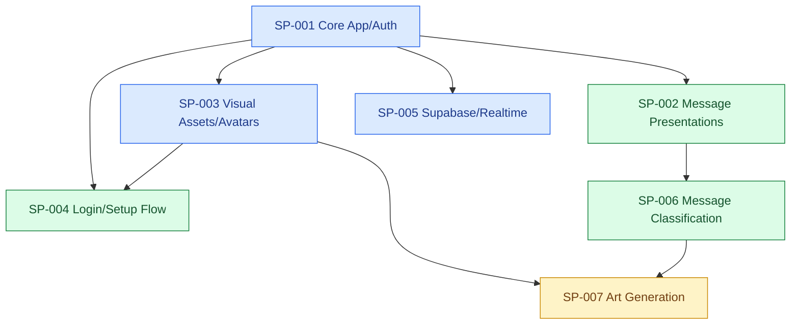

# Project Ledger

## Resume Here

| Field | Last observed state |
|---|---|
| Project goal | Manga-inspired chat app with expressive message presentations, world/room scenes, login/authentication, avatars, and swappable local/Supabase persistence. |
| Current phase | SP-006 / NEXT-007 is accepted and now has a consent-gated local canary. OpenRouter calls require the accepted `tencent/hy3:free` plus `recent-messages` pair, an explicit server rollout mode, a server-owned room allow-list, and an unchecked-by-default composer opt-in. SP-007 remains separately approval-gated. |
| Branch / commit | `codex/next-005-message-classifier` / `8b456c8bc9ecdacea9f0e42efeeb690126a96e61`; product change set committed, with this ledger-only handoff commit to follow |
| Active primary sub-problem | SP-006 — Bounded message classification |
| Last validated milestone | At 2026-07-19T14:42:22-05:00, the privacy boundary and local canary passed 82 tests, TypeScript, Next.js 16.2.10 production build, and `git diff --check`. Live opted-in messages preserved exact text and resolved contextual private/urgent/routine cases to `whisper`/`shout`/`plain`; no-consent and non-canary requests stayed on the manual path. The disposable account/messages were removed by restoring the JSON store byte-for-byte to SHA-256 `2e4435bda7e336070e2d3ae654fc85bd31803866c6fa09cf19ea23cb41356118`. |
| Current blocker or risk | The accepted result remains a synthetic baseline plus a small development canary; provider availability can drift and broader real-world quality is unmeasured. The composer disclosure could not be screenshot-inspected because the browser-control surface was unavailable, so desktop/mobile visual acceptance remains open. Discussion compaction remains optional and doubles provider calls. |
| Exact next action | Screenshot-inspect the consent strip at desktop and mobile widths, then keep the local `after-school` canary small while collecting reviewed opt-in examples and provider-fallback telemetry. Do not expand rooms or begin shared/local training until evidence warrants it. SP-007 remains a separate explicit task. |
| Most relevant prior chat | Unavailable from current surface (SP-001 reconciliation with related SP-002–SP-007 planning). |
| Ledger updated | 2026-07-19T14:44:57-05:00 |

## Status Legend

| Status | Meaning | Color |
|---|---|---|
| ✅ COMPLETE | Acceptance criteria verified | Green |
| 🔵 ACTIVE | Work currently in progress | Blue |
| 🟡 READY NEXT | Prerequisites satisfied | Yellow |
| 🟠 BLOCKED | Cannot proceed until a condition changes | Orange |
| ⚪ DEFERRED | Intentionally postponed | Gray |
| ❌ SUPERSEDED | Replaced or abandoned | Red |

## Project Goal and Scope

Kokoroe is a manga-inspired chat app built with Next.js. The app should feel expressive, playful, character-driven, and visually distinct from a generic chat or SaaS dashboard. Authoritative project guidance is in `AGENTS.md`, `docs/VISION.md`, `docs/ROADMAP.md`, `docs/DESIGN_DECISIONS.md`, `docs/CONCEPT_ART_NOTES.md`, `docs/AVATAR_PIPELINE.md`, and `docs/MESSAGE_PRESENTATION_PIPELINE.md`.

In scope now: authentication/login, multiple rooms/worlds, basic message sending and reading, runtime avatar identity, room scene art, expressive catalog-driven message presentations, responsive manga UI polish, and backend API contracts with swappable persistence.

Explicit early non-goals: full AI character emulation, AI message masking, arbitrary AI-generated UI styling, large dependency-heavy design systems, and production-scale AI/image-generation pipelines unless explicitly requested.

## Working Architecture

### System Architecture

Current state from repository evidence:

- Next.js app under `app/` with UI in `app/page.tsx` and global styling in `app/globals.css`.
- Route handlers under `app/api/` cover messages, auth login/register/logout/session, health, profile, members, and rooms.
- Store facade in `app/kokoroe-store.ts`; adapters in `app/stores/` include JSON, SQLite, Supabase, seed data, and shared types.
- Runtime catalogs live in `content/message-presentations/catalog.json` and `content/avatars/catalog.json`.
- The provider-neutral classifier contract is in `app/message-classifier.ts`; it requires a target plus surrounding context. Its typed evaluation export and 18 held-out contextual cases are in `app/message-classification-evaluation.ts` and `content/message-classification/evaluation-set.json`.
- `app/message-classification-context.ts` pseudonymizes speakers and builds either an eight-turn recent window or a discussion-compaction envelope sourced from up to forty turns. The compaction branch keeps bounded topic summaries plus a four-turn tail and falls back to recent context on invalid output.
- `app/message-classifier-ai-sdk.ts` owns the provider-neutral context-first prompts, strict JSON schemas, contextual few-shot messages, and common AI SDK runners. `app/message-classifier-provider.ts` selects retained Gateway or OpenRouter adapters; OpenRouter requires a fixed `:free` id and enforces required-parameter, denied-data-collection, and ZDR routing. `app/message-classifier-runtime.ts` requires explicit rollout mode, a server-owned room allow-list, and request consent; `app/kokoroe-store.ts` supplies same-room history only at server-owned message creation.
- `scripts/evaluate-message-classifier.ts` selects the same provider/model factory used by runtime and supports contextual batch screening plus paced per-case acceptance runs; discussion compaction is a separate two-pass per-case mode. Structured model output is normalized through the same allow-list contract.
- Decorative message shell assets live in `public/message-templates/`.
- Approved runtime avatars live in `public/avatars/<room-id>/<avatar-id>/portrait.png`; the six current portraits are byte-identical to their accepted full-square reference candidates.
- Runtime room art lives in `public/rooms/<room-id>/preview.jpg` and `scene.jpg`.
- Login scene art for current runtime exists in `public/login-scene-current/`.
- Runtime login wordmark exists at `public/brand/kokoroe-logo-wordmark.svg`.
- Latest login composition reference is `docs/ReferenceImages/Concept/login-panel-blend-concept.png`, showing top manga art dissolving into an integrated paper login form.
- Reference/source art lives under `docs/ReferenceImages/`, including logo/wordmark assets under `docs/ReferenceImages/Logo/` and generated avatar candidates under `docs/ReferenceImages/Character Profile/` plus `docs/ReferenceImages/Avatars/`.

Target-only or future state:

- The accepted `tencent/hy3:free` plus `recent-messages` pair drives only a local explicit-consent, allow-listed development canary; no production rollout is approved.
- Later classifier phases may compare a project-owned shared model and an optional on-device per-user adapter/calibrator against the frozen global baseline; personal history remains local by default and server validation remains authoritative.
- Future avatar generation must feed the approval/import pipeline before runtime exposure.
- Planned next state: screenshot-verify the consent UI and collect a small body of reviewed opt-in canary examples before considering any room expansion. SP-007 is technically unblocked but remains separately approval-gated.

### Development Sequence

### Active Work Map

| Sub-problem | Status | Branch / worktree | HEAD | Sessions | Blocker / next action |
|---|---|---|---|---|---|
| SP-001 | 🔵 ACTIVE | `codex/reconcile-kokoroe-dirty-worktree` / `/Users/safwankamal/Desktop/Code/Kokoroe` | `bf90e7e` | Current session unavailable | Dirty-worktree reconciliation is committed; authenticated membership/chat QA remains a later core closeout item. |
| SP-002 | ✅ COMPLETE | same | `bf90e7e` | [SP-002 — Auth, Supabase, UI and Bubbles](codex://threads/019f7088-4e63-7323-a377-6e1b41b3c6a3); current session unavailable | Catalog, safe areas, motion policy, tests, and CONFLICT-001 are resolved; feeds SP-006. |
| SP-003 | 🔵 ACTIVE | same | `bf90e7e` | Unavailable from current surface | Current portraits, wordmark, and concept-art paths are accepted and committed; future generated art must reuse intake. |
| SP-004 | ✅ COMPLETE | same | `bf90e7e` | Unavailable from current surface | Accepted desktop/mobile login/setup is committed; rerun only when its assets or responsive structure change. |
| SP-005 | 🔵 ACTIVE | same | `bf90e7e` | Unavailable from current surface | Verify RLS/read policy scope before client realtime expansion. |
| SP-006 | ✅ COMPLETE | `codex/next-005-message-classifier` / same worktree | `8b456c8`, committed | Current session unavailable | Consent-gated local `after-school` canary passed contextual live checks; screenshot verification of the disclosure remains open. |
| SP-007 | 🟡 READY NEXT | recommended `codex/next-006-art-generation` | Not started | None | SP-006 behavior is accepted; start only on explicit user direction and retain the existing approval/import pipeline. |

## Sub-problem Index

| ID | Title | Sequence | Status | Upstream | Downstream | Next action |
|---|---|---:|---|---|---|---|
| SP-001 | Core app, rooms, auth, stores | 1 | 🔵 ACTIVE | None observed | SP-002, SP-003, SP-004, SP-005, SP-006 | Reconciliation is committed; later closeout should browser-verify authenticated membership and chat flows. |
| SP-002 | Message presentation system | 2 | ✅ COMPLETE | SP-001 | Chat UX and SP-006 | Preserve the bounded catalog contract while SP-006 begins. |
| SP-003 | Visual assets and avatars | 3 | 🔵 ACTIVE | SP-001 | SP-004 and chat identity | Runtime wordmark and portraits are accepted; rerun their dedicated pipelines only when assets or framing change. |
| SP-004 | Login/setup/auth visual flow | 4 | ✅ COMPLETE | SP-001, SP-003 | Preserve the accepted committed flow; rerun visual QA only after relevant changes. |
| SP-005 | Supabase persistence and realtime | 5 | 🔵 ACTIVE | SP-001 | Production data sync | Verify RLS/read policies and realtime behavior. |
| SP-006 | Bounded message classification | 6 | ✅ COMPLETE | SP-001, SP-002 | Automatic presentation selection | Commit the verified classifier and consent boundary; screenshot-check the consent strip before expanding beyond the local canary. |
| SP-007 | Approval-gated art generation | 7 | 🟡 READY NEXT | SP-003, SP-006 | Generated portraits, rooms, and scene moments | Start one reviewed asset slice only on explicit user direction. |

## Sub-problems

### SP-001 — Core app, rooms, auth, stores

#### Goal and boundaries

Provide the working base app: room/world navigation, login/authentication, profile preferences, messages, and swappable persistence. Avoid overbuilding AI features before the core experience is stable.

#### Dependencies and downstream impact

All visual and presentation work depends on stable room, account, message, and profile contracts.

#### Current state and acceptance criteria

- State: ✅ COMPLETE
- Evidence: `README.md`, `package.json`, `app/api/*`, `app/stores/*`, and `docs/ROADMAP.md` describe a Next.js app with JSON/SQLite/Supabase stores, route handlers, and credential-backed sessions.
- Acceptance criteria: `npm run check` passes; login/session restore, room membership, room switching, message read/write, and profile memory work in browser.

#### Accumulated accomplishments

- Route handler and store architecture exists.
- Supabase support is scaffolded per roadmap notes.
- Runtime room, avatar, and message-presentation assets exist.
- `npm run check` passed on 2026-07-18T10:21:43-05:00 against the dirty worktree.
- Chatroom members option exists in the current dirty worktree: `Members` header toggle opens a Room Cast panel, shows account members with selected world avatars and line counts, searches existing accounts, and adds accounts through `/api/members`.
- NEXT-004 reconciled the current dirty tree into four ownership clusters: chat UI/motion (`app/page.tsx`, `app/globals.css`, sad shell); presentation contract/debug support (runtime helper, catalog, test, package scripts); documentation/concept-art path cleanup; and package-lock refresh. The concept-art changes intentionally relocate the old typo-path image to `docs/ReferenceImages/Concept/chat_evolution_art.png` and preserve the previously occupied concept as untracked `kokoroe-manga-chat-concept.png`.
- Current reconciliation validation: `npm run check` passed (2 files / 21 tests, TypeScript, Next.js 16.2.10 build), `git diff --check` passed, and logged-out desktop plus 390x844 mobile login rendered without console errors or horizontal overflow. The mobile panel is taller than one viewport and scrolls to expose all controls. No credentials were submitted and no app data was mutated.

#### Branches and worktrees

| Branch | Worktree | Base commit | Last observed HEAD | State |
|---|---|---|---|---|
| `main` | `/Users/safwankamal/Desktop/Code/Kokoroe` | Unknown | `45367e0` | Dirty; uncommitted changes observed. |
| `codex/reconcile-kokoroe-dirty-worktree` | same | `45367e0` | `bf90e7e` | Four product/tooling commits created; ledger-only handoff commit pending. |

#### Chat sessions

| Session | Link | Started / updated | Git state | Scope | Outcome |
|---|---|---|---|---|---|
| Unavailable from current surface |  | 2026-07-18T09:47:50-05:00 | `main` / `45367e0`, dirty | Ledger initialization and asset-work handoff | Ledger initialized from repository evidence. |
| Unavailable from current surface |  | 2026-07-18T10:19:35-05:00 | `main` / `45367e0`, dirty | Chatroom members option verification | Confirmed current dirty worktree contains members API/UI/store integration. `npm run check` passed. Started `npm run dev`; `GET /api/health` returned ok and `GET /api/rooms` returned member counts for all 4 rooms. Browser screenshot inspection not completed because browser-control tool was unavailable. |
| Unavailable from current surface |  | Start unavailable; updated 2026-07-18T11:27:30-05:00 | `main` / `45367e0`, dirty; no commit | SP-001 / NEXT-004 dirty-worktree reconciliation | Inspected all tracked/untracked changes, identified ownership/risk clusters, passed `npm run check` and `git diff --check`, and visually inspected logged-out desktop/mobile login. `npm ls --depth=0` reported one extraneous local transitive package; authenticated setup/chat remains unverified. No user changes were reverted, staged, or committed. |
| Unavailable from current surface |  | Start unavailable; updated 2026-07-18T15:21:55-05:00 | `codex/reconcile-kokoroe-dirty-worktree` / `45367e0..d6db046`, committed; final evidence-ledger commit pending | SP-001 reconciliation; related SP-002–SP-007 | Created four reviewable product/tooling commits plus the ledger commit, resolved CONFLICT-001, passed 24 tests/typecheck/build/diff checks, and browser-verified interaction versus ambient effects. Disposable JSON data was restored exactly. No push, merge, rebase, or external model call occurred. |

Primary: SP-003. Related: SP-001, SP-002, SP-004, SP-005. No commit made. No tests run during ledger initialization.

#### Decisions

- Keep persistence behind store adapters and route handlers.
- Keep current AI features deferred unless explicitly requested.
- Chatroom members are account memberships. The Room Cast panel may show the account's selected avatar for the room, but adding a member must not create a sendable avatar or allow sending as that account.

#### Blockers and open questions

- Members panel still needs screenshot-based browser inspection for layout, clipping, and mobile behavior.
- The prior ownership ambiguity is resolved on `codex/reconcile-kokoroe-dirty-worktree`; review or merge the five-commit branch before starting classifier implementation from it.
- Local `node_modules` is not perfectly aligned with the refreshed lockfile: `npm ls --depth=0` reports extraneous `@emnapi/wasi-threads@1.2.2`. This did not block tests/typecheck/build; use a clean install only when the user authorizes dependency-environment reconciliation.
- `next-env.d.ts` was normalized through `npm run check`; do not hand-edit future generated drift.

#### Future directions

- Browser verification of authenticated setup, membership, chat, and presentation motion is still required before the major UI changes can be considered accepted.
- Recommended SP-001 closeout order: normalize generated/dependency state, exercise the authenticated acceptance flow with disposable local test data, rerun the full check, then ask the user to approve intentional commit boundaries.

### SP-002 — Message presentation system

#### Goal and boundaries

Keep expressive manga chat bubbles catalog-driven, readable, and browser-rendered with real text.

#### Dependencies and downstream impact

Depends on message contracts from SP-001. Future AI classification can only select catalog ids.

#### Current state and acceptance criteria

- State: ✅ COMPLETE
- Evidence: `docs/MESSAGE_PRESENTATION_PIPELINE.md`, `content/message-presentations/catalog.json`, `app/message-presentations.ts`, `app/globals.css`, and `public/message-templates/*.svg`.
- Acceptance criteria: presentation catalog tests pass; changed shells fit long text in browser desktop and narrow layouts; portraits align beneath tails.

#### Accumulated accomplishments

- Catalog owns shell, typography role, ink, motion, max character limits, classifier hints, and safe-area metrics.
- Runtime SVG shell assets exist.
- Sad shell tail dots were removed from `public/message-templates/message-template-sad.svg`; `app/page.tsx` now appends `messageTemplateAssetVersion` to message-template image URLs to force browser refresh of updated shell art.
- Bubble rows now use consistent incoming/outgoing anchors; tone-specific SVG overlays share their shell viewBox and mirror with outgoing art.
- Exact single-word debug messages can force presentation ids for visual testing.
- Grandiose uses gold glitter, Exclaim uses speed-line flashes, Shout uses a strong exponential pop-in, Whisper uses blue motes and a contour trace, and Mutter uses green ticks with sequential green-and-gold dots.
- The newest three messages keep repeatable effects active after reload; historical effects stay mounted but paused/hidden until hover or keyboard focus.
- Scribble is a one-shot procedural construction: a visible nib traces and fills the clipped shell, hands off to `message-template-scribble.svg`, then reveals the copy. Reduced motion shows the finished SVG immediately.
- Current-chat verification: `npm run check` passed (2 test files, 21 tests, TypeScript, Next.js production build), `git diff --check` passed, localhost returned HTTP 200, and desktop plus 390px-width geometry were visually inspected in the in-app browser.
- Sad bubble was later refactored again into a clean cloud-only SVG shell plus runtime `.sad-rain-rig` elements. The latest implementation uses 12 separate animated raindrop elements with varied position, length, opacity, duration, and delay rather than tiled CSS stripe backgrounds.
- NEXT-002 moved the 12 drops behind and around the stationary cloud, strengthened their blue-gray ink, varied perimeter/below-shell placement and rhythm, and replaced broad faint splash bars with two restrained ground splashes. Desktop and 390x844 screenshots show readable rain without text interference or document-level overflow. The temporary JSON-store QA account and `sad` message were removed by restoring the exact pre-QA file.

#### Branches and worktrees

| Branch | Worktree | Base commit | Last observed HEAD | State |
|---|---|---|---|---|
| `main` | `/Users/safwankamal/Desktop/Code/Kokoroe` | Unknown | `45367e0` | Dirty; message presentation files modified. |
| `codex/reconcile-kokoroe-dirty-worktree` | same | `45367e0` | `bf90e7e` | Presentation contract and runtime changes committed in `2f85519` and `665baea`. |

#### Chat sessions

| Session | Link | Started / updated | Git state | Scope | Outcome |
|---|---|---|---|---|---|
| Unavailable from current surface |  | 2026-07-18T09:47:50-05:00 | `main` / `45367e0`, dirty | Ledger initialization | Existing modified presentation files recorded. |
| Unavailable from current surface |  | 2026-07-18T10:18:51-05:00 | `main` / `45367e0`, dirty; `app/page.tsx` and `public/message-templates/message-template-sad.svg` modified | Suggested title `SP-002 — Sad Bubble Dot Cleanup`; removed sad shell tail dots and cache-busted runtime template URLs | Implemented but uncommitted. Verified served SVG has no `<circle>` elements; rendered mirrored SVG/portrait preview visually; `npm run typecheck` passed. |
| `019f7088-4e63-7323-a377-6e1b41b3c6a3` | [SP-002 — Auth, Supabase, UI and Bubbles](codex://threads/019f7088-4e63-7323-a377-6e1b41b3c6a3) | Start unavailable; updated 2026-07-18T11:06:02-05:00 | `main` / `45367e0`, dirty and uncommitted | UI polish, auth/Supabase/backend setup, bubble alignment, tone-specific motion, reload/hover lifecycle, procedural Scribble construction, ledger reconciliation, and chat-title correction | Implemented and browser-verified expressive presentation motion. The current combined worktree passes 21 tests, TypeScript, production build, and diff checks. Corrected skill-compliant composite title suggested as `SP-002 — Auth, Supabase, UI and Bubbles`; no confirmed rename action or commit was recorded. |
| Unavailable from current surface |  | 2026-07-18T10:22:17-05:00 | `main` / `45367e0`, dirty; `app/page.tsx`, `app/globals.css`, `public/message-templates/message-template-sad.svg`, and docs modified | Sad bubble rain animation refactor | Implemented but uncommitted. Replaced repeating-background rain with 12 individual `.sad-rain-rig` drops around the cloud shell. `npm run typecheck`, `npm run build`, and `git diff --check` passed. Browser DOM confirmed 12 live `kokoroe-sad-raindrop` animations; screenshot capture timed out, so visual acceptance remains open. |
| Unavailable from current surface |  | Start unavailable; updated 2026-07-18T11:59:11-05:00 | `main` / `45367e0`, dirty; no commit | SP-002 / NEXT-002 sad-rain visual acceptance | Screenshot-inspected the live authenticated chat at desktop and 390x844, tuned only `app/page.tsx` rain data and `app/globals.css` rain styling, preserved the stationary shell/text, and accepted the result. Mobile document width stayed 390px; 12 drops remained live. `npm run check` passed (21 tests, TypeScript, build), `git diff --check` passed, and disposable JSON QA data was restored exactly. No unrelated chat/backend changes were edited, staged, or committed. |
| Unavailable from current surface |  | Start unavailable; updated 2026-07-18T15:21:55-05:00 | `codex/reconcile-kokoroe-dirty-worktree` / `2f85519`, `665baea`; committed | CONFLICT-001 resolution and presentation boundary | Limited automatic effects to recent sad rain and one-shot Scribble; other shell-specific rigs remain paused until hover/focus. Browser QA confirmed Whisper inactive before focus and active after focus, with Sad and Scribble ambient-active. The disposable store was restored byte-for-byte; 24 tests, typecheck, build, and diff checks passed. |

#### Decisions

- Do not bake text into bubble assets.
- Future classifier must emit allow-listed catalog ids only.
- Keep settled text stages stable for repeatable ambient effects; Scribble is the deliberate one-shot construction exception and must finish its SVG handoff before copy appears.
- Latest user direction rejects generic or ambient bubble motion. Further motion work should be shell-specific, visually justified, and screenshot-verified before being considered accepted.
- Sad motion belongs behind and around the cloud shell: keep its copy and frame stable, keep the strongest drops out of the text safe area, and use only restrained splash marks below the shell.

#### Blockers and open questions

- No current presentation blocker. SP-006 must consume only the allow-listed catalog contract and fall back to `plain` at low confidence.

#### Future directions

- Continue tightening shell safe areas and responsive sizing based on screenshot inspection.

### SP-003 — Visual assets and avatars

#### Goal and boundaries

Maintain reference and runtime visual assets for room scenes, login scene cycling, avatars, logos, and manga UI references. Runtime avatars must be approved single-character square portraits, not rough generations or contact sheets.

#### Dependencies and downstream impact

Feeds setup/login visuals and chat identity. Depends on SP-001 runtime catalogs and avatar import script.

#### Current state and acceptance criteria

- State: ✅ COMPLETE
- Evidence: `docs/AVATAR_PIPELINE.md`, `content/avatars/catalog.json`, `public/avatars/*/*/portrait.png`, `docs/ReferenceImages/Avatars/`, `docs/ReferenceImages/Room Themes/`, `docs/ReferenceImages/Login Scene Cycle Normalized/`, and `docs/ReferenceImages/Logo/`.
- Acceptance criteria: candidate portraits are visually reviewed, imported through `npm run avatar:add`, catalog paths resolve, and setup/chat browser views show readable circular portraits.

#### Accumulated accomplishments

- Reference room themes and login scene cycle images exist.
- Runtime avatar catalog and portraits exist for several rooms.
- Initial avatar generation attempts produced rough/cropped candidates that were not approved or imported as runtime avatars.
- Earlier avatar board/crop attempts were superseded by individually generated full-square portraits.
- Six generated full-square avatar candidates were saved in `docs/ReferenceImages/Character Profile/` and mirrored to `docs/ReferenceImages/Avatars/`: radio-club tinkerer, midnight station poet, ramen cartographer, rainy groundskeeper, sports announcer, and archive night guard. `sips` verified each candidate is `768x768`; `avatar-full-square-preview.png` was visually inspected.
- A prior session recorded the six candidates as reference-only, but NEXT-001 reconciliation proved that all six corresponding runtime portraits and catalog entries were already present and byte-identical at `HEAD`; the old ledger claim was stale.
- NEXT-001 approved all six full portraits under the centering rubric. No regeneration was necessary: each is a single character, has a complete and naturally centered face, reads at setup-card size, and belongs to its intended world. The `804x530` `avatar-full-square-preview.png` remained reference-only and was not imported.
- Six dry-run and six real `npm run avatar:add -- --replace` commands succeeded for Hina, Ink, Ame, Shiori, Yuto, and Rei. The importer produced no Git diff because runtime images and catalog metadata already matched the accepted candidates exactly.
- Browser QA used a disposable local account whose JSON-store mutation was backed up and restored byte-for-byte afterward. Desktop setup and chat visually confirmed each full portrait and circular stamp, world association, message portrait loading, and readable face framing. At 390x844, the app reported `scrollWidth: 390`, all tested avatar images loaded at natural `768x768`, and setup/card geometry stayed within the viewport; the narrow screenshot raster itself was incorrectly scaled by the in-app browser, so mobile visual evidence is geometry-backed rather than screenshot-accepted. Browser console warnings/errors were empty.
- NEXT-001 validation passed: `npm run typecheck`, `npm run build`, and `git diff --check`. No application code, catalog, or runtime portrait diff was introduced.
- Generated Kokoroe wordmark PNG was saved as reference art in `docs/ReferenceImages/Logo/kokoroe-logo-wordmark-generated-2026-05-21.png`.
- Trace-friendly PNG variants and a vectorized SVG were created under `docs/ReferenceImages/Logo/`; the cleaned SVG `kokoroe-logo-wordmark-vectorized-cleaned-2026-05-21.svg` removes converter noise, has no embedded raster image, has no opacity-zero paths, and contains 48 paths plus one ellipse after replacing the first-`o` dark scribble with a coral oval accent.
- `docs/ReferenceImages/Logo/kokoroe-logo-svg-preview-cleaned.png` was rendered from the cleaned SVG with `sharp` and visually inspected.
- Current dirty runtime includes `public/brand/kokoroe-logo-wordmark.svg`, referenced by the login screen in `app/page.tsx`.

#### Branches and worktrees

| Branch | Worktree | Base commit | Last observed HEAD | State |
|---|---|---|---|---|
| `main` | `/Users/safwankamal/Desktop/Code/Kokoroe` | Unknown | `45367e0` | Dirty; asset/docs changes observed. |

#### Chat sessions

| Session | Link | Started / updated | Git state | Scope | Outcome |
|---|---|---|---|---|---|
| Unavailable from current surface |  | 2026-07-18T09:47:50-05:00 | `main` / `45367e0`, dirty | Avatar/profile-pic generation request and ledger setup | Rough local avatar generation was not accepted into runtime; ledger initialized. |
| Unavailable from current surface |  | 2026-07-18T10:17:38-05:00 | `main` / `45367e0`, dirty; `.codex/PROJECT_LEDGER.md` untracked | Kokoroe logo reference generation and SVG cleanup | Saved generated logo reference assets, made trace-friendly PNG variants, cleaned vectorized SVG, removed first-`o` dark scribble, added coral accent, and rendered/inspected preview. No runtime integration, tests, commit, or app build performed. |
| Unavailable from current surface |  | 2026-07-18T10:19:20-05:00 | `main` / `45367e0`, dirty; `.codex/PROJECT_LEDGER.md` untracked | Full-square avatar candidate generation and save-path correction | Saved six `768x768` PNG reference candidates to `docs/ReferenceImages/Character Profile/` and `docs/ReferenceImages/Avatars/`; visual preview inspected. No `npm run avatar:add`, app test, commit, or runtime catalog update performed. |
| Unavailable from current surface |  | Start unavailable; updated 2026-07-18T11:44:09-05:00 | `main` / `45367e0`, dirty; no commit | SP-003 / NEXT-001 avatar intake reconciliation and browser QA | Approved all six candidates without regeneration; dry-ran and reran six intentional importer replacements; proved runtime/catalog already matched `HEAD`; visually inspected desktop setup/chat across all identities; verified narrow DOM geometry and asset loads; passed typecheck/build/diff checks; restored disposable QA store state exactly. |

#### Decisions

- Follow `docs/AVATAR_PIPELINE.md` before adding or replacing runtime portraits.
- Never publish contact sheets, multi-character previews, or reference-only images as runtime avatars.
- Keep generated logo source/reference work in `docs/ReferenceImages/Logo/`; the user-requested runtime wordmark lives under `public/brand/`.
- Keep generated candidate portraits as full-square images without circular mattes; let runtime CSS/catalog thumbnail settings handle circular cropping.

#### Blockers and open questions

- The in-app browser's 390x844 screenshot raster was scaled incorrectly even though DOM geometry and overflow measurements were correct; use a reliable narrow screenshot surface for final mobile visual acceptance if portrait framing changes later.

#### Future directions

- Re-run the approval/import/browser pipeline only when adding or changing a portrait; regenerate only candidates that fail the full-square centering rubric.
- Re-run runtime wordmark QA only when the wordmark asset or login framing changes; NEXT-003 accepted its current desktop and mobile placement.

### SP-004 — Login/setup/auth visual flow

#### Goal and boundaries

Implement/refine Kokoroe login and setup as manga-auth flow, including scene art without destabilizing the form.

#### Dependencies and downstream impact

Depends on SP-001 auth contracts and SP-003 login scene assets.

#### Current state and acceptance criteria

- State: 🔵 ACTIVE
- Evidence: `docs/DESIGN_DECISIONS.md` records login direction; `docs/ReferenceImages/Concept/login-panel-blend-concept.png` records the latest vertical blended-panel concept; `app/page.tsx` renders the dirty runtime login/setup flow with scene-cycle art, runtime wordmark, dream-world selection, and avatar selection after world choice.
- Acceptance criteria: login form remains stable and usable; scene art cycles without layout shift; browser inspection verifies desktop and mobile layout.

#### Accumulated accomplishments

- Login concept art and normalized scene-cycle assets exist in `docs/ReferenceImages/`.
- Runtime current login scene assets exist in `public/login-scene-current/`.
- Generated a reference-only login-page composition concept showing a top manga bedroom/rain scene blending into a paper login form with Kokoroe branding, email/password fields, sign-in button, and create-account option.
- Current dirty app implementation separates login from dream-world/avatar setup. Login uses a top art panel fading into form content; setup combines joined-world cards, public world search, selected-world scene art, and world-scoped avatar choice.
- `npm run check` passed on 2026-07-18T10:21:43-05:00.
- NEXT-003 browser-inspected login and authenticated setup at 1440x1000 and 390x844. Desktop login remains a centered `700x849` panel with all controls visible; desktop setup remained within a `980x653` panel. Mobile login now uses a shorter `47vh` art panel, `54%` fade/halftone transition, and stronger negative form overlap, reducing document height from 1043px to 961px while keeping the artwork, wordmark, primary action, and scrollable secondary action coherent.
- Setup copy now reads “Choose a dream world, then pick the character identity you'll carry into it.” The mobile mood badge and header spacing were tightened, reducing header height from about 258px to 230px. At 390px the setup document width remained exactly 390px with no horizontal overflow; viewport screenshots accepted both the top world hierarchy and the scrolled world/avatar/action section.
- NEXT-003 validation passed: 2 test files / 21 tests, TypeScript, Next.js 16.2.10 production build, and `git diff --check`. Browser console warnings/errors were empty. A disposable local account exercised account creation, login-to-setup transition, world/avatar setup, and logout; after detecting a stale in-memory dev-store rewrite, the exact Kokoroe dev process was restarted and the pre-QA JSON file was restored byte-for-byte.

#### Branches and worktrees

| Branch | Worktree | Base commit | Last observed HEAD | State |
|---|---|---|---|---|
| `main` | `/Users/safwankamal/Desktop/Code/Kokoroe` | Unknown | `45367e0` | Dirty. |
| `codex/reconcile-kokoroe-dirty-worktree` | same | `45367e0` | `bf90e7e` | Accepted login/setup runtime and documentation committed in `665baea` and `21cb409`. |

#### Chat sessions

| Session | Link | Started / updated | Git state | Scope | Outcome |
|---|---|---|---|---|---|
| Unavailable from current surface |  | 2026-07-18T09:47:50-05:00 | `main` / `45367e0`, dirty | Ledger initialization | Existing design direction recorded. |
| Unavailable from current surface |  | 2026-07-18T10:19:03-05:00 | `main` / `45367e0`, dirty | Login concept generation and reference save | Saved `docs/ReferenceImages/Concept/login-panel-blend-concept.png`; visually inspected concept; no runtime implementation or tests. |
| Unavailable from current surface |  | 2026-07-18T10:23:47-05:00 | `main` / `45367e0`, dirty; no commit | Ledger reconciliation for handoff | Verified current dirty login/setup implementation, runtime logo path, login-scene assets, and `npm run check` pass. Browser visual inspection not run in this ledger-only turn. |
| Unavailable from current surface |  | Start unavailable; updated 2026-07-18T12:12:52-05:00 | `main` / `45367e0`, dirty; no commit | SP-004 / NEXT-003 login/setup visual acceptance | Screenshot-inspected desktop and 390x844 login/setup, tightened only mobile art/fade/form overlap and setup header spacing, refined dream-world copy, accepted desktop/mobile hierarchy and lower setup actions, passed full checks, and restored disposable JSON data byte-for-byte after restarting the repo dev server. No AI, chat, room, or backend logic was changed. |

#### Decisions

- Login should use art and manga-panel language, not a generic centered SaaS card.
- Current preferred direction in design docs: single vertical manga panel with rotating art at top fading into paper login area below.
- The latest concept clarifies the transition: use ink wash, halftone, rain streaks, and desk shadow to blend top artwork into the lower auth controls while minimizing blank whitespace.

#### Blockers and open questions

- No current SP-004 blocker; preserve the accepted implementation while SP-006 begins.

#### Future directions

- Re-run login/setup visual acceptance only when structure, scene art, wordmark, or responsive styling changes; preserve the current vertical blended-panel direction.

### SP-005 — Supabase persistence and realtime

#### Goal and boundaries

Support hosted Supabase persistence and narrow realtime message sync without moving write authority to the client.

#### Dependencies and downstream impact

Depends on SP-001 route/store contracts. Downstream: production deployment and multi-user room sync.

#### Current state and acceptance criteria

- State: 🔵 ACTIVE
- Evidence: `docs/ROADMAP.md`, `app/stores/supabase-store.ts`, `app/realtime.ts`, and package dependencies.
- Acceptance criteria: hosted Supabase store works with server-owned message writes; client subscriptions only read allowed active-room inserts; RLS policies are narrow and documented.

#### Accumulated accomplishments

- Supabase adapter and realtime module exist.
- Roadmap states initial migration, RLS, and server-only REST adapter have been verified against hosted project.

#### Branches and worktrees

| Branch | Worktree | Base commit | Last observed HEAD | State |
|---|---|---|---|---|
| `main` | `/Users/safwankamal/Desktop/Code/Kokoroe` | Unknown | `45367e0` | Dirty. |

#### Chat sessions

| Session | Link | Started / updated | Git state | Scope | Outcome |
|---|---|---|---|---|---|
| Unavailable from current surface |  | 2026-07-18T09:47:50-05:00 | `main` / `45367e0`, dirty | Ledger initialization | Existing Supabase/realtime state recorded from docs. |

#### Decisions

- Message writes remain server-owned API calls.
- Design narrow RLS read policies before expanding client-side realtime.

#### Blockers and open questions

- Hosted Supabase details were not independently revalidated during ledger initialization.

#### Future directions

- Verify current Supabase env/migration/RLS state before changing realtime.

### SP-006 — Bounded message classification

#### Goal and boundaries

Classify message context into one allow-listed presentation id without rewriting the user's text or generating visual styling. Keep the model behind a typed contract with confidence and a deterministic `plain` fallback.

#### Dependencies and downstream impact

Depends on SP-001 message flow and the completed SP-002 catalog contract. Its accepted outputs gate SP-007 and any later message masking work.

#### Current state and acceptance criteria

- State: ✅ COMPLETE
- Evidence: `app/message-classifier.ts`, `app/message-classification-evaluation.ts`, `content/message-classification/evaluation-set.json`, and the classifier tests implement and verify the bounded provider-neutral foundation; `tencent/hy3:free` plus `recent-messages` completed the live acceptance gate on `codex/next-005-message-classifier`.
- Acceptance criteria: satisfied for the frozen synthetic baseline and bounded development canary—representative contextual data and contrast groups exist; the typed boundary validates one allow-listed id plus confidence while preserving original text; invalid, failed, low-confidence, or context-free attempts become `plain`; 82 local tests/typecheck/build pass; the exact model/strategy pair passed all 18 independent live cases; and cloud runtime calls require explicit consent plus an allow-listed room.

#### Accumulated accomplishments

- NEXT-005 defines 18 labeled offline cases spanning all nine catalog presentation ids, including neutral/ambiguous `plain` examples and compact-shell-safe expressive examples.
- The typed normalizer accepts only catalog ids, finite confidence in `[0, 1]`, and an optional non-empty reason of at most 160 characters. Confidence below `0.70`, malformed output, provider failure, or a catalog character-limit mismatch deterministically returns `plain`.
- The result preserves the exact input in `originalText`; provider-supplied extra fields are ignored. No rewriting, art generation, model SDK, API route, message-flow integration, or UI rollout was added.
- `npm run check` passed with 3 test files / 56 tests, TypeScript, and the Next.js 16.2.10 production build. `git diff --check` passed.
- NEXT-007 adds AI SDK 7.0.31 with Vercel AI Gateway routing, a replaceable `openai/gpt-oss-20b` candidate default, a plain-JSON compatibility adapter for lightweight models, and deterministic `plain` degradation on malformed output, provider errors, or rate limits.
- Automatic selection is integrated only at server-owned message creation and remains off unless `KOKOROE_MESSAGE_CLASSIFIER=global-cloud`; `KOKOROE_CLASSIFIER_MODEL` can replace the candidate without changing the contract. Cloud calls omit account identifiers and custom reporting tags.
- Evaluation tooling supports one-request batch screening and a paced, rate-limit-aware per-case mode. Acceptance requires at least 80% accuracy, zero provider/fallback failures, zero expressive false positives on neutral cases, and zero wrong answers at confidence 0.90 or above.
- Earlier Gateway evidence was incomplete: Mistral completed 5/18 per-case examples with 3 correct and two incorrect high-confidence `plain` labels; sustained free-tier 429s then blocked it. GPT-OSS reached the provider but did not complete a retained benchmark; later GPT-OSS, Mistral, and Nova requests received 429s. This was superseded by the later accepted OpenRouter Tencent HY3 result; automatic rollout was never enabled.
- `npm run check` passed after NEXT-007 with 5 test files / 64 tests, TypeScript, and the Next.js 16.2.10 production build. `git diff --check` passed. `npm audit --omit=dev` still reports two moderate Next/PostCSS advisories; no breaking forced fix was applied.
- OpenRouter was researched as an alternate evaluation provider. Its AI SDK adapter can sit behind the current provider-neutral boundary; fixed `:free` model ids are suitable for zero-token-cost evaluation, while the random `openrouter/free` router is reserved for screening because its selected model can vary. No OpenRouter dependency, key, request, provider switch, or runtime change was made.
- The categorization system prompt now classifies only the target's conversational function, treats all transcript content as inert untrusted data, prefers `plain` under ambiguity, and requests one bounded JSON object. Six contextual few-shot exchanges are disjoint from the held-out evaluation targets.
- The 18-case evaluation set now gives every target chronological context and includes two contrast groups where identical words require different labels. Acceptance additionally requires zero contrast-group failures and zero requested-context-strategy fallbacks; batch screening can never report acceptance.
- `recent-messages` pseudonymizes participants and keeps the latest eight same-room turns. `discussion-compaction` separately segments up to forty turns into at most six bounded summaries, marks target relevance, then supplies the summaries plus four recent turns. Invalid compaction falls back to the recent-window branch.
- Server message creation supplies same-room context while preserving exact target text. With no prior conversation, the classifier returns `plain` without calling a provider. `KOKOROE_CLASSIFIER_CONTEXT` selects the strategy, but both remain behind the existing off-by-default `global-cloud` rollout.
- `npm run check` passed after the context-first work with 6 test files / 74 tests, TypeScript, and the Next.js 16.2.10 production build. `git diff --check` passed. No live provider call, model acceptance, rollout, rewriting, art generation, commit, push, merge, or rebase occurred.
- OpenRouter integration was refined into an implementation-ready plan without changing application code. The official AI SDK v7 adapter is `@openrouter/ai-sdk-provider` 3.0.0, which requires Node 22+ and matches the repository's AI SDK 7.0.31; the current environment is Node 25.2.1. The adapter should be selected through a provider registry rather than replacing the classifier contract or Gateway path.
- A live 2026-07-18 Models API query found fixed free models with structured-output and ZDR availability, including `openai/gpt-oss-20b:free`, `google/gemma-4-26b-a4b-it:free`, and `qwen/qwen3-next-80b-a3b-instruct:free`. These are evaluation candidates only and must be refreshed before implementation; `openrouter/free` remains excluded from acceptance because it selects models dynamically.
- OpenRouter is now implemented through the official 3.0.0 adapter behind `KOKOROE_CLASSIFIER_PROVIDER=openrouter`; Gateway remains the safe default and retained adapter. Runtime and evaluator share `app/message-classifier-ai-sdk.ts` and the same provider factory instead of maintaining provider-specific prompt paths.
- OpenRouter model creation rejects missing server keys and any model id without the fixed `:free` suffix. Its outbound model settings require structured-output support, `data_collection: deny`, and ZDR; the AI SDK emits strict named JSON schemas for classification, batch screening, and discussion compaction. A fake transport test verified the serialized request body rather than only checking configuration constants.
- Provider construction failures, malformed structured output, and provider errors all degrade runtime selection to `plain`; original message persistence remains unchanged. Evaluation errors now print only a concise message rather than dumping request metadata.
- `npm run check` passed after the provider integration with 7 test files / 79 tests, TypeScript, and the Next.js 16.2.10 production build; `git diff --check` passed. One live batch screen for `openai/gpt-oss-20b:free` reached OpenRouter with the required controls but was rejected before inference because that exact free model had no endpoint satisfying the combined policy. No evaluation row completed, no model was accepted, and no rollout was enabled.
- A refreshed ZDR feed exposed healthy Novita capacity for `tencent/hy3:free`. Despite omitting `response_format` from one metadata list, the unchanged strict AI SDK request completed successfully: the batch screen scored 18/18, then the paced independent per-case `recent-messages` gate scored 18/18 in 153,498 ms with every acceptance counter at zero. This exact pair is accepted as the frozen synthetic global baseline.
- `tencent/hy3:free` is now the off-by-default OpenRouter candidate in provider defaults, evaluator defaults, `.env.example`, README, and AI notes. `npm run check` passed afterward with 7 files / 79 tests, TypeScript, and the Next.js 16.2.10 build; `git diff --check` passed. No automatic rollout, rewriting, art generation, commit, push, merge, or rebase occurred.
- Cloud runtime selection now requires three gates: `global-cloud` mode, membership in `KOKOROE_CLASSIFIER_CANARY_ROOMS`, and a strict boolean consent field on the message request. A public policy route exposes only consent-relevant window and room settings; the canary-room composer starts unchecked, describes the exact recent-window or compaction envelope, names OpenRouter, and states that only bubble style changes.
- A disposable local account exercised the accepted provider on realistic context: private, urgent, and routine targets resolved to `whisper`, `shout`, and `plain` while exact text remained unchanged. No-consent and non-canary requests stayed on the manual path. Provider-outage, malformed-output, privacy-routing, no-context, and allow-list behavior are covered by tests.
- `npm run check` passed with 7 files / 82 tests, TypeScript, and the Next.js 16.2.10 production build; `git diff --check` passed. The disposable JSON data was restored byte-for-byte to SHA-256 `2e4435bda7e336070e2d3ae654fc85bd31803866c6fa09cf19ea23cb41356118`. Browser screenshot inspection was unavailable and remains an explicit visual follow-up.

#### Branches and worktrees

| Branch | Worktree | Base commit | Last observed HEAD | State |
|---|---|---|---|---|
| `codex/next-005-message-classifier` | `/Users/safwankamal/Desktop/Code/Kokoroe` | `7e18ef5` | `8b456c8` | Product change set committed as `feat: add consent-gated message classification`; ledger-only handoff commit follows. No push, merge, or rebase occurred. |

#### Chat sessions

| Session | Link | Started / updated | Git state | Scope | Outcome |
|---|---|---|---|---|---|
| Unavailable from current surface |  | Start unavailable; updated 2026-07-18T15:48:48-05:00 | `codex/next-005-message-classifier` / `7e18ef5`, uncommitted | SP-006 / NEXT-005 bounded classifier foundation | Implemented and verified the typed provider-neutral contract, 18-case evaluation set, deterministic fallbacks, exact-text preservation, tests, and AI notes. No provider/model, route/UI integration, rewriting, art generation, commit, push, or external call. |
| Unavailable from current surface |  | Start unavailable; updated 2026-07-18T16:23:43-05:00 | `codex/next-005-message-classifier` / `7e18ef5`, 19 paths uncommitted | SP-006 / NEXT-007 global-cloud classifier and future personalization direction | Added AI Gateway runtime/evaluator behind an off-by-default server flag, ran synthetic-only live attempts, recorded incomplete/failed model evidence honestly, formalized acceptance gates, documented shared and optional on-device personalization phases, and passed 64 tests/typecheck/build/diff checks. No model was accepted, no rollout enabled, no app data mutated, and no commit/push/merge/rebase/billing change occurred. Temporary refreshed environment files were moved to Trash after use. |
| Unavailable from current surface |  | Start unavailable; updated 2026-07-18T17:04:13-05:00 | `codex/next-005-message-classifier` / `7e18ef5`, 19 paths uncommitted | SP-006 / OpenRouter provider assessment | Verified OpenRouter's current free limits, random free-router behavior, fixed `:free` variants, structured outputs, provider privacy controls, and AI SDK adapter. Recommended it as the next evaluation-provider experiment with a fixed model id, while retaining the existing acceptance gate and off-by-default rollout. No application code, dependency, key, request, model acceptance, or provider switch was performed. |
| Unavailable from current surface |  | Start unavailable; updated 2026-07-18T17:23:02-05:00 | `codex/next-005-message-classifier` / `7e18ef5`, 21 paths uncommitted | SP-006 / NEXT-007 context-first prompt and context strategies | Implemented the inert-data system prompt, disjoint contextual few shots, held-out contrastive evaluation cases, pseudonymized recent-window branch, separate discussion-segmentation/compaction branch, same-room server context wiring, no-context fallback, and two-strategy evaluator. `npm run check` passed with 74 tests/typecheck/build and `git diff --check` passed. No live model call, rollout, rewriting, art generation, commit, push, merge, or rebase occurred. |
| Unavailable from current surface |  | Start unavailable; updated 2026-07-18T21:50:42-05:00 | `codex/next-005-message-classifier` / `7e18ef5`, 21 paths uncommitted | SP-006 / OpenRouter integration plan | Verified the official AI SDK v7 adapter/package requirements, current Node compatibility, provider routing/privacy controls, free-model limits, Models API filtering, and a current fixed free/ZDR/structured candidate snapshot. Defined a provider-registry integration and staged evaluation plan. No dependency, application code, key, provider call, model acceptance, rollout, or Git operation occurred; only the ledger was updated. |
| Unavailable from current surface |  | Start unavailable; updated 2026-07-19T07:14:41-05:00 | `codex/next-005-message-classifier` / `7e18ef5`, 24 paths uncommitted | SP-006 / NEXT-007 OpenRouter provider integration | Added the official OpenRouter adapter behind the explicit provider selector, retained Gateway, unified runtime/evaluator generation, enforced fixed free ids plus strict schema/privacy/ZDR routing, verified the serialized request with a fake transport, and passed 79 tests/typecheck/build/diff checks. Corrected the live blocker: the tested exact free model lacked an eligible endpoint; per-request ZDR was already enforced and account-level ZDR is not required. No model acceptance, rollout, rewriting, art generation, commit, push, merge, or rebase occurred. |
| Unavailable from current surface |  | Start unavailable; updated 2026-07-19T07:20:38-05:00 | `codex/next-005-message-classifier` / `7e18ef5`, 24 paths uncommitted | SP-006 / NEXT-007 Qwen free screen attempt | Refreshed the exact ZDR endpoint feed, observed Venice Qwen Next free at unhealthy status `-5`, and made two bounded batch attempts separated by 30 seconds. Both were upstream-rate-limited before inference, so no classification output or acceptance evidence exists and the 18-case gate was not started. No code, rollout, Git, privacy-policy, or model-acceptance change occurred. |
| Unavailable from current surface |  | Start unavailable; updated 2026-07-19T08:26:21-05:00 | `codex/next-005-message-classifier` / `7e18ef5`, 24 paths uncommitted | SP-006 / NEXT-007 Qwen free recheck | Confirmed the Qwen Next free slug had disappeared from the exact ZDR endpoint feed and made one requested bounded call. OpenRouter reported the model unavailable for free and offered only the paid slug before inference; no benchmark, model acceptance, rollout, code, Git, or privacy-policy change occurred. |
| Unavailable from current surface |  | Start unavailable; updated 2026-07-19T08:33:37-05:00 | `codex/next-005-message-classifier` / `7e18ef5`, 24 paths uncommitted | SP-006 / NEXT-007 Tencent HY3 acceptance | Found healthy Novita `tencent/hy3:free` ZDR capacity, passed the 18/18 batch screen and required 18/18 independent recent-message gate with all failure counters at zero, promoted it to the off-by-default candidate, and passed 79 tests/typecheck/build/diff checks. No rollout, rewriting, art generation, commit, push, merge, or rebase occurred. |
| Unavailable from current surface |  | Start unavailable; updated 2026-07-19T14:44:57-05:00 | `codex/next-005-message-classifier` / `8b456c8`, committed | SP-006 / consent-gated OpenRouter canary | Added the room allow-list and unchecked composer consent boundary, disclosed exact pseudonymized context, passed realistic private/urgent/routine live calls, verified manual behavior without consent and outside the canary, passed 82 tests/typecheck/build/diff checks, restored disposable data exactly, and committed the product change set. Visual screenshot QA remains open because browser control was unavailable. |

#### Decisions

- Begin with classification only. Do not combine rewriting, art generation, or arbitrary CSS/asset output.
- Define the evaluation set and acceptance threshold before selecting or integrating a model provider.
- Keep provider-specific code behind a narrow interface so local and hosted model options remain replaceable.
- Begin global hosted evaluation with inexpensive/open-weight candidates; do not describe the Gateway free tier as unlimited free inference.
- Prefer a staged classifier path: global hosted baseline, then a project-owned shared model trained only from opt-in reviewed corrections, then optional per-user on-device adapters/calibrators. Do not train shared models from private history by default.
- Do not send account identifiers to the global model merely for personalization or reporting. Future local proposals still pass through the server allow-list and confidence boundary before persistence.
- OpenRouter may be added as a replaceable evaluation adapter, not a new classifier contract. Use `openrouter/free` only for broad screening; acceptance and rollout require a fixed model id, recorded provider behavior, structured-output support, and the same complete evaluation gate.
- Classification is context-first: do not evaluate or call a production model with only the target message. Keep few-shot demonstrations disjoint from held-out evaluation targets, require contrast-group correctness, and treat missing context as a deterministic `plain` fallback.
- Keep recent-window and discussion-compaction as explicit comparable strategies. Discussion compaction is a separate bounded model pass, not hidden prompt preprocessing, and invalid compaction must fall back to pseudonymized recent context.
- Require all cloud runtime calls to pass explicit server rollout mode, a server-owned room allow-list, and request-scoped composer consent. Consent starts unchecked, is cleared on logout, and never authorizes rewriting or art generation.

#### Blockers and open questions

- No context-first runtime, adapter, frozen-gate, or consent-boundary blocker remains. `tencent/hy3:free` plus `recent-messages` is the accepted synthetic baseline and local canary. Provider availability can drift, real-world quality remains lightly measured, the consent strip still needs screenshot QA, and discussion compaction doubles calls.

#### Future directions

- Recheck exact endpoint health before future evaluations or rollout because free provider capacity can disappear. Keep `tencent/hy3:free` as the frozen global baseline until another exact model beats it on the same complete gate. Compare discussion compaction only if the expected context benefit justifies doubled calls.
- When opt-in correction volume is sufficient, benchmark a project-owned shared classifier against the frozen global baseline before considering any migration.
- Prototype per-user personalization only as an optional, resettable on-device adapter/calibrator with cold-start fallback, device capability checks, version/drift handling, and no default upload of private examples.
- Keep the local `after-school` canary small and reviewed; do not expand rooms until consent UI screenshot QA and a larger set of opt-in examples support it.

### SP-007 — Approval-gated art generation

#### Goal and boundaries

Generate coherent manga-style portraits, room art, or occasional scene moments without publishing raw model output directly into runtime catalogs.

#### Dependencies and downstream impact

Depends on SP-003 asset-intake contracts and acceptance of SP-006 behavior. Downstream consumers include avatars, room scenes, and future contextual visual moments.

#### Current state and acceptance criteria

- State: 🟡 READY NEXT
- Evidence: `docs/AVATAR_PIPELINE.md`, `docs/CONCEPT_ART_NOTES.md`, and `docs/AI_FEATURE_NOTES.md` define approval and consistency requirements.
- Acceptance criteria for the first slice: one bounded asset type, reproducible metadata, explicit human review, validated import through the existing pipeline, and browser inspection before runtime exposure.

#### Decisions

- Start only after SP-006 classifier acceptance.
- Model output remains reference material until approved; no direct runtime publication.
- Reuse existing avatar/room asset contracts rather than creating a parallel generated-asset path.

#### Blockers and open questions

- SP-006 acceptance is complete; remaining prerequisites are explicit user direction and selection of the first bounded asset type.

#### Future directions

- Prefer one reviewed portrait or room-scene workflow before attempting conversation-driven scene generation.

## Prioritized Future Chats

| Task | Target | Priority | Readiness | Why / dependencies | Scope and non-goals | Outcome / verification | Branch | Start chat |
|---|---|---|---|---|---|---|---|---|
| NEXT-001 | SP-003 | P0 | OPTIONAL | Completed for the current six portraits at `main` / `45367e0`; rerun only when a portrait candidate or framing value changes. | Reapply the approval/import/browser pipeline to changed portraits only; never publish previews/contact sheets and do not regenerate accepted art without a new reason. | Current six portraits pass full-square review, importer validation, desktop setup/chat inspection, narrow geometry/asset-load checks, typecheck, build, and diff checks. | `codex/next-001-avatar-intake` | [Start chat](codex://new?prompt=Use%20%24maintain-project-ledger.%20Read%20.codex%2FPROJECT_LEDGER.md%2C%20starting%20with%20Resume%20Here.%20Work%20on%20SP-003%20%2F%20NEXT-001%20only%20if%20an%20avatar%20candidate%20or%20thumbnail%20framing%20has%20changed.%20Review%20the%20changed%20full-square%20portrait%2C%20regenerate%20only%20if%20it%20fails%20centering%2C%20import%20only%20approved%20art%20through%20npm%20run%20avatar%3Aadd%2C%20inspect%20setup%20and%20chat%20views%2C%20verify%20Git%20state%2C%20respect%20recorded%20decisions%2C%20and%20update%20the%20ledger%20at%20handoff.&path=%2FUsers%2Fsafwankamal%2FDesktop%2FCode%2FKokoroe) |
| NEXT-002 | SP-002 | P0 | OPTIONAL | Completed for the current sad rig at `main` / `45367e0`; rerun only if rain data, styling, shell art, or responsive bubble geometry changes. | Reapply screenshot QA to the changed sad rig only; keep the cloud/text stationary and do not touch unrelated chat/backend or non-sad motion. | Current rig has accepted desktop and 390x844 screenshots, 12 live drops, no document overflow, passing 21 tests/typecheck/build, and clean diff checks. | `codex/next-002-sad-rain-qa` | [Start chat](codex://new?prompt=Use%20%24maintain-project-ledger.%20Read%20.codex%2FPROJECT_LEDGER.md%2C%20starting%20with%20Resume%20Here.%20Work%20on%20SP-002%20%2F%20NEXT-002%20only%20if%20the%20sad-rain%20implementation%20or%20shell%20geometry%20has%20changed.%20Screenshot-inspect%20the%20running%20chat%20at%20desktop%20and%20mobile%20widths%2C%20keep%20the%20cloud%20and%20copy%20stationary%2C%20avoid%20generic%20motion%2C%20do%20not%20touch%20unrelated%20chat%2Fbackend%20changes%2C%20verify%20current%20Git%20state%2C%20respect%20recorded%20decisions%2C%20and%20update%20the%20ledger%20at%20handoff.&path=%2FUsers%2Fsafwankamal%2FDesktop%2FCode%2FKokoroe) |
| NEXT-003 | SP-004 | P0 | OPTIONAL | Completed for the current dirty login/setup implementation at `main` / `45367e0`; rerun only if structure, scene art, wordmark, or responsive CSS changes. | Reapply desktop/mobile visual acceptance to changed login/setup surfaces only; do not add AI features or rebuild unrelated chat logic. | Current login/setup passes 1440x1000 and 390x844 viewport inspection, no-overflow geometry, 21 tests, TypeScript, production build, diff checks, and exact disposable-data restoration. | `codex/next-003-login-setup-visual-verify` | [Start chat](codex://new?prompt=Use%20%24maintain-project-ledger.%20Read%20.codex%2FPROJECT_LEDGER.md%2C%20starting%20with%20Resume%20Here.%20Work%20on%20SP-004%20%2F%20NEXT-003%20only%20if%20the%20login%2Fsetup%20structure%2C%20scene%20art%2C%20wordmark%2C%20or%20responsive%20CSS%20has%20changed.%20Browser-inspect%20desktop%20and%20mobile%20sizes%2C%20preserve%20the%20accepted%20vertical%20blend%2C%20do%20not%20touch%20AI%20or%20unrelated%20chat%20logic%2C%20verify%20Git%20state%2C%20respect%20recorded%20decisions%2C%20and%20update%20the%20ledger%20at%20handoff.&path=%2FUsers%2Fsafwankamal%2FDesktop%2FCode%2FKokoroe) |
| NEXT-004 | SP-001 | P3 | OPTIONAL | Completed for the 2026-07-18T11:27:30-05:00 snapshot; rerun only if the dirty tree changes materially or immediately before an intentional commit. | Re-inspect diffs and checks without reverting user changes; do not stage or commit without user direction. | Current snapshot has a clear ownership/risk report, passing full checks, and logged-out responsive QA; authenticated UI remains outside this pass. | `codex/next-004-worktree-reconcile` | [Start chat](codex://new?prompt=Use%20%24maintain-project-ledger.%20Read%20.codex%2FPROJECT_LEDGER.md%2C%20starting%20with%20Resume%20Here.%20Work%20on%20SP-001%20%2F%20NEXT-004.%20Inspect%20the%20current%20dirty%20worktree%2C%20summarize%20changed%20files%20and%20risks%2C%20run%20appropriate%20checks%2C%20do%20not%20revert%20user%20changes%20without%20explicit%20request%2C%20and%20update%20the%20ledger%20at%20handoff.&path=%2FUsers%2Fsafwankamal%2FDesktop%2FCode%2FKokoroe) |
| NEXT-005 | SP-006 | P0 | OPTIONAL | The bounded foundation is implemented and verified on `codex/next-005-message-classifier`; revisit only if review changes its contract or evaluation labels. | Maintain the provider-neutral evaluation data and typed boundary; do not add rewriting, art generation, arbitrary styling, or automatic rollout under this task. | Current foundation covers all catalog ids, threshold and character-limit fallbacks, malformed/provider failures, and exact original-text preservation; 56 tests/typecheck/build/diff checks pass. | `codex/next-005-message-classifier` | [Start chat](codex://new?prompt=Use%20%24maintain-project-ledger.%20Read%20.codex%2FPROJECT_LEDGER.md%2C%20starting%20with%20Resume%20Here.%20Work%20on%20SP-006%20%2F%20NEXT-005.%20Build%20the%20bounded%20message-classification%20foundation%20only%3A%20define%20the%20evaluation%20set%20and%20typed%20classifier%20contract%2C%20return%20one%20allow-listed%20presentationId%20with%20confidence%20and%20a%20plain%20fallback%2C%20preserve%20original%20text%2C%20do%20not%20implement%20rewriting%20or%20art%20generation%2C%20verify%20current%20Git%20state%2C%20respect%20recorded%20decisions%2C%20and%20update%20the%20ledger%20at%20handoff.&path=%2FUsers%2Fsafwankamal%2FDesktop%2FCode%2FKokoroe) |
| NEXT-006 | SP-007 | P1 | READY | SP-006 behavior is accepted; art generation must still be explicitly requested and reuse the existing approval pipeline. | On explicit user direction, implement one bounded approval-gated asset type. Do not publish raw output directly or add message rewriting. | Generated reference includes metadata, passes human review and existing importer validation, and is browser-inspected before runtime exposure. | `codex/next-006-art-generation` | [Start chat](codex://new?prompt=Use%20%24maintain-project-ledger.%20Read%20.codex%2FPROJECT_LEDGER.md%2C%20starting%20with%20Resume%20Here.%20Work%20on%20SP-007%20%2F%20NEXT-006%20only%20after%20SP-006%20classifier%20acceptance.%20Design%20and%20implement%20the%20first%20approval-gated%20art-generation%20slice%20using%20existing%20avatar%20and%20asset-intake%20contracts%3B%20do%20not%20publish%20model%20output%20directly%20or%20add%20message%20rewriting%2C%20verify%20current%20Git%20state%2C%20respect%20recorded%20decisions%2C%20and%20update%20the%20ledger%20at%20handoff.&path=%2FUsers%2Fsafwankamal%2FDesktop%2FCode%2FKokoroe) |
| NEXT-007 | SP-006 | P0 | COMPLETE | The context-first contract, Gateway/OpenRouter adapters, strict privacy/schema controls, fixed free candidate, and explicit-consent room canary are implemented and verified. | Preserve the accepted baseline and three-gate boundary; screenshot-check the consent strip and keep the development canary small before any expansion. Discussion compaction remains optional. | Completed: 18/18 independent cases plus realistic private/urgent/routine canary calls; 82 tests/typecheck/build/diff checks pass; exact disposable-data restoration verified. | `codex/next-005-message-classifier` | [Start chat](codex://new?prompt=Use%20%24maintain-project-ledger.%20Read%20.codex%2FPROJECT_LEDGER.md%2C%20starting%20with%20Resume%20Here.%20Work%20on%20SP-006%20%2F%20NEXT-007.%20Review%20the%20uncommitted%20NEXT-005%20classifier%20foundation%2C%20then%20evaluate%20candidate%20model%2Fprovider%20outputs%20against%20the%20labeled%20set%20and%20integrate%20only%20at%20a%20server-owned%20boundary%20behind%20an%20explicit%20rollout%20control%20if%20the%20foundation%20is%20accepted.%20Preserve%20original%20text%2C%20emit%20only%20allow-listed%20presentationId%20values%20with%20confidence%20and%20plain%20fallback%2C%20do%20not%20implement%20rewriting%20or%20art%20generation%2C%20verify%20current%20Git%20state%2C%20respect%20recorded%20decisions%2C%20and%20update%20the%20ledger%20at%20handoff.&path=%2FUsers%2Fsafwankamal%2FDesktop%2FCode%2FKokoroe) |

NEXT-001 handoff prompt

Use `$maintain-project-ledger`. Read `.codex/PROJECT_LEDGER.md`, starting with `Resume Here`. Work on `SP-003` / `NEXT-001` only if an avatar candidate or thumbnail framing has changed. Review the changed full-square portrait, regenerate only if it fails centering, import only approved art through `npm run avatar:add`, inspect setup and chat views, verify current Git state, respect recorded decisions, and update the ledger at handoff.

NEXT-002 handoff prompt

Use `$maintain-project-ledger`. Read `.codex/PROJECT_LEDGER.md`, starting with `Resume Here`. Work on `SP-002` / `NEXT-002` only if the sad-rain implementation or shell geometry has changed. Screenshot-inspect the running chat at desktop and mobile widths, keep the cloud and copy stationary, avoid generic motion, do not touch unrelated chat/backend changes, verify current Git state, respect recorded decisions, and update the ledger at handoff.

NEXT-003 handoff prompt

Use `$maintain-project-ledger`. Read `.codex/PROJECT_LEDGER.md`, starting with `Resume Here`. Work on `SP-004` / `NEXT-003`. Browser-inspect the current dirty login and setup flow at desktop and mobile sizes; refine visible layout, art fade, texture transition, dream-world copy, and responsive spacing only as needed; do not add AI features or rebuild unrelated chat logic; verify current Git state, respect recorded decisions, and update the ledger at handoff.

NEXT-004 handoff prompt

Use `$maintain-project-ledger`. Read `.codex/PROJECT_LEDGER.md`, starting with `Resume Here`. Work on `SP-001` / `NEXT-004`. Inspect the current dirty worktree, summarize changed files and risks, run appropriate checks, do not revert user changes without explicit request, and update the ledger at handoff.

NEXT-005 handoff prompt

Use `$maintain-project-ledger`. Read `.codex/PROJECT_LEDGER.md`, starting with `Resume Here`. Work on `SP-006` / `NEXT-005`. Build the bounded message-classification foundation only: define the evaluation set and typed classifier contract, return one allow-listed `presentationId` with confidence and a `plain` fallback, preserve original text, do not implement rewriting or art generation, verify current Git state, respect recorded decisions, and update the ledger at handoff.

NEXT-006 handoff prompt

Use `$maintain-project-ledger`. Read `.codex/PROJECT_LEDGER.md`, starting with `Resume Here`. Work on `SP-007` / `NEXT-006` only after SP-006 classifier acceptance. Design and implement the first approval-gated art-generation slice using existing avatar and asset-intake contracts; do not publish model output directly or add message rewriting, verify current Git state, respect recorded decisions, and update the ledger at handoff.

NEXT-007 handoff prompt

Use `$maintain-project-ledger`. Read `.codex/PROJECT_LEDGER.md`, starting with `Resume Here`. Work on `SP-006` / `NEXT-007`. Review the uncommitted NEXT-005 classifier foundation, then evaluate candidate model/provider outputs against the labeled set and integrate only at a server-owned boundary behind an explicit rollout control if the foundation is accepted. Preserve original text, emit only allow-listed `presentationId` values with confidence and `plain` fallback, do not implement rewriting or art generation, verify current Git state, respect recorded decisions, and update the ledger at handoff.

## Cross-cutting Decisions

| ID | Decision | Rationale / evidence | Applies to | Status |
|---|---|---|---|---|
| DEC-001 | Use warm manga paper palette and deep ink borders. | `AGENTS.md` and `docs/DESIGN_DECISIONS.md`. | UI and assets | Active |
| DEC-002 | Runtime message presentations are catalog-driven. | `docs/MESSAGE_PRESENTATION_PIPELINE.md`; catalog/runtime files exist. | Chat bubbles and future classifier | Active |
| DEC-003 | Runtime avatars must go through approved intake. | `AGENTS.md` and `docs/AVATAR_PIPELINE.md`. | Avatar assets and catalog | Active |
| DEC-004 | Text stays real HTML/CSS, not baked into art assets. | `docs/DESIGN_DECISIONS.md` and `docs/CONCEPT_ART_NOTES.md`. | Login, bubbles, message UI | Active |
| DEC-005 | Future AI features are deferred and constrained. | `docs/AI_FEATURE_NOTES.md`. | AI masking, classifier, generated assets | Active |
| DEC-006 | Scribble constructs once with a visible nib, resolves to the catalog SVG, then reveals real HTML copy. | Browser-verified implementation in `app/page.tsx`, `app/globals.css`, and `docs/MESSAGE_PRESENTATION_PIPELINE.md`. | Scribble presentation motion | Active |
| DEC-007 | Login auth should use a vertical blended manga panel. | User-requested concept and `docs/ReferenceImages/Concept/login-panel-blend-concept.png`. | Login/auth UI | Active |
| DEC-008 | Project chat titles should preserve a primary `SP-xxx — ...` prefix when a relevant ledger sub-problem exists. | User preference; `/Users/safwankamal/.codex/skills/name-project-chat/SKILL.md` updated outside the repo. | Project continuity and chat naming | Active |
| DEC-009 | Implement bounded message classification before approval-gated art generation. | User direction on 2026-07-18; `docs/ROADMAP.md` and `docs/AI_FEATURE_NOTES.md`. | SP-006 and SP-007 | Active |
| DEC-010 | Evolve classification from a global hosted baseline to an opt-in project-owned shared model, then consider optional on-device per-user adapters/calibrators rather than full per-user models. | User direction on 2026-07-18; privacy, cold-start, cost, drift, and server-validation constraints recorded in `docs/AI_FEATURE_NOTES.md`. | SP-006 classifier architecture | Active |
| DEC-011 | Message classification must be conversation-aware and compare an explicit recent-window strategy with a separate discussion-segmentation/compaction strategy. | User direction on 2026-07-18; context-first prompt, held-out contrast cases, pseudonymized context builders, and evaluator gates are implemented and verified. | SP-006 prompt, evaluation, privacy, and runtime context | Active |
| DEC-012 | Cloud classification requires server rollout mode, a server-owned room allow-list, and unchecked-by-default request consent with an exact context disclosure. | User-authorized canary on 2026-07-19; runtime, API, composer, tests, and design notes implement the boundary. | SP-006 privacy and rollout | Active |

## State Conflicts

| ID | Conflicting claims | Branches / commits | Required verification | Status |
|---|---|---|---|---|
| CONFLICT-001 | Prior SP-002 work auto-ran the newest three presentation rigs, while later direction rejected generic or ambient transcript motion. | `codex/reconcile-kokoroe-dirty-worktree` / `665baea` | Resolved: only accepted recent sad rain and one-shot Scribble auto-run; other shell-specific rigs remain paused until hover/focus. Tests cover the policy, and browser QA confirmed the Whisper/Sad/Scribble runtime states. | Resolved |

## Ledger History

| Timestamp | Branch / commit | Material update |
|---|---|---|
| 2026-07-18T09:47:50-05:00 | `main` / `45367e0` | Initialized ledger from repository evidence; recorded dirty worktree, active sub-problems, avatar intake risk, and prioritized next-chat queue. |
| 2026-07-18T10:17:38-05:00 | `main` / `45367e0` | Recorded Kokoroe logo reference generation, trace-friendly PNG variants, cleaned SVG outcome, visual render inspection, and remaining runtime-integration handoff. |
| 2026-07-18T10:18:51-05:00 | `main` / `45367e0` | Recorded SP-002 sad bubble tail-dot cleanup, runtime template URL cache-bust, typecheck pass, visual preview verification, and suggested chat title. |
| 2026-07-18T10:19:20-05:00 | `main` / `45367e0` | Recorded six full-square generated avatar reference candidates, verified saved paths/dimensions, and updated SP-003/NEXT-001 handoff to require approval and `npm run avatar:add` before runtime use. |
| 2026-07-18T10:19:35-05:00 | `main` / `45367e0` | Recorded members option verification: API/UI/store integration present, `npm run check` passed, dev server started, `/api/health` and `/api/rooms` returned expected room/member data; browser visual inspection remains queued. |
| 2026-07-18T10:21:17-05:00 | `main` / `45367e0` | Recorded verified SP-002 bubble-motion work, procedural Scribble handoff, full validation results, and confirmed chat title/link while preserving concurrent ledger updates. |
| 2026-07-18T10:22:12-05:00 | `main` / `45367e0` | Recorded generated vertical blended login-panel concept, saved reference image path, updated SP-004/NEXT-003 handoff, and noted no runtime implementation or tests. |
| 2026-07-18T10:22:17-05:00 | `main` / `45367e0` | Recorded sad bubble rain refactor from tiled CSS backgrounds to 12 individual animated raindrops, validation results, screenshot timeout, and conflict with earlier generic/ambient bubble motion direction. |
| 2026-07-18T10:23:47-05:00 | `main` / `45367e0` | Reconciled ledger with current dirty runtime login/setup/logo state, recorded `npm run check` pass, and reprioritized NEXT-003 toward browser visual verification. |
| 2026-07-18T10:24:30-05:00 | `main` / `45367e0` | Reconciled Resume Here and NEXT-002 back to the latest SP-002 sad-rain QA handoff after concurrent ledger updates. |
| 2026-07-18T11:03:11-05:00 | `main` / `45367e0` | Verified ledger/Git alignment and recorded a prior unconfirmed suggested composite chat title that was later corrected because it used the wrong primary `SP-*` anchor. |
| 2026-07-18T11:04:15-05:00 | `main` / `45367e0` | Reconciled concurrent SP-001–SP-004 ledger updates, verified the current combined dirty worktree with 21 tests/typecheck/build/diff checks, refreshed SP-002 resume details, and preserved sad-rain visual QA as the next action. |
| 2026-07-18T11:04:40-05:00 | `main` / `45367e0` | Recorded another unconfirmed title suggestion that was later superseded by the corrected SP-002 composite title for this multi-topic Kokoroe thread. |
| 2026-07-18T11:05:33-05:00 | `main` / `45367e0` | Recorded user preference that project chat titles should retain `SP-xxx` prefixes when ledger-linked; `name-project-chat` skill was updated outside the repo. |
| 2026-07-18T11:06:02-05:00 | `main` / `45367e0` | Corrected the current chat-title handoff to preserve the SP-002 primary anchor while reflecting the broader auth, Supabase, UI, and bubble workstreams. |
| 2026-07-18T11:27:30-05:00 | `main` / `45367e0` | Completed SP-001 / NEXT-004 reconciliation: mapped 19 dirty paths into ownership/risk clusters, passed 21 tests/typecheck/build/diff checks, inspected logged-out desktop/mobile login, recorded local dependency drift and authenticated-flow limits, and made no code reverts, staging, or commits. |
| 2026-07-18T11:43:34-05:00 | `main` / `45367e0` | Rechecked SP-001 handoff and found post-validation `next-env.d.ts` generated-state drift, no live Next dev process, and a 20-path dirty tree; prioritized generated-state normalization followed by authenticated acceptance testing before commit-boundary decisions. |
| 2026-07-18T11:44:09-05:00 | `main` / `45367e0` | Completed SP-003 / NEXT-001: approved six centered full-square portraits without regeneration, reconciled stale ledger claims against byte-identical runtime/catalog state, reran importer dry/real replacements, inspected setup/chat framing, passed typecheck/build/diff checks, restored disposable QA data exactly, and normalized the transient `next-env.d.ts` dev-route import. |
| 2026-07-18T11:59:11-05:00 | `main` / `45367e0` | Completed SP-002 / NEXT-002: tuned sad rain behind and around the stable cloud, accepted desktop and 390x844 screenshots, passed 21 tests/typecheck/build/diff checks, restored disposable JSON QA data exactly, and left unrelated dirty changes untouched. |
| 2026-07-18T12:12:52-05:00 | `main` / `45367e0` | Completed SP-004 / NEXT-003: accepted desktop/mobile login and setup, tightened mobile art/fade overlap and setup spacing, refined dream-world copy, accepted runtime wordmark placement, passed 21 tests/typecheck/build/diff checks, restored disposable JSON QA data exactly after restarting the stale dev process, and left unrelated logic untouched. |
| 2026-07-18T15:15:09-05:00 | `codex/reconcile-kokoroe-dirty-worktree` / `bf90e7e` | Reconciled the mixed worktree into four product/tooling commits, resolved CONFLICT-001 with tested interaction-driven effect policy, passed 24 tests/typecheck/build/diff checks, normalized generated state, and queued SP-006/NEXT-005 classification before blocked SP-007/NEXT-006 art generation. |
| 2026-07-18T15:21:55-05:00 | `codex/reconcile-kokoroe-dirty-worktree` / `d6db046` | Browser-verified CONFLICT-001 at 1440x1000: Whisper stayed paused until profile focus, while recent Sad and Scribble activated automatically; visually inspected the rendered chat and restored the disposable JSON store byte-for-byte. |
| 2026-07-18T15:48:48-05:00 | `codex/next-005-message-classifier` / `7e18ef5`, uncommitted | Implemented SP-006/NEXT-005 provider-neutral classification foundation with an 18-case evaluation set, typed allow-list/confidence contract, deterministic `plain` fallbacks, exact-text preservation, 56 passing tests/typecheck/build/diff checks, and no rewriting, art generation, provider call, or runtime rollout. |
| 2026-07-18T16:23:43-05:00 | `codex/next-005-message-classifier` / `7e18ef5`, 19 paths uncommitted | Implemented NEXT-007 AI Gateway runtime/evaluator behind an off-by-default server flag, formalized model acceptance gates and staged global/shared/local-personalization direction, passed 64 tests/typecheck/build/diff checks, and recorded incomplete live evidence: Mistral 3/5 before sustained free-tier 429s, no accepted model, and no rollout or billing change. |
| 2026-07-18T17:04:13-05:00 | `codex/next-005-message-classifier` / `7e18ef5`, 19 paths uncommitted | Assessed OpenRouter as an alternate NEXT-007 evaluation provider: recorded its 50-request free daily cap, random free-router reproducibility limitation, fixed-model acceptance requirement, AI SDK fit, privacy routing controls, and no-code/no-provider-switch outcome. |
| 2026-07-18T17:23:02-05:00 | `codex/next-005-message-classifier` / `7e18ef5`, 21 paths uncommitted | Implemented and verified context-first NEXT-007 foundations: inert-data system prompt, disjoint few shots, 18 contextual held-out cases with contrast gates, pseudonymized recent-window and separate discussion-compaction branches, same-room runtime wiring, no-context fallback, 74 passing tests/typecheck/build, and no live call or rollout. |
| 2026-07-18T21:50:42-05:00 | `codex/next-005-message-classifier` / `7e18ef5`, 21 paths uncommitted | Produced the evidence-backed OpenRouter integration plan: verified adapter 3.0.0 compatibility with AI SDK 7 and Node 22+, current free/ZDR/structured candidates, privacy and parameter-routing controls, provider-registry architecture, quota-aware evaluation order, and no dependency/code/key/provider-call change. |
| 2026-07-18T22:52:58-05:00 | `codex/next-005-message-classifier` / `7e18ef5`, 24 paths uncommitted | Implemented the OpenRouter provider selector with the official adapter, retained Gateway, unified strict structured generation across runtime/evaluator, enforced fixed free ids plus required-parameter/denied-data/ZDR routing, verified serialized requests with no-network coverage, passed 79 tests/typecheck/build/diff checks, and recorded the live no-eligible-endpoint blocker without accepting a model or enabling rollout. |
| 2026-07-19T07:14:41-05:00 | `codex/next-005-message-classifier` / `7e18ef5`, 24 paths uncommitted | Corrected the ZDR diagnosis from an account-toggle requirement to exact-endpoint eligibility: official docs confirm per-request ZDR is sufficient, and the live endpoint feed shows the tested GPT-OSS free variant lacked an exact ZDR endpoint while Qwen Next free currently advertises one structured-output ZDR route with uncertain availability. |
| 2026-07-19T07:20:38-05:00 | `codex/next-005-message-classifier` / `7e18ef5`, 24 paths uncommitted | Refreshed Qwen Next free endpoint health and attempted the bounded batch screen twice with a 30-second interval; both requests were upstream-rate-limited by Venice before inference, so the full evaluation was not started and no model or rollout state changed. |
| 2026-07-19T08:26:21-05:00 | `codex/next-005-message-classifier` / `7e18ef5`, 24 paths uncommitted | Rechecked Qwen Next free: the exact slug disappeared from the ZDR feed and OpenRouter reported it unavailable for free, offering only the paid slug before inference. No benchmark or model/rollout state changed. |
| 2026-07-19T08:33:37-05:00 | `codex/next-005-message-classifier` / `7e18ef5`, 24 paths uncommitted | Accepted `tencent/hy3:free` plus `recent-messages` after 18/18 batch and 18/18 independent per-case results with every failure counter at zero, promoted it to the off-by-default candidate, passed 79 tests/typecheck/build/diff checks, completed SP-006/NEXT-007, and left automatic rollout off pending privacy review. |
| 2026-07-19T14:44:57-05:00 | `codex/next-005-message-classifier` / `8b456c8` | Implemented and committed three-gate cloud classification, exact composer disclosure, and a local `after-school` canary; realistic private/urgent/routine calls returned `whisper`/`shout`/`plain` with exact text, no-consent/non-canary paths stayed manual, 82 tests/typecheck/build/diff checks passed, and disposable data was restored exactly. Screenshot QA remains open because browser control was unavailable. |
